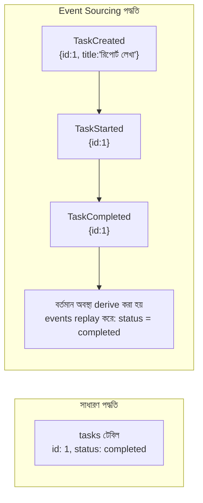

# ৪০.১৮ Event-Driven Architecture — Deep Dive: Event Sourcing

৪০.৪-এ আমরা Event-Driven Architecture-এর মূল ধারণা দেখেছিলাম — সার্ভিসগুলো সরাসরি একে অপরকে কল না করে event পাবলিশ আর সাবস্ক্রাইব করে যোগাযোগ করে। এই লেসনে আমরা সেই ধারণাকে এক ধাপ এগিয়ে নিয়ে যাবো একটা বিশেষায়িত, শক্তিশালী কৌশলে — **Event Sourcing**।

স্বাভাবিক ডেটাবেজ ডিজাইনে (Module ১৮-১৯) আমরা শুধু **বর্তমান অবস্থা** সংরক্ষণ করি। ধরো একটা task-এর `status` কলাম `pending` থেকে `in_progress`, তারপর `completed`-এ বদলে গেলো — সাধারণ ডেটাবেজে শুধু সর্বশেষ মান `completed` থেকে যায়, মাঝের পরিবর্তনগুলোর ইতিহাস হারিয়ে যায়। Event Sourcing এই দর্শনটাকে উল্টে দেয় — **বর্তমান অবস্থা সংরক্ষণ করার বদলে, প্রতিটা পরিবর্তনকে (event) একটার পর একটা সংরক্ষণ করা হয়**, আর বর্তমান অবস্থা হিসাব করা হয় সেই event গুলো একে একে "replay" করে।

এটাকে ভাবা যায় ব্যাংকের একাউন্ট স্টেটমেন্টের মতো — ব্যাংক তোমার একাউন্টে শুধু "বর্তমান ব্যালেন্স ৫০,০০০ টাকা" রাখে না, বরং প্রতিটা লেনদেন (জমা, উত্তোলন) আলাদা এন্ট্রি হিসেবে রাখে। বর্তমান ব্যালেন্স আসলে সব লেনদেনের যোগফল — আর এই সম্পূর্ণ ইতিহাস থাকার কারণে যেকোনো disput তদন্ত করা, বা ভুল হলে ঠিক কোন লেনদেনে সমস্যা হয়েছিলো তা খুঁজে বের করা সম্ভব হয়।



কোড দিয়ে দেখা যাক Event Sourcing কীভাবে কাজ করে। প্রথমে প্রতিটা event সংরক্ষণ করা হয় একটা **event store**-এ, যেটা কখনো update বা delete হয় না — শুধু append হয়:

```python
from datetime import datetime

# Event Store — শুধু append হয়, কখনো পরিবর্তন হয় না
class EventStore:
    def __init__(self):
        self.events: list[dict] = []  # বাস্তবে এটা একটা ডেটাবেজ টেবিল বা Kafka topic

    def append(self, event: dict):
        self.events.append({
            **event,
            "timestamp": datetime.now(),
            "sequence_number": len(self.events) + 1,
        })

    def get_events_for(self, aggregate_id: str) -> list[dict]:
        return [e for e in self.events if e["aggregate_id"] == aggregate_id]


event_store = EventStore()

# ব্যবসায়িক কর্মকাণ্ড event হিসেবে সংরক্ষিত হয়, সরাসরি অবস্থা বদলানো হয় না
def create_task(task_id: str, title: str):
    event_store.append({"type": "TaskCreated", "aggregate_id": task_id, "data": {"title": title}})

def start_task(task_id: str):
    event_store.append({"type": "TaskStarted", "aggregate_id": task_id, "data": {}})

def complete_task(task_id: str):
    event_store.append({"type": "TaskCompleted", "aggregate_id": task_id, "data": {}})

# বর্তমান অবস্থা event replay করে "derive" (উদ্ভূত) করা হয়
def get_current_task_state(task_id: str) -> dict | None:
    events = event_store.get_events_for(task_id)
    state = None

    for event in events:
        if event["type"] == "TaskCreated":
            state = {"id": task_id, "title": event["data"]["title"], "status": "pending"}
        elif event["type"] == "TaskStarted":
            state["status"] = "in_progress"
        elif event["type"] == "TaskCompleted":
            state["status"] = "completed"
    return state


create_task("t1", "মাসিক রিপোর্ট লেখা")
start_task("t1")
complete_task("t1")

print(get_current_task_state("t1"))
# {'id': 't1', 'title': 'মাসিক রিপোর্ট লেখা', 'status': 'completed'}
```

এই কৌশলটার সাথে ৪০.৫-এ শেখা CQRS-এর সম্পর্ক গভীর — CQRS-এ আমরা read আর write আলাদা করেছিলাম, আর Event Sourcing প্রায়ই CQRS-এর "write side"-এর বাস্তবায়ন হিসেবে ব্যবহার হয়। প্রতিটা command (যেমন `completeTask`) একটা event তৈরি করে (write model), আর সেই event গুলো থেকে read-optimized "projection" বানানো হয় (read model), যেটা `getCurrentTaskState`-এর মতো প্রতিবার replay না করে দ্রুত query করা যায়।

Event Sourcing-এর সবচেয়ে বড় সুবিধা হলো **সম্পূর্ণ অডিট ট্রেইল** — "এই task কবে, কীভাবে, কার দ্বারা প্রতিটা অবস্থায় গিয়েছিলো" তার নিখুঁত ইতিহাস পাওয়া যায়, যেটা আর্থিক সিস্টেম বা compliance-ভারী ডোমেইনে অমূল্য। এমনকি একটা বাগ ফিক্স করার পর পুরনো event replay করে নতুন করে state হিসাব করা যায় (Module ৩৪-এর production debugging-এর একটা শক্তিশালী টুল)।

তবে জটিলতাও উল্লেখযোগ্য — লক্ষ লক্ষ event জমা হলে replay ধীর হয়ে যেতে পারে (এই সমস্যার সমাধান **snapshot** — মাঝে মাঝে বর্তমান অবস্থা সংরক্ষণ করে রাখা, যাতে শুরু থেকে replay করতে না হয়), আর ডেভেলপারদের নতুন মানসিকতায় চিন্তা করতে শেখা লাগে — "অবস্থা" নয়, "ঘটনার ধারা" দিয়ে সিস্টেম মডেল করা।

পরের লেসনে আমরা Service Discovery-এর গভীরে যাবো — বাস্তব টুল Consul আর etcd কীভাবে কাজ করে, আর কেন এগুলো নিজে-লেখা রেজিস্ট্রির চেয়ে ভালো।
