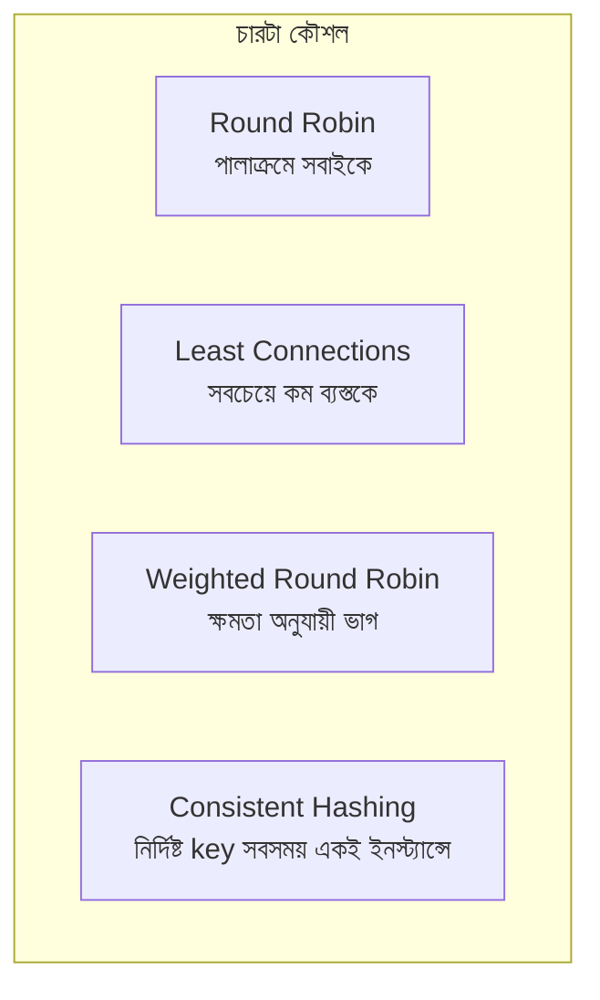
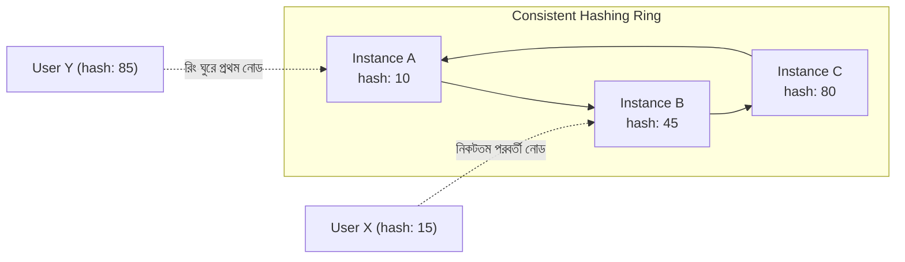

# ৪০.২০ Load Balancing Strategies — Deep Dive: অ্যালগরিদম তুলনা

৪০.১২-এ আমরা Round Robin দিয়ে Load Balancing-এর মূল ধারণা দেখেছিলাম, আর Least Connections-এর কথা সংক্ষেপে উল্লেখ করেছিলাম। এই মডিউলের শেষ লেসনে আমরা চারটা প্রধান অ্যালগরিদম পাশাপাশি রেখে গভীরভাবে তুলনা করবো, যাতে বাস্তব সিস্টেম ডিজাইন করার সময় সঠিক পছন্দ করতে পারো।



**Round Robin** (৪০.১২-এ দেখা) সবচেয়ে সরল — প্রতিটা ইনস্ট্যান্সকে সমানভাবে বিবেচনা করে, পালাক্রমে রিকোয়েস্ট পাঠায়। এটা তখনই ভালো কাজ করে যখন প্রতিটা ইনস্ট্যান্স সমান শক্তিশালী আর প্রতিটা রিকোয়েস্ট প্রায় সমান ভারী।

**Least Connections** এই ধরে না নিয়ে বাস্তব সময়ে প্রতিটা ইনস্ট্যান্সের ব্যস্ততা মেপে সিদ্ধান্ত নেয়:

```python
class LeastConnectionsBalancer:
    def __init__(self, instances: list[dict]):
        # প্রতিটা ইনস্ট্যান্সের সাথে বর্তমান active connection সংখ্যা রাখা হয়
        self.instances = [{**i, "active_connections": 0} for i in instances]

    def get_next_instance(self) -> dict:
        # সবচেয়ে কম ব্যস্ত ইনস্ট্যান্স বেছে নেয়া
        return min(self.instances, key=lambda i: i["active_connections"])

    def on_request_start(self, instance: dict):
        instance["active_connections"] += 1

    def on_request_end(self, instance: dict):
        instance["active_connections"] -= 1
```

ধরো তিনটা ইনস্ট্যান্সের মধ্যে একটাতে একটা ভারী রিপোর্ট-জেনারেশন রিকোয়েস্ট চলছে (৩০ সেকেন্ড ধরে)। Round Robin তারপরও তার পালা অনুযায়ী নতুন রিকোয়েস্ট সেখানে পাঠাবে, কিন্তু Least Connections দেখবে সেই ইনস্ট্যান্সের active connection বেশি, তাই অন্য দুইটাকে বেশি রিকোয়েস্ট পাঠাবে — এটা অসম কাজের চাপ পরিস্থিতিতে অনেক বেশি ন্যায্য।

**Weighted Round Robin** কাজে লাগে যখন ইনস্ট্যান্সগুলো সমান শক্তিশালী না — ধরো একটা সার্ভার নতুন, দ্বিগুণ CPU আছে অন্যগুলোর চেয়ে:

```python
class WeightedRoundRobinBalancer:
    def __init__(self, instances: list[dict]):
        # weight যত বেশি, তত বেশি রিকোয়েস্ট পাবে
        self.instances = instances  # [{"address": ..., "weight": 2}, {"address": ..., "weight": 1}, ...]
        self.expanded = [i for i in instances for _ in range(i["weight"])]
        self.current_index = 0

    def get_next_instance(self) -> dict:
        instance = self.expanded[self.current_index]
        self.current_index = (self.current_index + 1) % len(self.expanded)
        return instance

# weight: 2 আর weight: 1 হলে অনুক্রম হবে: [সার্ভার-১, সার্ভার-১, সার্ভার-২, সার্ভার-১, সার্ভার-১, সার্ভার-২...]
```

সবচেয়ে চিত্তাকর্ষক কৌশল হলো **Consistent Hashing**, যেটা কাজে লাগে যখন একই ব্যবহারকারী বা একই ডেটার জন্য বারবার **একই** ইনস্ট্যান্সে পৌঁছানো দরকার (যেমন in-memory cache ব্যবহার করলে, বা WebSocket কানেকশন বজায় রাখতে):



```python
import hashlib

class ConsistentHashBalancer:
    def __init__(self, instances: list[dict]):
        self.ring = sorted(
            ({**i, "hash": self._hash(i["address"])} for i in instances),
            key=lambda i: i["hash"],
        )

    def _hash(self, key: str) -> int:
        return int(hashlib.md5(key.encode()).hexdigest()[:8], 16)

    def get_instance_for_key(self, key: str) -> dict:
        key_hash = self._hash(key)
        # key-এর hash থেকে বড় প্রথম instance খুঁজে বের করা, না পেলে রিং-এর প্রথমটা
        return next((i for i in self.ring if i["hash"] >= key_hash), self.ring[0])

balancer = ConsistentHashBalancer(instances)
target = balancer.get_instance_for_key(user_id)  # এই user_id সবসময় একই ইনস্ট্যান্সে যাবে
```

Consistent Hashing-এর আসল শক্তি বোঝা যায় যখন একটা ইনস্ট্যান্স যোগ বা বাদ হয় — সাধারণ hashing (`userId % instanceCount`) ব্যবহার করলে ইনস্ট্যান্স সংখ্যা বদলালে প্রায় **সব** key নতুন ইনস্ট্যান্সে চলে যায় (cache পুরোপুরি invalidate হয়ে যায়), কিন্তু Consistent Hashing-এ রিং-এর শুধু একটা ছোট অংশ প্রভাবিত হয় — বাকি সব key তাদের আগের ইনস্ট্যান্সেই থেকে যায়।

চারটা কৌশলের সারসংক্ষেপ:

| অ্যালগরিদম | সবচেয়ে উপযুক্ত যখন |
|---|---|
| Round Robin | সব ইনস্ট্যান্স সমান, রিকোয়েস্ট হালকা ও সমান |
| Least Connections | রিকোয়েস্টের ভার অসম (কিছু ভারী, কিছু হালকা) |
| Weighted Round Robin | ইনস্ট্যান্সগুলোর হার্ডওয়্যার ক্ষমতা ভিন্ন |
| Consistent Hashing | cache affinity বা stateful কানেকশন দরকার |

এই লেসন দিয়ে আমরা Module ৪০-এর সব ২০টা লেসন সম্পন্ন করলাম — Monolith থেকে শুরু করে Microservices, Serverless, Event-Driven, CQRS, এবং তাদের চারপাশের সব সাপোর্টিং প্যাটার্ন (Gateway, Communication, Circuit Breaker, Discovery, Load Balancing, Multi-Tenancy, Clean Architecture) নিয়ে আমরা একটা সম্পূর্ণ স্থাপত্য টুলবক্স তৈরি করলাম। এখন প্রশ্ন হলো — এই আর্কিটেকচারের ভেতরে বসানো সিস্টেম বাস্তব দুনিয়ার সাথে কীভাবে কথা বলবে, যেমন ইমেইল পাঠানো, SMS পাঠানো, পেমেন্ট প্রসেস করা। পরের মডিউল, **Module 41 — Third Party Integrations**-এ আমরা ঠিক এই বাস্তব-জগতের ইন্টিগ্রেশনগুলো নিয়ে কাজ শুরু করবো।
