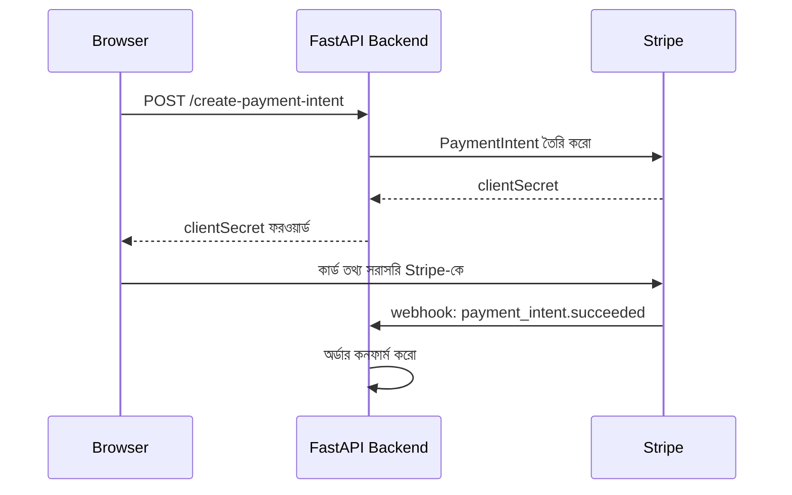

# ০৫. Payment Processing with Stripe

আগের চারটা লেসনে আমরা যোগাযোগ (ইমেইল, SMS, WhatsApp) আর ডেটা সিঙ্ক (Salesforce CRM) নিয়ে কাজ করেছি — কোথাও সরাসরি টাকার লেনদেন জড়িত ছিলো না। এবার আমরা এমন একটা জায়গায় ঢুকছি যেখানে ভুল করার সুযোগ প্রায় নেই — **পেমেন্ট প্রসেসিং**। ধরো তুমি একটা ই-কমার্স সাইট বানাচ্ছো, ইউজার "Buy Now" চাপলো — এখন তার কার্ডের নম্বর কোথায় যাবে? তুমি কি নিজের সার্ভারে কার্ডের নম্বর সেভ করবে?

এই প্রশ্নের উত্তর একেবারে স্পষ্ট — **না, কখনোই না**। কার্ডের তথ্য নিজের সার্ভারে ছোঁয়ার সাথে সাথে তুমি একটা বিশাল কমপ্লায়েন্স দায়িত্বের (PCI-DSS) মধ্যে পড়ে যাও, আর সামান্য একটা নিরাপত্তা-ভুল হলে হাজার হাজার কার্ডের তথ্য চুরি হয়ে যেতে পারে। ঠিক এই সমস্যার সমাধান হিসেবেই **Stripe**-এর মতো পেমেন্ট গেটওয়ে তৈরি হয়েছে — তারা কার্ডের সংবেদনশীল তথ্য নিজেদের অতি-সুরক্ষিত সিস্টেমে সামলায়, তোমার সার্ভার শুধু "কত টাকা চার্জ করতে হবে, কার জন্য" — এই মেটাডেটাটুকু নিয়ে কাজ করে। এটা অনেকটা ব্যাংক লকারের মতো — তুমি নিজের বাসায় সোনাদানা রাখার ঝুঁকি না নিয়ে ব্যাংকের ভল্টে রাখো, শুধু চাবিটা (একটা রেফারেন্স/টোকেন) নিজের কাছে রাখো।


এই ডায়াগ্রামটাই Stripe ইন্টিগ্রেশনের কেন্দ্রীয় ধারণা — কার্ডের কাঁচা তথ্য কখনোই তোমার ব্যাকএন্ডে আসে না, শুধু ফ্রন্টএন্ড থেকে সরাসরি Stripe-এ যায়, আর তোমার ব্যাকএন্ড শুধু একটা নিরাপদ রেফারেন্স (token/PaymentMethod ID) নিয়ে কাজ করে।

```bash
pip install stripe python-dotenv fastapi uvicorn
```

```
STRIPE_SECRET_KEY=sk_test_xxxxxxxxxxxxxxxxxxxxxxxx
```

```python
# services/payment_service.py
import os
import stripe
from dotenv import load_dotenv

load_dotenv()
stripe.api_key = os.getenv("STRIPE_SECRET_KEY")

def create_payment_intent(amount_in_cents, currency="usd"):
    payment_intent = stripe.PaymentIntent.create(
        amount=amount_in_cents,
        currency=currency,
        automatic_payment_methods={"enabled": True},
    )
    return payment_intent
```

লক্ষ্য করো ফাংশনটা `async def` না, প্লেইন `def` — অফিসিয়াল Python `stripe` প্যাকেজ সিঙ্ক্রোনাস, মানে `stripe.PaymentIntent.create(...)` কল করার সময় নেটওয়ার্ক রিকোয়েস্টটা ব্লকিং। FastAPI-এর মতো async ফ্রেমওয়ার্কে এটা একটু বেমানান শোনালেও, Stripe-এর রেসপন্স সাধারণত অনেক দ্রুত (কয়েক শ মিলিসেকেন্ড) আসে, তাই ছোট-মাঝারি ট্রাফিকে এই ট্রেড-অফ মেনে নেওয়া যায়। ট্রাফিক বেশি হলে এই কলটাকে থ্রেডপুলে চালানো (`fastapi.concurrency.run_in_threadpool`) ভালো অভ্যাস, যাতে একটা ধীর Stripe কল বাকি সব রিকোয়েস্টের ইভেন্ট লুপ ব্লক করে না দেয়।

এখানে **PaymentIntent** একটা গুরুত্বপূর্ণ ধারণা যা প্রথমে একটু অস্বাভাবিক লাগতে পারে — আমরা সরাসরি "চার্জ করো" বলছি না, বরং "একটা পেমেন্টের অভিপ্রায় (intent) তৈরি করো" বলছি। কেন এই বাড়তি ধাপ? কারণ বাস্তব পেমেন্টে অনেক কিছু ঘটতে পারে মাঝপথে — ব্যাংক অতিরিক্ত ভেরিফিকেশন (3D Secure) চাইতে পারে, কার্ড প্রত্যাখ্যান হতে পারে, ইউজার পেজ বন্ধ করে দিতে পারে। PaymentIntent এই পুরো প্রক্রিয়াটাকে একটা "স্টেট মেশিন" হিসেবে ট্র্যাক করে — `requires_payment_method` → `requires_confirmation` → `processing` → `succeeded`। এটা অনেকটা আমাদের নিজের অর্ডার সিস্টেমে "pending → confirmed → shipped" স্ট্যাটাসের ধারণার মতোই, শুধু এখানে Stripe নিজেই এই স্টেট মেশিনটা ম্যানেজ করছে।

FastAPI রাউট বানাই:

```python
from fastapi import FastAPI, HTTPException
from pydantic import BaseModel

app = FastAPI()

class PaymentIntentRequest(BaseModel):
    amount: float  # ডলারে, যেমন 25.00

@app.post("/api/create-payment-intent")
def create_payment_intent_route(body: PaymentIntentRequest):
    try:
        payment_intent = create_payment_intent(round(body.amount * 100))
        return {"clientSecret": payment_intent.client_secret}
    except stripe.error.StripeError as e:
        raise HTTPException(status_code=502, detail="পেমেন্ট প্রসেস শুরু করা যায়নি")
```

লক্ষ্য করো `round(body.amount * 100)` — Stripe সবসময় সবচেয়ে ছোট মুদ্রা এককে (সেন্ট, পয়সা) কাজ করে, ডলার/টাকায় না। এটা একটা সাধারণ কিন্তু গুরুত্বপূর্ণ ভুল-এড়ানোর বিষয় — ফ্লোটিং পয়েন্ট সংখ্যা (যেমন ২৫.০০ ডলার) নিয়ে সরাসরি হিসাব করলে রাউন্ডিং এরর হতে পারে, তাই ইন্টিজার (সেন্ট) নিয়ে কাজ করাই নিরাপদ।

ফ্রন্টএন্ডে (React বা প্লেইন JS) Stripe.js ব্যবহার করে এই `clientSecret` দিয়ে কার্ড ফর্ম দেখানো হয় — সেই কোড এই ব্যাকএন্ড-কেন্দ্রিক কোর্সের সীমার বাইরে, কিন্তু ধারণাটা মনে রাখা জরুরি: ব্যাকএন্ড শুধু "অনুমতি" তৈরি করে, আসল কার্ড-হ্যান্ডলিং ফ্রন্টএন্ড আর Stripe-এর মধ্যে সরাসরি ঘটে।

এখন প্রশ্ন হলো — পেমেন্ট সফল হলো কিনা, সেটা আমাদের ব্যাকএন্ড কীভাবে জানবে? এখানেই আসে আগের WhatsApp লেসনে শেখা **webhook** ধারণাটা আবার — Stripe পেমেন্ট সফল/ব্যর্থ হলে আমাদের সার্ভারকে জানিয়ে দেয়:

```python
from fastapi import Request

@app.post("/webhook/stripe")
async def stripe_webhook(request: Request):
    payload = await request.body()  # raw bytes — must NOT parse as JSON first
    sig_header = request.headers.get("stripe-signature")
    try:
        event = stripe.Webhook.construct_event(
            payload, sig_header, os.getenv("STRIPE_WEBHOOK_SECRET")
        )
    except (ValueError, stripe.error.SignatureVerificationError) as e:
        raise HTTPException(status_code=400, detail=f"Webhook Error: {str(e)}")

    if event["type"] == "payment_intent.succeeded":
        payment_intent = event["data"]["object"]
        # অর্ডার স্ট্যাটাস আপডেট করো, ইনভয়েস ইমেইল পাঠাও ইত্যাদি

    return {"received": True}
```

এখানে `stripe.Webhook.construct_event(...)` দিয়ে সিগনেচার যাচাই করা হচ্ছে — ঠিক সেই একই নিরাপত্তা-নীতি যা আমরা Twilio webhook-এও দেখেছিলাম। এটা অত্যন্ত গুরুত্বপূর্ণ, কারণ এই URL টা পাবলিক, আর যদি কেউ ভুয়া "payment succeeded" ইভেন্ট পাঠিয়ে দেয় সিগনেচার-যাচাই ছাড়া, তাহলে সে বিনামূল্যে পণ্য পেয়ে যেতে পারবে।

> **সবচেয়ে বেশি হওয়া একটা ভুল (Common Mistake): raw body হারিয়ে যাওয়া**
>
> Express-এ আমরা `bodyParser.raw({ type: 'application/json' })` ব্যবহার করে বলে দিতাম যে এই রাউটের body টা parse না করে raw bytes হিসেবেই রাখতে হবে। FastAPI-এ এর সমতুল্য নিয়মটা হলো: **`await request.body()` কল করে raw bytes নিতে হবে, JSON parse করার আগেই** — এবং এই bytes + `Stripe-Signature` হেডার একসাথে `stripe.Webhook.construct_event(...)`-এ পাঠাতে হবে।
>
> লক্ষ্য করো, উপরের রাউটে আমরা `request: Request` নিয়েছি, কোনো Pydantic মডেল দিয়ে body ডিক্লেয়ার করিনি। এটা ইচ্ছাকৃত। যদি এই রাউটে কোনো Pydantic body মডেল বসিয়ে দেওয়া হয়, বা কোনো middleware/dependency আগেই `await request.json()` কল করে বসে — তাহলে সিগনেচার-যাচাই মাঝেমধ্যে অদ্ভুতভাবে ফেইল করবে। কারণটা সূক্ষ্ম: একবার body parse হয়ে গেলে, সেটাকে আবার serialize করে যে bytes বানানো হয়, সেটা বাইট-বাই-বাইট Stripe যেটা মূলত সাইন করেছিলো তার সাথে মিলবে না (key-এর অর্ডার, স্পেসিং, ফ্লোটিং পয়েন্ট রিপ্রেজেন্টেশন — এসব সামান্য পার্থক্যও সিগনেচার ভেঙে দেয়)। ফলাফল: `SignatureVerificationError`, এবং ডিবাগ করা কঠিন, কারণ ৯০% রিকোয়েস্টে সমস্যা নেই মনে হলেও production-এ এলোমেলোভাবে ফেইল করতে থাকে। তাই webhook রাউটে সবসময় সবচেয়ে আগে raw bytes নিয়ে সিগনেচার যাচাই করো, তারপর প্রয়োজনে `event` ডিকশনারি থেকে ডেটা বের করো।



খেয়াল করো, এখানে ব্রাউজার আর Stripe-এর মধ্যে সরাসরি একটা যোগাযোগ হচ্ছে যেখানে আমাদের ব্যাকএন্ড অংশগ্রহণ করছে না — এটাই কার্ড ডেটা সুরক্ষিত রাখার মূল কৌশল। আমাদের ব্যাকএন্ড শুধু শুরুতে অনুমতি দেয়, আর শেষে webhook দিয়ে ফলাফল জানে।

Stripe বিশ্বব্যাপী জনপ্রিয়, কিন্তু কিছু অঞ্চলে এবং কিছু ধরনের ব্যবসায় **PayPal**-এর নিজস্ব একটা বড় ব্যবহারকারী-ভিত্তি আছে, বিশেষ করে যেখানে ইউজাররা কার্ড না দিয়ে সরাসরি PayPal ব্যালেন্স ব্যবহার করতে চায়। পরের লেসনে আমরা দেখবো PayPal ইন্টিগ্রেশন কীভাবে কাজ করে, আর Stripe-এর সাথে এর কাঠামোগত মিল-অমিল কী।
