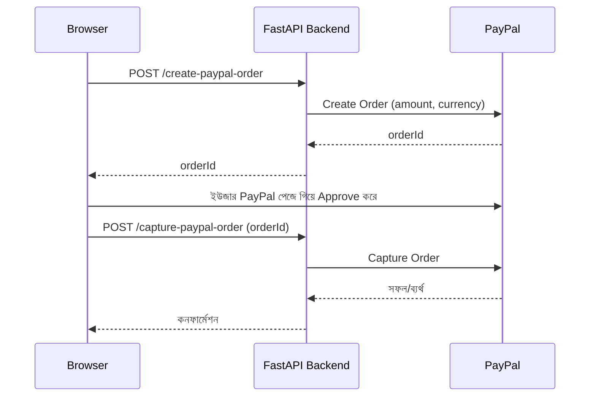

# ০৬. Payment Processing with PayPal

আগের লেসনে আমরা Stripe দিয়ে পেমেন্ট প্রসেসিং শিখেছি, আর সবচেয়ে গুরুত্বপূর্ণ নীতিটা বুঝেছি — কার্ডের কাঁচা তথ্য কখনো নিজের ব্যাকএন্ডে আনা যাবে না। এই একই নীতি **PayPal**-এও সমানভাবে প্রযোজ্য, কারণ PayPal মূলত একটা ভিন্ন ধরনের পেমেন্ট মাধ্যম সমাধান করে — এখানে ইউজার তার কার্ড না দিয়ে সরাসরি তার PayPal অ্যাকাউন্টের ব্যালেন্স বা লিংকড ব্যাংক থেকে টাকা পাঠায়। অনেক দেশে, বিশেষ করে ফ্রিল্যান্স মার্কেটপ্লেসে (মনে করো Module 19-এ যে freelancer platform ERD আমরা দেখেছিলাম), PayPal-ই লেনদেনের প্রধান মাধ্যম, তাই একটা প্রোডাকশন সিস্টেমে প্রায়ই Stripe আর PayPal — দুটোই বিকল্প হিসেবে রাখা হয়।

স্ট্রাকচারালি PayPal-এর ফ্লো Stripe-এর PaymentIntent-এর সাথে দারুণভাবে মেলে, শুধু নামকরণ আর ধাপগুলো একটু ভিন্ন — এখানে প্রথমে একটা **Order** তৈরি করতে হয়, ইউজার PayPal-এ গিয়ে অনুমোদন (approve) দেয়, এরপর ব্যাকএন্ড সেই অর্ডারটা **Capture** করে টাকা প্রকৃতপক্ষে স্থানান্তর করে।



এই ফ্লোতে দুইটা ধাপ (create + capture) থাকার একটা যৌক্তিক কারণ আছে — "Create" ধাপে শুধু বলা হচ্ছে "এই পরিমাণ টাকার একটা লেনদেন হতে যাচ্ছে", কিন্তু আসল টাকা তখনও সরে না। ইউজার যতক্ষণ না নিজে গিয়ে PayPal-এ লগইন করে অনুমোদন দিচ্ছে, ততক্ষণ কিছুই ঘটে না। এটা অনেকটা Module 12 (JWT)-এ আমরা যেমন দেখেছিলাম "কোনো কাজ করার আগে অথরাইজেশন যাচাই করা দরকার" — এখানেও PayPal নিশ্চিত করে যে টাকা সরানোর আগে প্রকৃত মালিকের সম্মতি নেওয়া হয়েছে।

একটা গুরুত্বপূর্ণ নোট — Node.js-এর `@paypal/checkout-server-sdk` প্যাকেজটা এখন deprecated, আর তার কোনো সক্রিয়ভাবে maintained পাইথন সমতুল্য নেই। আসলে PayPal নিজেই এখন পুরনো SDK-গুলো সরিয়ে সরাসরি তাদের **REST API (Orders v2)** কল করার পরামর্শ দেয়। পাইথন কমিউনিটির PayPal SDK-গুলোও মূলত `httpx`/`requests`-এর ওপর পাতলা একটা wrapper — ভেতরে গিয়ে দেখলে ঠিক এই একই HTTP কলগুলোই করে। তাই এই লেসনে আমরা সরাসরি REST API-এর সাথে কথা বলবো `httpx` দিয়ে — এটা শুধু বাস্তবসম্মত না, বরং শিক্ষামূলকভাবেও ভালো, কারণ এটা দেখায় যে কোনো SDK "ভেতরে ভেতরে" আসলে কী করে।

```bash
pip install httpx python-dotenv fastapi uvicorn
```

```
PAYPAL_CLIENT_ID=xxxxxxxxxxxxxxxxxxxxxxxx
PAYPAL_CLIENT_SECRET=xxxxxxxxxxxxxxxxxxxxxxxx
PAYPAL_API_BASE=https://api-m.sandbox.paypal.com
```

```python
# services/paypal_service.py
import os
import httpx
from dotenv import load_dotenv

load_dotenv()

PAYPAL_CLIENT_ID = os.environ["PAYPAL_CLIENT_ID"]
PAYPAL_CLIENT_SECRET = os.environ["PAYPAL_CLIENT_SECRET"]
# sandbox-এ টেস্ট করার জন্য এই base URL; প্রোডাকশনে গেলে
# https://api-m.paypal.com দিয়ে বদলে দিতে হবে
PAYPAL_API_BASE = os.environ.get("PAYPAL_API_BASE", "https://api-m.sandbox.paypal.com")


async def get_paypal_access_token() -> str:
    """
    পুরনো SDK-তে SandboxEnvironment/PayPalHttpClient অবজেক্ট আমাদের বদলে
    অ্যাক্সেস টোকেন ম্যানেজ করত। আমরা এখন সেই কাজটা নিজেরাই করছি — এটা
    OAuth 2.0-এর client-credentials grant-এর একটা সরাসরি, honest উদাহরণ,
    যা Module 29-এ আমরা তত্ত্বগতভাবে যে OAuth ফ্লো দেখেছিলাম তার সাথে মেলে।
    """
    async with httpx.AsyncClient() as client:
        response = await client.post(
            f"{PAYPAL_API_BASE}/v1/oauth2/token",
            data={"grant_type": "client_credentials"},
            auth=(PAYPAL_CLIENT_ID, PAYPAL_CLIENT_SECRET),
        )
        response.raise_for_status()
        return response.json()["access_token"]


async def create_order(amount: float, currency: str = "USD") -> str:
    access_token = await get_paypal_access_token()

    async with httpx.AsyncClient() as client:
        response = await client.post(
            f"{PAYPAL_API_BASE}/v2/checkout/orders",
            headers={"Authorization": f"Bearer {access_token}"},
            json={
                "intent": "CAPTURE",
                "purchase_units": [
                    {
                        "amount": {
                            "currency_code": currency,
                            "value": f"{amount:.2f}",
                        }
                    }
                ],
            },
        )
        response.raise_for_status()
        return response.json()["id"]


async def capture_order(order_id: str) -> dict:
    access_token = await get_paypal_access_token()

    async with httpx.AsyncClient() as client:
        response = await client.post(
            f"{PAYPAL_API_BASE}/v2/checkout/orders/{order_id}/capture",
            headers={"Authorization": f"Bearer {access_token}"},
        )
        response.raise_for_status()
        return response.json()
```

`PAYPAL_API_BASE`-এর মান লক্ষ্য করো — PayPal-এর নিজস্ব একটা sandbox পরিবেশ (`api-m.sandbox.paypal.com`) আছে যেখানে আসল টাকা ছাড়াই পুরো ফ্লো টেস্ট করা যায়। প্রোডাকশনে গেলে এটা `api-m.paypal.com`-এ বদলাতে হবে। এই "sandbox বনাম production" ধারণাটা প্রায় সব পেমেন্ট আর অনেক থার্ড-পার্টি সার্ভিসেই থাকে (Stripe-এও `sk_test_` বনাম `sk_live_` কী দেখেছিলাম) — সবসময় ডেভেলপমেন্টের সময় sandbox/test মোড ব্যবহার করা উচিত, নাহলে টেস্ট করতে গিয়ে সত্যিকারের টাকা লেনদেন হয়ে যেতে পারে।

FastAPI রাউট দুটো:

```python
# main.py
from fastapi import FastAPI, HTTPException
from pydantic import BaseModel
from services import paypal_service

app = FastAPI()


class CreateOrderRequest(BaseModel):
    amount: float


class CaptureOrderRequest(BaseModel):
    order_id: str


@app.post("/api/create-paypal-order")
async def create_paypal_order(payload: CreateOrderRequest):
    try:
        order_id = await paypal_service.create_order(payload.amount)
        return {"orderId": order_id}
    except Exception as error:
        print(f"PayPal create order error: {error}")
        raise HTTPException(status_code=502, detail="PayPal অর্ডার তৈরি করা যায়নি")


@app.post("/api/capture-paypal-order")
async def capture_paypal_order(payload: CaptureOrderRequest):
    try:
        capture_result = await paypal_service.capture_order(payload.order_id)
        if capture_result.get("status") == "COMPLETED":
            # ডেটাবেজে অর্ডার সম্পন্ন হিসেবে চিহ্নিত করো
            return {"status": "success", "details": capture_result}
        raise HTTPException(
            status_code=400,
            detail={"status": "incomplete", "details": capture_result},
        )
    except HTTPException:
        raise
    except Exception as error:
        print(f"PayPal capture error: {error}")
        raise HTTPException(status_code=502, detail="পেমেন্ট ক্যাপচার ব্যর্থ")
```

এখন একটা গুরুত্বপূর্ণ প্রশ্ন — যদি Stripe আর PayPal দুটোই সাপোর্ট করতে হয়, তাহলে কি পুরো কোড দুইবার লিখতে হবে? বাস্তব প্রোডাকশন সিস্টেমে এই সমস্যার সমাধান করা হয় একটা **abstraction layer** দিয়ে — Module 22-এ আমরা যে ডিজাইন প্যাটার্ন শিখেছিলাম (Strategy Pattern), সেটা এখানে দারুণভাবে কাজে লাগে:

```python
# payment_gateway.py — Strategy Pattern-এর প্রয়োগ
from services import stripe_service, paypal_service


def get_payment_gateway(gateway_name: str):
    if gateway_name == "stripe":
        return stripe_service
    if gateway_name == "paypal":
        return paypal_service
    raise ValueError("অজানা পেমেন্ট গেটওয়ে")
```

এভাবে বাকি কোড শুধু `get_payment_gateway(user_choice)` কল করে, নির্দিষ্ট গেটওয়ের নাম না জেনেই কাজ চালিয়ে যেতে পারে — এটাই Strategy Pattern-এর মূল শক্তি, যা আমরা Module 22-এ তাত্ত্বিকভাবে শিখেছিলাম, আর এখানে বাস্তব প্রয়োগ দেখছি।

দুটো পেমেন্ট গেটওয়েতেই আমরা লক্ষ্য করেছি একটা কমন প্যাটার্ন — বাইরের সার্ভিস `async`/`await` দিয়ে কল করো, এরর হ্যান্ডল করো, আর সংবেদনশীল কী `.env`-এ রাখো। ইমেইল মার্কেটিং জগতেও এই একই প্যাটার্ন প্রযোজ্য, শুধু উদ্দেশ্যটা ভিন্ন — এবার আমরা এককালীন ইমেইলের বদলে বড় স্কেলে **ইমেইল মার্কেটিং ক্যাম্পেইন** চালানো শিখবো, Mailchimp দিয়ে।
