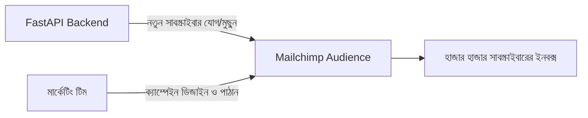
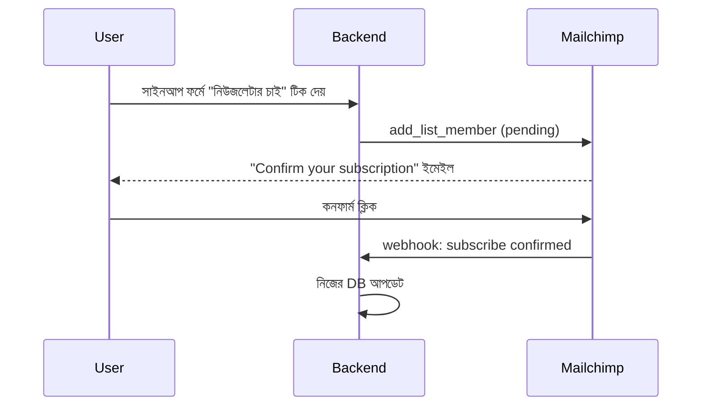

# ০৭. Mailchimp Email Marketing Integration

Module-এর প্রথম লেসনে আমরা SendGrid দিয়ে **ট্রানজ্যাকশনাল ইমেইল** পাঠানো শিখেছিলাম — ওয়েলকাম মেইল, পাসওয়ার্ড রিসেট, একটা নির্দিষ্ট ইভেন্টের সাথে সরাসরি যুক্ত এক-জন-এক-মেইল বার্তা। কিন্তু ব্যবসার আরেকটা প্রয়োজন আছে যেটা সম্পূর্ণ ভিন্ন প্রকৃতির — প্রতি সপ্তাহে হাজার হাজার সাবস্ক্রাইবারকে একটা নিউজলেটার পাঠানো, নতুন ফিচার ঘোষণা করা, ছাড়ের অফার জানানো। এই ধরনের **বাল্ক মার্কেটিং ইমেইল**-এর জন্য SendGrid প্রযুক্তিগতভাবে সক্ষম হলেও, এই কাজের জন্য বিশেষায়িত টুল দরকার — যেখানে থাকবে সাবস্ক্রাইবার লিস্ট ম্যানেজমেন্ট, আনসাবস্ক্রাইব-এর আইনি বাধ্যবাধকতা মানা, ক্যাম্পেইন পারফরম্যান্স অ্যানালিটিক্স (কে খুলেছে, কে ক্লিক করেছে)। এই কাজের জন্যই তৈরি হয়েছে **Mailchimp**।

এখানে একটা গুরুত্বপূর্ণ পার্থক্য বোঝা দরকার — SendGrid-এ আমরা প্রতিটা ইমেইল "সরাসরি পাঠাও" বলে দিতাম, কন্টেন্ট নিজে তৈরি করতাম। Mailchimp-এ ব্যাকএন্ডের ভূমিকা একটু ভিন্ন — আমাদের কোড মূলত **সাবস্ক্রাইবার লিস্ট (Audience) ম্যানেজ করে**, আর আসল ইমেইল ডিজাইন-পাঠানো Mailchimp-এর নিজস্ব ড্যাশবোর্ড থেকে হয় (মার্কেটিং টিম নিজে করে)। এটা অনেকটা Module 41-এর প্রথম লেসনের শেষে যে Dynamic Templates-এর কথা বলেছিলাম তার একটা বড় সংস্করণ — কোড আর ডিজাইনের কাজ আলাদা করে দেওয়া।



শুরু করি। Mailchimp-এর API একটু অস্বাভাবিক একটা নিয়ম মেনে চলে — তোমার API Key-এর শেষে একটা "ডেটা সেন্টার" কোড থাকে (যেমন `-us21`), যেটা বলে দেয় তোমার অ্যাকাউন্টের ডেটা কোন সার্ভারে আছে।

```bash
pip install mailchimp-marketing python-dotenv fastapi uvicorn
```

```
MAILCHIMP_API_KEY=xxxxxxxxxxxxxxxxxxxxxxxx-us21
MAILCHIMP_SERVER_PREFIX=us21
MAILCHIMP_AUDIENCE_ID=xxxxxxxxxx
```

```python
# services/mailchimp_service.py
import os
from dotenv import load_dotenv
import mailchimp_marketing as MailchimpMarketing
from mailchimp_marketing.api_client import ApiClientError

load_dotenv()

client = MailchimpMarketing.Client()
client.set_config({
    "api_key": os.getenv("MAILCHIMP_API_KEY"),
    "server": os.getenv("MAILCHIMP_SERVER_PREFIX"),
})

def add_subscriber(email: str, first_name: str) -> str:
    try:
        response = client.lists.add_list_member(os.getenv("MAILCHIMP_AUDIENCE_ID"), {
            "email_address": email,
            "status": "subscribed",  # 'pending' দিলে ডাবল অপ্ট-ইন হবে
            "merge_fields": {"FNAME": first_name},
        })
        return response["id"]
    except ApiClientError as error:
        print(f"Mailchimp error: {error.text}")
        raise error
```

লক্ষ্য করো `status: "subscribed"` বনাম `"pending"`-এর পার্থক্যটা। অনেক দেশে (যেমন ইউরোপে GDPR আইনের অধীনে) কাউকে নিউজলেটার-এ যোগ করার আগে তার স্পষ্ট সম্মতি নিতে হয় — `pending` স্ট্যাটাস দিলে Mailchimp নিজে থেকে একটা "confirm your subscription" ইমেইল পাঠায়, ইউজার ক্লিক করলে তবেই সে সত্যিকারের সাবস্ক্রাইবার হয়। এটা একটা গুরুত্বপূর্ণ শিক্ষা — থার্ড-পার্টি ইন্টিগ্রেশন করার সময় শুধু কোড লেখাই যথেষ্ট না, প্রাসঙ্গিক আইনি/নৈতিক নিয়মও মাথায় রাখতে হয়।

একটা ছোট্ট নুয়ান্স মাথায় রাখো — Python-এর `mailchimp-marketing` ক্লায়েন্ট **সিনক্রোনাস** (SendGrid-এর Python লাইব্রেরির মতোই), তাই এখানে `await` লাগবে না; FastAPI রাউটের ভেতরে সরাসরি কল করলেই চলবে।

FastAPI রাউট:

```python
from fastapi import FastAPI, HTTPException
from pydantic import BaseModel
from services.mailchimp_service import add_subscriber
from mailchimp_marketing.api_client import ApiClientError

app = FastAPI()

class SubscribeRequest(BaseModel):
    email: str
    first_name: str

@app.post("/api/newsletter/subscribe")
def subscribe(payload: SubscribeRequest):
    try:
        add_subscriber(payload.email, payload.first_name)
        return {"message": "সাবস্ক্রিপশন সফল! ইমেইল চেক করো কনফার্ম করার জন্য।"}
    except ApiClientError as error:
        # Mailchimp ইতিমধ্যে-সাবস্ক্রাইবড ইমেইলের জন্য error object-এর
        # status/body-তে "Member Exists" জানায় — এখানে সরলভাবে status code
        # দিয়ে চেক করা হলো
        if error.status_code == 400:
            raise HTTPException(status_code=409, detail="এই ইমেইল ইতিমধ্যে সাবস্ক্রাইবড")
        raise HTTPException(status_code=502, detail="সাবস্ক্রিপশন সম্পন্ন করা যায়নি")
```

`409 Conflict` স্ট্যাটাস কোড ব্যবহার করেছি — Module 6-এ শেখা স্ট্যাটাস কোডের নিয়ম অনুযায়ী, এটা বোঝায় "রিকোয়েস্টটা বৈধ, কিন্তু বর্তমান অবস্থার সাথে সাংঘর্ষিক" (এই ইমেইল আগে থেকেই তালিকায় আছে)। এই ধরনের নির্দিষ্ট এরর ম্যাপিং ফ্রন্টএন্ডকে যথাযথ বার্তা দেখাতে সাহায্য করে, শুধু "কিছু একটা ভুল হয়েছে" না বলে।

Mailchimp-এর সাথে আরেকটা গুরুত্বপূর্ণ ইন্টিগ্রেশন হলো ইউজার যখন আনসাবস্ক্রাইব করে বা তার তথ্য বদলায়, সেটা webhook-এর মাধ্যমে আমাদের সিস্টেমে ফিরিয়ে আনা:

```python
from fastapi import Request

@app.post("/webhook/mailchimp")
async def mailchimp_webhook(request: Request):
    form = await request.form()
    event_type = form.get("type")
    # Mailchimp webhook ফর্ম-এনকোডেড ডেটাতে ফিল্ডের নাম bracket-notation-এ
    # পাঠায় (যেমন "data[email]"), তাই সরাসরি dict key হিসেবেই অ্যাক্সেস করতে হয়
    email = form.get("data[email]")

    if event_type == "unsubscribe":
        print(f"{email} আনসাবস্ক্রাইব করেছে")
        # নিজের ডেটাবেজেও newsletter_opt_in = false আপডেট করো

    return {"status": "ok"}
```

এই প্যাটার্নটা আমরা আগেই WhatsApp আর Stripe-এ দেখেছি — বাইরের সিস্টেমে কিছু একটা ঘটলে, সেটা webhook দিয়ে আমাদের নিজের সিস্টেমে প্রতিফলিত হওয়া উচিত, যাতে দুই দিকের ডেটা সবসময় সিঙ্ক্রোনাইজড থাকে। ধীরে ধীরে এই মডিউলে তুমি খেয়াল করবে — প্রতিটা নতুন ইন্টিগ্রেশন আসলে একই কয়েকটা মৌলিক প্যাটার্নের (API কল, async/await, webhook, environment variable-এ সিক্রেট) পুনরাবৃত্তি, শুধু ডোমেইন বদলাচ্ছে।



Mailchimp আমাদের ইমেইল-ভিত্তিক মার্কেটিং শেখালো, কিন্তু আধুনিক বিক্রয় ও মার্কেটিং টিম প্রায়ই একটা সম্পূর্ণ **অল-ইন-ওয়ান প্ল্যাটফর্ম** চায় — যেখানে CRM, ইমেইল মার্কেটিং, আর সেলস পাইপলাইন একসাথে থাকে। পরের লেসনে আমরা দেখবো তেমনই একটা জনপ্রিয় প্ল্যাটফর্ম — **HubSpot** — কীভাবে ইন্টিগ্রেট করা যায়।
