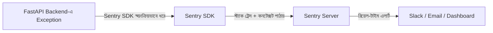
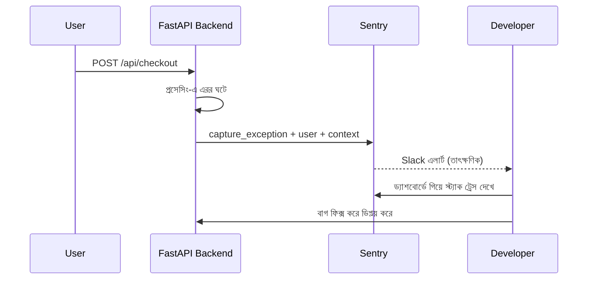

# ০৯. Error Tracking with Sentry

আগের লেসনের শেষে আমরা দেখেছিলাম কতগুলো থার্ড-পার্টি ইন্টিগ্রেশন একসাথে কাজ করছে — Stripe, HubSpot, SendGrid, Mailchimp — একটা মাত্র পেমেন্ট ইভেন্টে। এত জটিল একটা সিস্টেমে যদি কোথাও একটা ক্র্যাশ হয় মাঝরাতে, যখন তুমি ঘুমিয়ে আছো, সেটা তুমি কীভাবে জানবে? Module 32-এ আমরা Winston/Pino দিয়ে লগিং শিখেছিলাম — সেটা সাহায্য করে, কিন্তু লগ ফাইল তো তখনই কাজে লাগে যখন তুমি নিজে সেটা খুঁজে দেখো। বাস্তবে হাজার হাজার লাইন লগের মধ্যে একটা নির্দিষ্ট ক্র্যাশ খুঁজে বের করা, আর সেটার প্রেক্ষাপট (কোন ইউজার, কোন রিকোয়েস্ট, কোন ব্রাউজার) বোঝা প্রায় অসম্ভব হয়ে যায় যদি হাতে করে খুঁজতে হয়।

এই সমস্যার সমাধানই **Sentry** — একটা এরর-ট্র্যাকিং সার্ভিস যেটা তোমার অ্যাপ্লিকেশনের প্রতিটা এক্সেপশন স্বয়ংক্রিয়ভাবে ধরে ফেলে, তার সম্পূর্ণ প্রেক্ষাপট (স্ট্যাক ট্রেস, কোন ইউজার, কোন রিকোয়েস্ট, কোন এনভায়রনমেন্ট) জমা করে, আর সাথে সাথে তোমাকে (Slack/ইমেইলে) জানিয়ে দেয়। এটাকে ভাবতে পারো একটা "স্মোক ডিটেক্টর"-এর মতো — তুমি সবসময় বাড়িতে বসে আগুন খুঁজতে থাকো না, বরং একটা ডিটেক্টর বসিয়ে রাখো যেটা আগুন লাগলেই অ্যালার্ম বাজায়।



ইন্সটলেশন এবং সেটআপ:

```bash
pip install "sentry-sdk[fastapi]" fastapi uvicorn python-dotenv
```

```
SENTRY_DSN=https://xxxxxxxxxxxxxxxxxxxxxxxx@o000000.ingest.sentry.io/0000000
```

Sentry-এর সেটআপ একটু বিশেষ, কারণ এটাকে অ্যাপ্লিকেশনের একদম শুরুতেই ইনিশিয়ালাইজ করতে হয়, অ্যাপ ইনস্ট্যান্স তৈরি হওয়ার আগে বা তার সাথে সাথেই:

```python
# main.py
import os
import sentry_sdk
from sentry_sdk.integrations.fastapi import FastApiIntegration
from sentry_sdk.integrations.starlette import StarletteIntegration
from fastapi import FastAPI

sentry_sdk.init(
    dsn=os.getenv("SENTRY_DSN"),
    environment=os.getenv("ENVIRONMENT", "development"),
    integrations=[StarletteIntegration(), FastApiIntegration()],
    traces_sample_rate=1.0,  # প্রোডাকশনে কমিয়ে দেওয়া ভালো
)

app = FastAPI()


@app.get("/api/products/{product_id}")
async def get_product(product_id: str):
    product = await get_product_by_id(product_id)  # যদি এখানে এরর হয়...
    return product
```

Express-এ আমাদের `Sentry.Handlers.requestHandler()` আর `Sentry.Handlers.errorHandler()` — এই দুটো মিডলওয়্যারকে হাতে করে ঠিক জায়গায় বসাতে হতো: `requestHandler()` সবার শুরুতে, আর `errorHandler()` সব রাউটের পরে কিন্তু নিজেদের কাস্টম এরর-হ্যান্ডলারের আগে। Module 7-এ শেখা মিডলওয়্যার আর্কিটেকচারে এই ক্রমটা মেনে চলা জরুরি ছিল — একটু এদিক-ওদিক হলে পুরো মেকানিজম ভেঙে যেত।

Python-এর দুনিয়ায় এই সমস্যাটা অনেক সহজ হয়ে যায়। FastAPI-র জন্য sentry-sdk-এর ইন্টিগ্রেশন মডেল অটো-ইনস্ট্রুমেন্টেশনের উপর ভিত্তি করে তৈরি — `sentry_sdk.init(...)` অ্যাপ্লিকেশন স্টার্টআপে একবার কল করলেই `StarletteIntegration()` আর `FastApiIntegration()` নিজে থেকে প্রতিটা রিকোয়েস্ট-রেসপন্স সাইকেল আর আনক্যাচড এক্সেপশন হুক করে নেয়। এখানে Express-এর মতো হাতে করে দুটো মিডলওয়্যারকে সঠিক ক্রমে (একটা শুরুতে, একটা শেষে) বসানোর প্রয়োজন নেই — মিডলওয়্যার-অর্ডারিং নিয়ে যে সতর্কতা Module 7-তে শিখেছিলাম, সেটা এখানে ইন্টিগ্রেশন লেয়ারই সামলে নেয়।

শুধু স্বয়ংক্রিয় ক্যাচ নয়, নিজে থেকেও গুরুত্বপূর্ণ তথ্য পাঠানো যায়:

```python
@app.post("/api/checkout")
async def checkout(payload: CheckoutPayload):
    try:
        result = await process_payment(payload)
        return result
    except Exception as error:
        # tags/extra context set via scope:
        with sentry_sdk.push_scope() as scope:
            scope.set_tag("feature", "checkout")
            scope.set_extra("user_id", payload.user_id)
            scope.set_extra("amount", payload.amount)
            sentry_sdk.capture_exception(error)
        raise HTTPException(status_code=500, detail="চেকআউট ব্যর্থ হয়েছে")
```

লক্ষ্য করো `set_tag` আর `set_extra` — এগুলো Sentry-এর ড্যাশবোর্ডে এরর ফিল্টার আর সার্চ করার জন্য অসম্ভব উপকারী। ধরো তুমি জানতে চাও "checkout ফিচারে গত সপ্তাহে কতগুলো এরর হয়েছে" — `tag("feature", "checkout")` দিয়ে সহজেই সেটা ফিল্টার করা যায়। এটা অনেকটা Module 32-এ শেখা "structured logging"-এর ধারণার মতোই — শুধু একটা টেক্সট মেসেজ লগ না করে, সংগঠিত মেটাডেটাসহ লগ করা।

Sentry-তে ইউজার শনাক্ত করাও গুরুত্বপূর্ণ, বিশেষ করে যখন Module 12-এ শেখা JWT অথেনটিকেশন ব্যবহার করছো। এটা একটা FastAPI মিডলওয়্যার দিয়ে করা যায়, যেটা অথেনটিকেশনের পরে চলে:

```python
@app.middleware("http")
async def set_sentry_user(request: Request, call_next):
    user = getattr(request.state, "user", None)
    if user:
        sentry_sdk.set_user({"id": user.id, "email": user.email})
    return await call_next(request)
```

এভাবে যখন কোনো এরর হয়, Sentry-এর ড্যাশবোর্ডে সরাসরি দেখা যায় ঠিক কোন ইউজারের অভিজ্ঞতায় সমস্যাটা হয়েছে — এটা সাপোর্ট টিমের জন্য অমূল্য, কারণ ইউজার অভিযোগ করার আগেই তুমি সমস্যাটা জানতে ও সমাধান করতে পারো।



**একটা জরুরি সতর্কতা: PII স্ক্রাবিং।** Sentry ডিফল্টভাবে অনেক সময় পুরো রিকোয়েস্ট (বডি, হেডার, কুকি) ক্যাপচার করে ফেলে, যাতে থাকতে পারে পাসওয়ার্ড, টোকেন, কার্ড নাম্বার, বা অন্য ব্যক্তিগত তথ্য (PII — Personally Identifiable Information)। এই ডেটা যদি অপরিবর্তিত অবস্থায় একটা থার্ড-পার্টি সার্ভারে (Sentry-এর নিজের সার্ভারে) চলে যায়, সেটা একটা বড় compliance ঝুঁকি — Mailchimp লেসনে আমরা GDPR নিয়ে যে আলোচনা করেছিলাম, এখানেও ঠিক সেই একই আইনি দায়বদ্ধতা প্রযোজ্য। অনেক টিম এই ঝুঁকিটা খেয়াল করে না, যতক্ষণ না কোনো অডিটে ধরা পড়ে।

এর সমাধান হলো `sentry_sdk.init()`-এ একটা `before_send` কলব্যাক দেওয়া — এই ফাংশনটা প্রতিটা এরর ইভেন্ট Sentry-এর সার্ভারে পাঠানোর আগে পায়, আর সেটাকে পরিবর্তন (sensitive ফিল্ড বাদ দেওয়া) করতে পারে, বা `None` রিটার্ন করে পুরো ইভেন্টটাই বাদ দিতে পারে:

```python
def before_send(event, hint):
    if "request" in event and "data" in event["request"]:
        for sensitive_field in ("password", "card_number", "token"):
            event["request"]["data"].pop(sensitive_field, None)
    return event

sentry_sdk.init(
    dsn=os.getenv("SENTRY_DSN"),
    environment=os.getenv("ENVIRONMENT", "development"),
    integrations=[StarletteIntegration(), FastApiIntegration()],
    traces_sample_rate=1.0,
    before_send=before_send,
)
```

এই একটা লাইন যুক্ত করাটা প্রোডাকশনে যাওয়ার আগে অপ্রয়োজনীয় মনে হতে পারে, কিন্তু বাস্তবে এটা একটা সাধারণ ও গুরুত্বপূর্ণ প্রোডাকশন রিকোয়ারমেন্ট — বিশেষ করে GDPR-এর মতো নিয়মকানুনের অধীনে থাকা প্রোডাক্টে। error-tracking সার্ভিস তোমার নিজের অবকাঠামো নয়, সেটা একটা থার্ড-পার্টি — আর সেখানে raw PII পাঠানো মানে সেই ডেটার উপর নিয়ন্ত্রণ হারানো।

একটা বাস্তব সতর্কতা — Sentry-তে সব ধরনের এরর পাঠানো ঠিক না, বিশেষ করে যেগুলো ইউজারের সাধারণ ভুল (যেমন ভুল পাসওয়ার্ড দেওয়া, যেটা `400`/`401` স্ট্যাটাসে হ্যান্ডল করা উচিত)। সেগুলো "এরর" নয়, বরং প্রত্যাশিত আচরণ। Sentry রাখা উচিত সত্যিকারের অপ্রত্যাশিত পরিস্থিতির জন্য — যেমন ডেটাবেজ কানেকশন হঠাৎ বিচ্ছিন্ন হওয়া, বা কোনো থার্ড-পার্টি সার্ভিস অপ্রত্যাশিত ফরম্যাটে ডেটা ফেরত দেওয়া। এই পার্থক্যটা বোঝা জরুরি, নাহলে Sentry-এর ড্যাশবোর্ড "নয়েজ"-এ ভরে যাবে আর আসল সমস্যা খুঁজে পাওয়া কঠিন হয়ে যাবে।

আমরা এখন জানি কীভাবে সমস্যা ধরতে হয়, কিন্তু আরেকটা প্রশ্ন থেকে যায় — ইউজাররা আসলে আমাদের প্রোডাক্ট কীভাবে ব্যবহার করছে, কোন পেজে বেশি সময় কাটাচ্ছে, কোথায় থেমে যাচ্ছে? এটা এরর নয়, বরং আচরণগত তথ্য, যেটা বোঝার জন্য দরকার **অ্যানালিটিক্স**। এই মডিউলের শেষ লেসনে আমরা দেখবো **Google Analytics** কীভাবে ব্যাকএন্ড ও ফ্রন্টএন্ড থেকে ইন্টিগ্রেট করা যায়।
