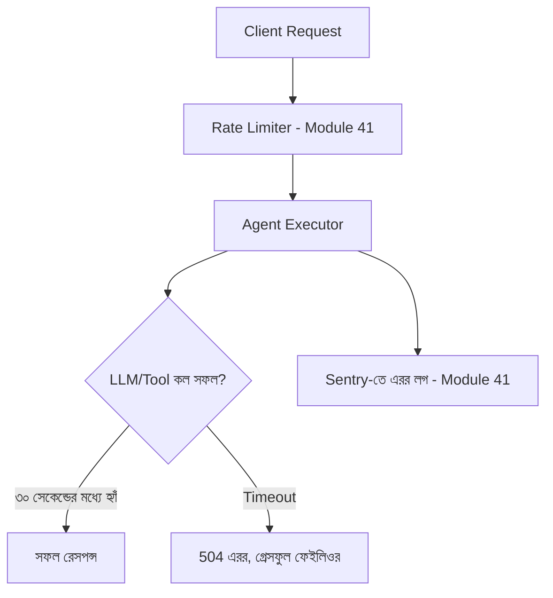

# ০৮. Deploying AI Agents to Production

আমাদের এজেন্ট এখন টুল ব্যবহার করতে জানে, মনে রাখতে পারে, দলবদ্ধভাবে কাজ করতে পারে, আর নিরাপত্তা গার্ডরেল আছে। এখন প্রশ্ন হলো — এটাকে বাস্তব ব্যবহারকারীদের সামনে কীভাবে নিরাপদে ছাড়া যায়? এই লেসনে আমরা Module 40-এর আর্কিটেকচার প্যাটার্ন আর Module 41-এর ইন্টিগ্রেশন প্যাটার্ন একসাথে জুড়ে এজেন্ট ডেপ্লয়মেন্টের নিয়মগুলো দেখবো।

একটা এজেন্টকে সাধারণ FastAPI অ্যাপের মতোই ডেপ্লয় করা যায়, কিন্তু কয়েকটা বিশেষ বিবেচনা যোগ হয়। প্রথমত, LLM কল সাধারণ ডাটাবেজ কোয়েরির চেয়ে অনেক ধীর (কয়েক সেকেন্ড লাগতে পারে), তাই **timeout** আর **streaming response** ভালোভাবে হ্যান্ডল করা জরুরি।

```python
import asyncio
from fastapi import APIRouter, HTTPException
from pydantic import BaseModel

router = APIRouter()


class AgentChatRequest(BaseModel):
    message: str
    user_id: str


@router.post("/api/agent/chat")
async def agent_chat(payload: AgentChatRequest):
    try:
        result = await asyncio.wait_for(
            run_agent_with_memory(payload.user_id, payload.message),
            timeout=30,
        )
        return {"reply": result["output"]}
    except asyncio.TimeoutError:
        logger.error("agent_timeout", user_id=payload.user_id)
        raise HTTPException(status_code=504, detail="এজেন্ট সাড়া দিতে দেরি করছে, আবার চেষ্টা করুন")
    except Exception as error:
        logger.error("agent_deployment_error", error=str(error))
        raise HTTPException(status_code=504, detail="এজেন্ট সাড়া দিতে দেরি করছে, আবার চেষ্টা করুন")
```



দ্বিতীয় গুরুত্বপূর্ণ বিষয় হলো **খরচ নিয়ন্ত্রণ** — প্রতিটা LLM API কলের একটা টাকার মূল্য আছে, যেটা সাধারণ HTTP রিকোয়েস্টের মতো না। তাই প্রোডাকশনে রেট লিমিটিং (Module 41-এ শেখা) আরো গুরুত্বপূর্ণ হয়ে ওঠে, নাহলে একজন ইউজার (বা একটা বট আক্রমণ) হাজার হাজার এজেন্ট কল করে বিশাল বিল তৈরি করতে পারে।

```python
from slowapi import Limiter
from slowapi.util import get_remote_address

limiter = Limiter(key_func=get_remote_address)


@router.post("/api/agent/chat")
@limiter.limit("10/minute")  # প্রতি মিনিটে সর্বোচ্চ ১০টা এজেন্ট কল প্রতি ইউজার
async def agent_chat(payload: AgentChatRequest):
    ...
```

তৃতীয়ত, এজেন্ট ডেপ্লয়মেন্টে একটা **staged rollout** কৌশল ভালো কাজ করে — নতুন এজেন্ট ভার্সন সরাসরি সব ইউজারের কাছে না ছেড়ে, প্রথমে অল্প শতাংশ (যেমন ৫%) ট্রাফিকে পরীক্ষা করা, তারপর ধীরে ধীরে বাড়ানো। এটা "Build, Measure, Learn" চক্রেরই একটা প্রোডাকশন সংস্করণ (Module 44-এর লেসন ০৪-এ এই চক্র নিয়ে আরো বিস্তারিত আলোচনা হবে), যেখানে একটা ভুল প্রম্পট বা টুল আপডেট সব ইউজারকে প্রভাবিত করার আগেই ধরা পড়ে।

```python
def should_use_new_agent_version(user_id: str) -> bool:
    bucket = simple_hash(user_id) % 100
    return bucket < 5  # মাত্র ৫% ইউজার নতুন ভার্সন পাবে
```

এজেন্ট ডেপ্লয়মেন্টে একটা ফলব্যাক পরিকল্পনাও থাকা দরকার — LLM প্রোভাইডার (Anthropic API) ডাউন হয়ে গেলে বা রেসপন্স দিতে ব্যর্থ হলে, সিস্টেম যেন সম্পূর্ণ ভেঙে না পড়ে, বরং একটা সহজ, নিয়ম-ভিত্তিক ফলব্যাক দেখাতে পারে ("আমাদের এজেন্ট এই মুহূর্তে ব্যস্ত, সরাসরি সাপোর্ট টিমের সাথে যোগাযোগ করুন")।

এজেন্ট এখন লাইভ, কিন্তু ডেপ্লয় করাই শেষ কথা না — এটা ঠিকভাবে কাজ করছে কিনা, কোথায় ভুল করছে, কতজন গ্রাহক সন্তুষ্ট — এই সবকিছু নিয়মিত পর্যবেক্ষণ করা দরকার। পরের লেসনে আমরা সেই মনিটরিং আর অ্যানালিটিক্স নিয়ে বিস্তারিত আলোচনা করবো।
