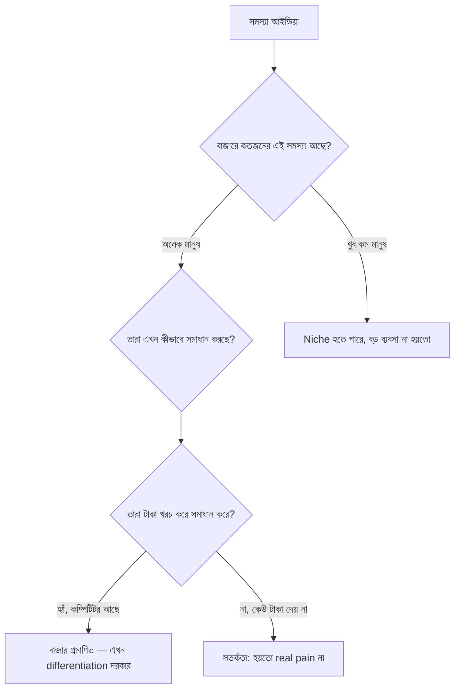

# ০২. Market Research & Competitive Analysis

গত লেসনে আমরা বুঝলাম SaaS মডেলে "কেন" প্রতি মাসে গ্রাহককে ধরে রাখা এত গুরুত্বপূর্ণ। কিন্তু তার আগে একটা আরো মৌলিক প্রশ্ন আছে — তুমি যে সমস্যাটা সমাধান করতে চাও, সেটা কি আসলেই কারো সমস্যা, নাকি শুধু তোমার মাথায় ঘুরছে? এই প্রশ্নের উত্তর খুঁজতেই মার্কেট রিসার্চ দরকার।

মার্কেট রিসার্চকে একটা ডিটেকটিভ কাজের মতো ভাবতে পারো। তুমি প্রমাণ জোগাড় করছো — এই বাজারে কতজন মানুষ আছে যাদের এই সমস্যা আছে, তারা এখন কীভাবে সমস্যাটা সামলাচ্ছে (হয়তো এক্সেল শিট দিয়ে, হয়তো কোনো প্রতিযোগীর টুল দিয়ে, হয়তো কিছুই করছে না), আর তারা এই সমাধানের জন্য টাকা খরচ করতে রাজি কিনা।

কম্পিটিটিভ অ্যানালাইসিস মানে প্রতিযোগীদের অনুকরণ করা না — বরং তাদের থেকে শেখা। ধরো তুমি একটা ইনভয়েসিং SaaS বানাতে চাও। বাজারে আগে থেকেই FreshBooks, Wave, Zoho Invoice আছে। এটা দেখে অনেকে ভয় পেয়ে যায় — "এত কম্পিটিটর থাকলে আমি কীভাবে ঢুকবো?" কিন্তু বাস্তবে এটা উল্টো একটা ভালো লক্ষণ — এটা প্রমাণ করে বাজারে মানুষ এই সমস্যার জন্য টাকা খরচ করে। তোমার কাজ হলো তাদের ফাঁকফোকর খুঁজে বের করা — কোন ধরনের গ্রাহক তাদের প্রোডাক্টে অসন্তুষ্ট, কোন ফিচার তারা দেয় না, কোন নির্দিষ্ট ইন্ডাস্ট্রি (যেমন শুধু ফ্রিল্যান্সার ডিজাইনার) তাদের কাছে অবহেলিত।

এই কাজটা করার একটা কার্যকর পদ্ধতি হলো একটা তুলনামূলক টেবিল বানানো:

| ফিচার/দিক | কম্পিটিটর A | কম্পিটিটর B | তোমার সম্ভাব্য সুযোগ |
|---|---|---|---|
| দাম | $29/মাস থেকে | $15/মাস থেকে | ছোট ফ্রিল্যান্সারদের জন্য ফ্রি টিয়ার |
| টার্গেট ইউজার | মাঝারি ব্যবসা | সব ধরনের | নির্দিষ্ট ইন্ডাস্ট্রি (যেমন ফটোগ্রাফার) |
| দুর্বলতা | জটিল UI | কম কাস্টমাইজেশন | সহজ UI + ইন্ডাস্ট্রি-স্পেসিফিক টেমপ্লেট |

রিসার্চ করার আসল উৎস হলো মানুষ, ডকুমেন্ট না। Reddit-এর নির্দিষ্ট সাবরেডিট, ফেসবুক গ্রুপ, G2/Capterra-র রিভিউ সেকশন (যেখানে মানুষ কম্পিটিটরের ব্যাপারে অভিযোগ লেখে) — এগুলো সোনার খনি। কেউ যখন একটা প্রোডাক্টের রিভিউতে লেখে "এইটা থাকলে ভালো হতো", সেটাই তোমার জন্য একটা ফিচার আইডিয়া, বিনামূল্যে।

তবে মার্কেট রিসার্চ শুধু ডেটা জোগাড় করে থেমে গেলে চলবে না — আসল মানুষের সাথে সরাসরি কথা বলাটাই সবচেয়ে জোরালো প্রমাণ দেয়। সেটাই আমাদের পরের লেসনের বিষয় — কাস্টমার ডিসকভারি আর ইউজার পার্সোনা বানানো।
