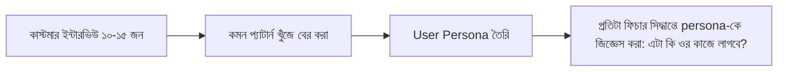

# ০৩. Customer Discovery & User Personas

মার্কেট রিসার্চ থেকে আমরা একটা ধারণা পেলাম — বাজারে কি সুযোগ আছে, কম্পিটিটর কারা। কিন্তু ডেটা আর স্প্রেডশিট কখনো পুরো গল্প বলে না। আসল প্রশ্নের উত্তর পেতে হলে সরাসরি মানুষের সাথে কথা বলতে হবে — এটাই কাস্টমার ডিসকভারি।

কাস্টমার ডিসকভারি মানে সম্ভাব্য গ্রাহকদের সাথে বসে তাদের সমস্যা নিয়ে প্রশ্ন করা — কিন্তু সাবধানতার সাথে। নতুন ফাউন্ডাররা সাধারণত একটা ভুল করে — তারা গিয়ে জিজ্ঞেস করে "আপনি কি এই প্রোডাক্টটা কিনবেন?" মানুষ ভদ্রতার খাতিরে "হ্যাঁ" বলে দেয়, কিন্তু বাস্তবে কখনো কেনে না। এর বদলে ভালো প্রশ্ন হলো অতীত সম্পর্কে — "শেষবার যখন আপনার এই সমস্যা হয়েছিল, তখন আপনি কী করেছিলেন?" অতীতের আচরণ ভবিষ্যতের প্রতিশ্রুতির চেয়ে অনেক বেশি নির্ভরযোগ্য প্রমাণ।

এই পার্থক্যটা মনে রাখার একটা সহজ নিয়ম আছে — **Mom Test** (Rob Fitzgerald-এর বই থেকে আসা ধারণা)। ধরে নাও তুমি তোমার মায়ের কাছে গিয়ে জিজ্ঞেস করছো তোমার আইডিয়া ভালো কিনা — মা সবসময় বলবে "হ্যাঁ বাবা, দারুণ!" তাই এমনভাবে প্রশ্ন সাজাতে হবে যাতে উত্তরদাতা মিথ্যা প্রশংসা করার সুযোগ না পায়। "আপনার এই সমস্যায় সবচেয়ে বেশি সময় কোথায় নষ্ট হয়?" — এই প্রশ্নের উত্তর মিথ্যা দেয়া কঠিন, কারণ এটা তথ্য চাইছে, মতামত না।

এই কথোপকথনগুলো থেকে যে প্যাটার্ন বের হয়, সেটাকে গুছিয়ে রাখার একটা টুল হলো **User Persona** — একটা কাল্পনিক কিন্তু বাস্তব-ভিত্তিক প্রতিনিধি চরিত্র, যে তোমার আদর্শ গ্রাহকের প্রতিনিধিত্ব করে। এটা কোনো ফ্যান্সি ডিজাইন এক্সারসাইজ না, এটা তোমার প্রতিটা প্রোডাক্ট সিদ্ধান্তের একটা রেফারেন্স পয়েন্ট।

একটা persona-তে সাধারণত থাকে — নাম, পেশা, দৈনন্দিন কাজের ধরন, প্রধান হতাশা (pain points), আর সে এখন কীভাবে সমস্যাটা সামলায়। যেমন ইনভয়েসিং টুলের জন্য একটা persona হতে পারে: "রাফি, ফ্রিল্যান্স গ্রাফিক ডিজাইনার, প্রতি মাসে ৫-৬ জন ক্লায়েন্টকে ইনভয়েস পাঠায়, এখন Google Docs টেমপ্লেট দিয়ে ম্যানুয়ালি বানায়, পেমেন্ট কবে এলো তার হিসাব রাখতে ভুলে যায়, ইংরেজি ভালো না বলে ফরম্যাল ভাষায় ইনভয়েস লিখতে সময় লাগে।" এই একটা প্যারাগ্রাফ থেকেই কিন্তু তিন-চারটা ফিচার আইডিয়া বের হয়ে আসে — অটো-রিমাইন্ডার, বাংলা টেমপ্লেট, পেমেন্ট ট্র্যাকিং।

মনে রাখতে হবে, persona একটা অনুমান, চূড়ান্ত সত্য না — বাস্তব ইউজারদের সাথে কথা বলতে বলতে এটা বদলাতে থাকবে। Module 44-এ যখন আমরা ইনডি হ্যাকিং নিয়ে কথা বলবো, দেখবে সফল সোলো ফাউন্ডাররা সবাই তাদের প্রথম কয়েকজন গ্রাহকের সাথে সরাসরি চ্যাট করে product বানিয়েছে — persona কোনো একবারের কাজ না, এটা চলমান একটা অভ্যাস।

এখন প্রশ্ন হলো — এই persona-র সমস্যা বুঝে তুমি কীভাবে বলবে "আমার প্রোডাক্ট এই সমস্যার সেরা সমাধান"? সেই উত্তরটাই লুকিয়ে আছে ভ্যালু প্রোপোজিশনে — পরের লেসনের বিষয়।
