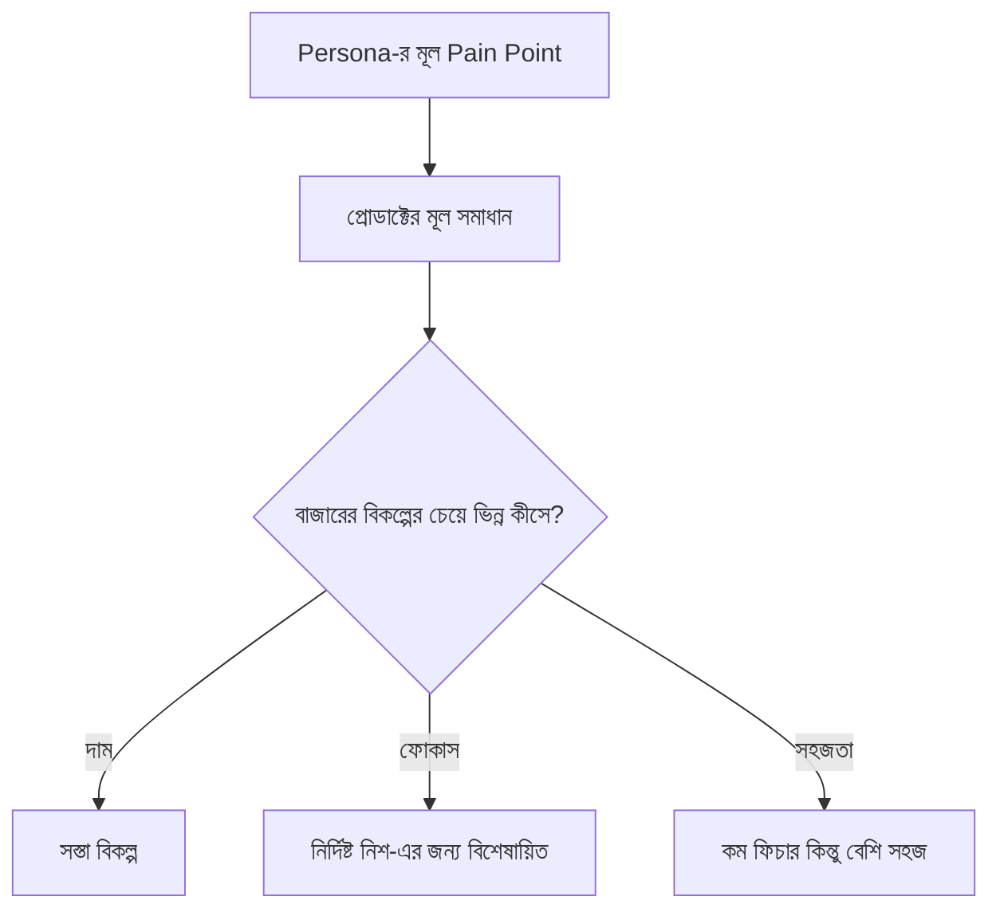

# ০৪. Value Proposition & Product Strategy

আগের লেসনে আমরা রাফির মতো একটা persona বানিয়েছি — একজন ফ্রিল্যান্স ডিজাইনার যে ম্যানুয়ালি ইনভয়েস বানাতে গিয়ে সময় নষ্ট করে, পেমেন্ট ট্র্যাক করতে ভুলে যায়। এখন প্রশ্ন হলো — এই একই সমস্যার জন্য বাজারে যখন আগে থেকেই দশটা প্রোডাক্ট আছে, তুমি কেন বলবে "আমারটা বেছে নাও"? এই প্রশ্নের উত্তরটাই ভ্যালু প্রোপোজিশন।

ভ্যালু প্রোপোজিশন মানে এক লাইনে বলা যায় এমন একটা বাক্য, যেটা তিনটা জিনিস স্পষ্ট করে — কার জন্য বানানো হয়েছে, কী সমস্যার সমাধান করে, আর কেন এটা অন্যদের চেয়ে ভালো। এটাকে একটা সহজ ফর্মুলায় ফেলা যায়:

> "[নির্দিষ্ট গ্রাহকদের] জন্য, যাদের [নির্দিষ্ট সমস্যা] আছে, [প্রোডাক্টের নাম] হলো এমন একটা [ক্যাটাগরি], যেটা [মূল সুবিধা] দেয় — অন্য [কম্পিটিটরদের] থেকে ভিন্ন, কারণ [পার্থক্য]।"

রাফির উদাহরণ দিয়ে ভরাট করলে দাঁড়ায়: "বাংলাদেশি ফ্রিল্যান্সারদের জন্য, যাদের ইংরেজি ইনভয়েসিং টুল ব্যবহার করতে অস্বস্তি লাগে, InvoiceBari হলো এমন একটা ইনভয়েসিং টুল, যেটা বাংলা টেমপ্লেট আর bKash পেমেন্ট রিমাইন্ডার দেয় — FreshBooks বা Wave থেকে ভিন্ন, কারণ এগুলো স্থানীয় বাস্তবতা মাথায় রেখে বানানো না।" লক্ষ্য করো, এখানে "সবচেয়ে ভালো" বা "সেরা" জাতীয় কোনো অস্পষ্ট দাবি নেই — শুধু নির্দিষ্ট, যাচাইযোগ্য পার্থক্য।

ভ্যালু প্রোপোজিশন ঠিক হলে, এর উপর ভিত্তি করে **প্রোডাক্ট স্ট্র্যাটেজি** তৈরি হয় — মানে কোন ফিচার আগে বানাবে, কোনটা পরে, আর কোনটা কখনোই বানাবে না। এখানে একটা সাধারণ ভুল হলো সব ফিচার একসাথে বানানোর চেষ্টা করা। বাস্তবে স্ট্র্যাটেজি মানে হলো "না" বলতে শেখা — প্রতিটা ফিচার আইডিয়াকে ভ্যালু প্রোপোজিশনের বিপরীতে পরীক্ষা করা: "এটা কি রাফির মূল সমস্যাটা সমাধান করে, নাকি শুধু 'ভালো হতে পারে' টাইপের সংযোজন?"

এই ফিল্টারিং প্রক্রিয়াটা এমন একটা ম্যাট্রিক্স দিয়ে করা যায়, যেখানে প্রতিটা ফিচার আইডিয়াকে দুটো মাপকাঠিতে বসানো হয় — এটা বানাতে কত সময়/এফোর্ট লাগবে (Effort), আর এটা গ্রাহকের জন্য কতটা মূল্য যোগ করবে (Impact)।

| ফিচার | Impact | Effort | সিদ্ধান্ত |
|---|---|---|---|
| বাংলা ইনভয়েস টেমপ্লেট | High | Low | আগে বানাও |
| Overdue payment রিমাইন্ডার | High | Low | আগে বানাও |
| মাল্টি-কারেন্সি সাপোর্ট | Low | High | এখন বাদ দাও |
| টিম কোলাবরেশন | Medium | High | পরে বিবেচনা করো |

এই ম্যাট্রিক্সটা Module 44-এ আমরা যখন লিন ডেভেলপমেন্ট আর MVP স্ট্র্যাটেজি নিয়ে আরো গভীরে যাবো, তখন আবার কাজে লাগবে — কারণ MVP-র মূল কথাই হলো "High Impact, Low Effort" কোয়াড্রেন্টে থাকা জিনিসগুলো আগে বানানো।

একটা স্পষ্ট ভ্যালু প্রোপোজিশন আর ফিল্টার করা ফিচার লিস্ট থাকলেও, আসল প্রশ্নটা এখনো বাকি — বাজারে এটা রাখলে কি সত্যিই গ্রাহক ধরে রাখা যাবে, নাকি শুধু আইডিয়া হিসেবে সুন্দর? এই প্রশ্নের বৈজ্ঞানিক উত্তর খোঁজার নাম প্রোডাক্ট-মার্কেট ফিট — যেটা আমাদের পরের লেসনের বিষয়।
