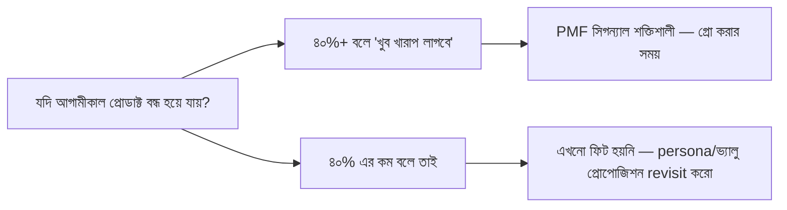

# ০৫. Product-Market Fit Analysis

আগের লেসনে আমরা ভ্যালু প্রোপোজিশন লিখলাম, ফিচার বাছাই করলাম। কিন্তু এগুলো সবই এখনো অনুমান — কাগজে-কলমে ভালো শোনানো একটা থিওরি। বাস্তবে বাজার সেটা মেনে নিচ্ছে কিনা, সেটা বোঝার নামই **Product-Market Fit (PMF)**।

PMF-এর সবচেয়ে সহজ সংজ্ঞা দিয়েছিলেন বিনিয়োগকারী Marc Andreessen — "PMF মানে হলো এমন একটা বাজারে ভালো একটা প্রোডাক্ট থাকা, যেখানে সেই প্রোডাক্ট বাজারের চাহিদা মেটাতে পারে।" শুনতে সহজ মনে হলেও এটা বোঝার আসল সমস্যা হলো — PMF কোনো এক মুহূর্তে "হ্যাঁ পেয়ে গেছি" বলে ঘোষণা দেয়া যায় না, এটা ধীরে ধীরে বোঝা যায় কিছু সিগন্যাল দেখে।

সবচেয়ে পরিচিত পরিমাপ পদ্ধতি হলো Sean Ellis টেস্ট — তোমার বর্তমান ইউজারদের জিজ্ঞেস করো, "যদি আগামীকাল থেকে এই প্রোডাক্ট আর ব্যবহার করতে না পারো, তাহলে কেমন লাগবে?" আর অপশন দাও তিনটা — "খুব খারাপ লাগবে", "কিছুটা খারাপ লাগবে", "কিছু যায় আসে না"। যদি ৪০% বা তার বেশি ইউজার বলে "খুব খারাপ লাগবে" — সেটা একটা শক্তিশালী সিগন্যাল যে তুমি PMF-এর কাছাকাছি আছো। ৪০%-এর নিচে হলে বুঝতে হবে এখনো কাজ বাকি আছে।

তবে এই একটা প্রশ্নের বাইরেও কিছু বাস্তব আচরণগত সিগন্যাল আছে যেগুলো PMF-এর দিকে ইঙ্গিত দেয়। যেমন **অর্গানিক গ্রোথ** — মানুষ নিজে থেকে তোমার প্রোডাক্টের কথা বন্ধুদের বলছে, তোমাকে বিজ্ঞাপনে টাকা ঢালতে হচ্ছে না। যেমন **রিটেনশন** — গ্রাহক একমাস ব্যবহার করে চলে যাচ্ছে না, মাসের পর মাস থেকে যাচ্ছে (এই মেট্রিকটা নিয়ে বিস্তারিত পরের লেসনে যাবো)। আর যেমন **ব্যবহারের চাপ** — সার্ভার ধরে রাখতে কষ্ট হচ্ছে কারণ ইউজার বেড়ে যাচ্ছে দ্রুত।

উল্টো দিকের সিগন্যালও চেনা দরকার — PMF না থাকলে কী দেখা যায়। বিক্রি খুব কষ্ট করে করতে হয়, প্রতিটা গ্রাহক পেতে অনেক দৌড়াদৌড়ি লাগে, ট্রায়াল ইউজাররা পেইড হচ্ছে না, আর যারা সাইন-আপ করছে তারা প্রথম সপ্তাহেই চলে যাচ্ছে। এই অবস্থায় থাকলে অনেক ফাউন্ডার ভুল সমাধান খোঁজে — মার্কেটিং বাজেট বাড়ায়, সেলস টিম বড় করে। কিন্তু সমস্যাটা মার্কেটিংয়ের না, প্রোডাক্টের — কাউকে জোর করে এমন কিছু কেনানো যায় না যেটা তার আসলে দরকার নেই।

এখানে Module 43-এর ০২ আর ০৩ লেসনের সাথে যোগসূত্রটা স্পষ্ট — মার্কেট রিসার্চ আর কাস্টমার ডিসকভারি একবার করে থেমে যাওয়ার জিনিস না। PMF না পেলে তোমাকে আবার persona-তে ফিরে যেতে হয়, প্রশ্ন করতে হয় — আমরা কি ভুল গ্রাহকের কথা শুনছি, নাকি সঠিক গ্রাহকের ভুল সমস্যা সমাধান করছি? এই লুপটা কতবার চালাতে হবে তার কোনো নির্দিষ্ট সংখ্যা নেই — কিছু প্রোডাক্ট প্রথম চেষ্টাতেই ফিট পায়, বেশিরভাগ পায় তিন-চারবার persona আর ভ্যালু প্রোপোজিশন বদলানোর পর।

একটা গুরুত্বপূর্ণ ভুল ধারণা ভাঙা দরকার — PMF মানে এই না যে সবাই তোমার প্রোডাক্ট পছন্দ করবে। PMF মানে একটা নির্দিষ্ট, ছোট হলেও, গ্রুপ তোমার প্রোডাক্ট ছাড়া চলতে পারবে না এমন মনে করছে। প্রথমে ছোট একটা niche-এ গভীর PMF পাওয়া, তারপর ধীরে ধীরে বাজার বড় করা — এটাই বেশিরভাগ সফল SaaS-এর আসল পথ, শুরু থেকেই সবার জন্য বানানোর চেষ্টা না।

PMF পাওয়ার পর প্রশ্নটা বদলে যায় — এখন আর "কেউ কি চায়?" না, বরং "এটা কি টেকসই ব্যবসা হিসেবে কাজ করছে?" সেই প্রশ্নের উত্তর সংখ্যায় মাপতে হয় — আর সেই সংখ্যাগুলোর নামই SaaS মেট্রিক্স, যেটা আমাদের পরের লেসনের বিষয়।
