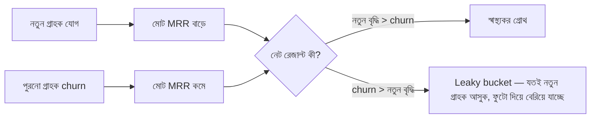

# ০৬. SaaS Metrics & KPIs

PMF আছে কিনা সেটা অনুভূতি দিয়ে বোঝার একটা সীমা আছে — এরপর দরকার সংখ্যা। SaaS ব্যবসায় কিছু নির্দিষ্ট মেট্রিক আছে যেগুলো ছাড়া তুমি বুঝতেই পারবে না ব্যবসাটা আসলে সুস্থ আছে নাকি ধীরে ধীরে ডুবছে। এই লেসনে আমরা সেই মূল সংখ্যাগুলো চিনবো।

সবচেয়ে গুরুত্বপূর্ণ মেট্রিক হলো **MRR (Monthly Recurring Revenue)** — প্রতি মাসে কত টাকা predictable revenue আসছে। ধরো তোমার ১০০ জন গ্রাহক আছে, প্রত্যেকে মাসে $২০ দেয় — তোমার MRR $২,০০০। MRR-কে ১২ দিয়ে গুণ করলে পাওয়া যায় **ARR (Annual Recurring Revenue)**, যেটা বিনিয়োগকারীরা আর বড় সিদ্ধান্ত নেয়ার সময় বেশি দেখে।

কিন্তু MRR একা বিভ্রান্তিকর হতে পারে যদি তুমি churn না দেখো। **Churn Rate** মানে কত শতাংশ গ্রাহক প্রতি মাসে সাবস্ক্রিপশন বন্ধ করে দিচ্ছে। ধরো তোমার ১০০ গ্রাহক ছিল মাসের শুরুতে, ৫ জন চলে গেলো — churn rate ৫%। এটা শুনতে ছোট মনে হলেও ভয়ংকর কম্পাউন্ডিং ইফেক্ট আছে — মাসে ৫% churn মানে বছরে প্রায় ৪৬% গ্রাহক হারানো, যদি নতুন গ্রাহক না আসে।

এই "leaky bucket" রূপকটা মনে রাখা জরুরি — একটা বালতিতে যত পানি ঢালো না কেন, নিচে ফুটো থাকলে বালতি ভরবে না। অনেক ফাউন্ডার মার্কেটিংয়ে টাকা ঢেলে নতুন গ্রাহক আনার চেষ্টা করে, কিন্তু churn ঠিক না করলে সেই টাকা কার্যত জলে যায়। তাই অভিজ্ঞ SaaS ফাউন্ডাররা প্রথমে churn কমানোর দিকে মনোযোগ দেয়, তারপর গ্রোথে বিনিয়োগ করে।

আরেকটা গুরুত্বপূর্ণ জোড়া মেট্রিক হলো **CAC (Customer Acquisition Cost)** আর **LTV (Lifetime Value)**। CAC মানে একজন গ্রাহক পেতে গড়ে কত টাকা খরচ হলো (মার্কেটিং + সেলস খরচ ভাগ নতুন গ্রাহক সংখ্যা দিয়ে)। LTV মানে একজন গ্রাহক তার পুরো জীবদ্দশায় (মানে সে যতদিন সাবস্ক্রাইবার থাকবে) গড়ে কত টাকা দেবে। এই দুটোর অনুপাত (LTV:CAC) দিয়ে বোঝা যায় ব্যবসাটা টেকসই কিনা।

| মেট্রিক | মানে কী | সুস্থ অবস্থা |
|---|---|---|
| Churn Rate | মাসিক কত % গ্রাহক হারাচ্ছি | SaaS-এ সাধারণত মাসিক ৩-৫%-এর নিচে ভালো |
| LTV:CAC | এক গ্রাহকের মূল্য বনাম তাকে পেতে খরচ | ৩:১ বা তার বেশি হলে ভালো |
| CAC Payback | CAC-এর টাকা তুলতে কত মাস লাগে | ১২ মাসের মধ্যে হলে ভালো |

ধরো তোমার CAC $১০০, আর একজন গ্রাহক গড়ে ১০ মাস থাকে, মাসে $২০ দেয় — তাহলে LTV = $২০০। LTV:CAC হলো ২:১, যেটা মোটামুটি দুর্বল। এখানে ফাউন্ডারের দুটো পথ আছে — হয় churn কমিয়ে গ্রাহককে বেশিদিন ধরে রাখা (LTV বাড়ানো), অথবা মার্কেটিং খরচ কমানো (CAC কমানো)। কোনটা করবে সেটা নির্ভর করে কোথায় সমস্যাটা আসলে বেশি — সেটা বের করতেই এই মেট্রিকগুলো ট্র্যাক করা দরকার, শুধু সংখ্যা জানার জন্য না।

এই মেট্রিকগুলো একটা ড্যাশবোর্ডের মতো — প্রতিটা আলাদা আলাদা প্রশ্নের উত্তর দেয়, কিন্তু একসাথে দেখলে পুরো ব্যবসার স্বাস্থ্যের ছবি পাওয়া যায়। Module 32-33-এ যখন আমরা লগিং আর মনিটরিং নিয়ে কথা বলেছিলাম, লক্ষ্য ছিল সিস্টেমের স্বাস্থ্য বোঝা — এখানে একই দর্শন, শুধু টেকনিক্যাল মেট্রিকের বদলে বিজনেস মেট্রিক।

এই মেট্রিকগুলো বোঝা গেলো, কিন্তু এখনো একটা বড় সিদ্ধান্ত বাকি — গ্রাহকের কাছ থেকে টাকা নেবে কীভাবে, কত নেবে? সেই সিদ্ধান্তই ঠিক করে দেয় MRR, churn, আর LTV সবকিছু। পরের লেসনে আমরা যাবো SaaS প্রাইসিং স্ট্র্যাটেজিতে।
