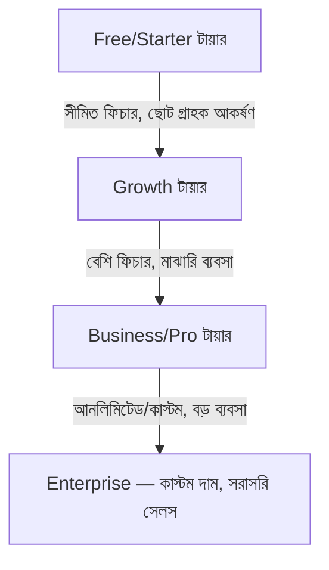

# ০৭. Pricing Strategies for SaaS

গত লেসনের শেষে দেখলাম LTV বাড়ানোর একটা পথ হলো প্রাইসিং ঠিকঠাক করা। প্রাইসিং নিয়ে বেশিরভাগ নতুন ফাউন্ডার সবচেয়ে বড় ভুলটা করে শুরুতেই — তারা দাম ঠিক করে নিজের অস্বস্তি থেকে, গ্রাহকের ভ্যালু থেকে না। মনে হয় "$১০ চাইলে বেশি চাওয়া হয়ে যাবে না তো?" — অথচ আসল প্রশ্নটা হওয়া উচিত "এই প্রোডাক্ট গ্রাহকের কতটা সময় বা টাকা বাঁচাচ্ছে?"

দাম ঠিক করার তিনটা সাধারণ পদ্ধতি আছে। **Cost-plus pricing** মানে তোমার খরচ (সার্ভার, ডেভেলপমেন্ট সময়) হিসাব করে তার উপর লাভ যোগ করে দাম বসানো — এটা সবচেয়ে সহজ কিন্তু SaaS-এ সবচেয়ে দুর্বল পদ্ধতি, কারণ এটা গ্রাহক কতটা ভ্যালু পাচ্ছে সেটা হিসাবেই নেয় না। **Competitor-based pricing** মানে প্রতিযোগীরা যা চার্জ করে তার কাছাকাছি দাম রাখা — এটা একটা নিরাপদ শুরু, কিন্তু তোমাকে সবসময় অন্যের ছায়ায় রাখে। সবচেয়ে শক্তিশালী পদ্ধতি হলো **Value-based pricing** — গ্রাহক তোমার প্রোডাক্ট থেকে কত টাকার সমান সুবিধা পাচ্ছে সেটা হিসাব করে, তার একটা অংশ দাম হিসেবে নেয়া।

রাফির উদাহরণে ফিরি — যদি InvoiceBondhu তার প্রতি মাসে ৩ ঘণ্টা সময় বাঁচায়, আর রাফির ঘণ্টার মূল্য $৫ হয়, তাহলে সে মাসে $১৫ ভ্যালু পাচ্ছে শুধু সময়ের হিসেবে। তার উপর পেমেন্ট রিমাইন্ডারের কারণে দেরিতে টাকা পাওয়ার সমস্যা কমলে সেটাও একটা বাড়তি ভ্যালু। এই হিসাব থেকে $৯-১৫/মাস দাম বসানো যৌক্তিক মনে হয় — এটা "কম দাম রাখলে বেশি মানুষ কিনবে" এই অনুমানের চেয়ে অনেক শক্ত ভিত্তি।

SaaS-এ সবচেয়ে প্রচলিত মডেল হলো **টায়ার্ড প্রাইসিং** — একাধিক স্তরে দাম রাখা, যাতে ছোট আর বড় গ্রাহক দুজনেই তাদের বাজেট অনুযায়ী বেছে নিতে পারে।

| টায়ার | টার্গেট | সাধারণ দাম রেঞ্জ | উদ্দেশ্য |
|---|---|---|---|
| Free/Trial | নতুন ইউজার, প্রথম পরিচয় | $০ | ঘর্ষণ কমানো, ব্যবহার শুরু করানো |
| Starter | ছোট ব্যবসা/সোলো | $৯-২৯/মাস | মূল রেভিনিউ বেস |
| Business | মাঝারি টিম | $৪৯-৯৯/মাস | বেশি ফিচার, বেশি ইউজার সিট |
| Enterprise | বড় প্রতিষ্ঠান | কাস্টম | কাস্টম চুক্তি, বড় রেভিনিউ প্রতি গ্রাহক |

একটা গুরুত্বপূর্ণ সিদ্ধান্ত হলো Free Tier রাখবে নাকি শুধু Free Trial। Free Tier মানে চিরকাল বিনামূল্যে একটা সীমিত ভার্সন ব্যবহার করা যায় (যেমন Slack-এর ফ্রি প্ল্যান) — এটা ইউজার বেস বাড়াতে সাহায্য করে কিন্তু সার্ভার খরচ বাড়ায় আর অনেকে কখনো আপগ্রেড করে না। Free Trial মানে ১৪ বা ৩০ দিন পুরো ফিচার ফ্রি ব্যবহার করার পর হয় টাকা দিতে হবে নয় বন্ধ হয়ে যাবে — এটা দ্রুত সিদ্ধান্তে বাধ্য করে, তাই ছোট টিমের জন্য প্রায়ই বেশি বাস্তবসম্মত, কারণ ফ্রি ইউজারদের সাপোর্ট দেয়ার মতো লোকবল থাকে না।

প্রাইসিং কখনো একবার ঠিক করে ভুলে যাওয়ার জিনিস না। Module 43-এর ০৫ লেসনে PMF নিয়ে যেমন বলেছিলাম এটা একটা চলমান প্রক্রিয়া, প্রাইসিংও তেমন — বাজার থেকে সিগন্যাল পেয়ে (যেমন সবাই সহজেই সবচেয়ে দামি টায়ার কিনে ফেলছে, মানে দাম কম রাখা হয়েছে) ধীরে ধীরে সামঞ্জস্য করতে হয়।

দাম ঠিক থাকলেও কেউ যদি তোমার প্রোডাক্টের কথা না জানে, সে কিনবে কীভাবে? এখন আমাদের নজর দিতে হবে গ্রাহক আসলে কোথা থেকে আসবে, কীভাবে তাদের কাছে পৌঁছাবে — সেটাই পরের লেসনের বিষয়, কাস্টমার অ্যাকুইজিশন আর গ্রোথ স্ট্র্যাটেজি।
