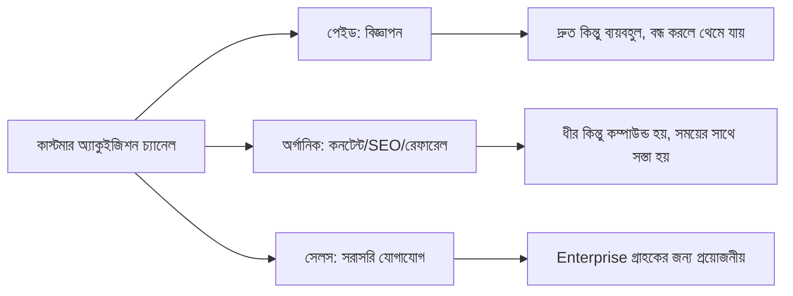

# ০৮. Customer Acquisition & Growth Strategies

দাম ঠিক হলো, প্রোডাক্ট রেডি — কিন্তু SaaS ব্যবসায় সবচেয়ে বড় প্রশ্নটা এখনো বাকি: গ্রাহক আসবে কোথা থেকে? "ভালো প্রোডাক্ট বানালে মানুষ এমনিতেই পেয়ে যাবে" — এই ধারণা প্রায় সবসময় ভুল প্রমাণিত হয়। কাস্টমার অ্যাকুইজিশন একটা ইচ্ছাকৃত, পরিকল্পিত কাজ, দুর্ঘটনা না।

কাস্টমার অ্যাকুইজিশনের চ্যানেলগুলোকে মোটাদাগে দুই ভাগে ভাগ করা যায় — **পেইড** আর **অর্গানিক**। পেইড মানে বিজ্ঞাপনে টাকা ঢেলে গ্রাহক আনা (Google Ads, Facebook Ads) — দ্রুত ফল দেয়, কিন্তু টাকা বন্ধ করলেই গ্রাহক আসা বন্ধ হয়ে যায়। অর্গানিক মানে কনটেন্ট, SEO, রেফারেল, কমিউনিটির মাধ্যমে ধীরে ধীরে গ্রাহক আসা — সময় লাগে বেশি, কিন্তু একবার তৈরি হয়ে গেলে দীর্ঘমেয়াদে সস্তা আর টেকসই।

ছোট বাজেটের সোলো ফাউন্ডারদের জন্য (যেটা নিয়ে আমরা Module 44-এ বিস্তারিত যাবো) অর্গানিক চ্যানেলগুলো প্রায়ই বাস্তবসম্মত শুরু, কারণ পেইড অ্যাডে টাকা ঢালার আগে সেই টাকা তোলার মতো একটা প্রমাণিত ফানেল লাগে। তবে অর্গানিক গ্রোথের একটা কৌশলগত অস্ত্র হলো **রেফারেল লুপ** — বিদ্যমান গ্রাহককে নতুন গ্রাহক আনার প্রণোদনা দেয়া। Dropbox-এর বিখ্যাত উদাহরণ — বন্ধুকে ইনভাইট করলে দুজনেই বাড়তি স্টোরেজ পেতো। এই একটা ফিচার তাদের গ্রোথের একটা বড় অংশ চালিয়েছিল।

গ্রোথ মাপার একটা সহজ ফ্রেমওয়ার্ক হলো **ফানেল** — একজন সম্ভাব্য গ্রাহক প্রথম তোমার প্রোডাক্ট সম্পর্কে জানা থেকে শুরু করে পেইড গ্রাহক হওয়া পর্যন্ত কয়েকটা ধাপ পার হয়।

| ধাপ | মানে | উদাহরণ মেট্রিক |
|---|---|---|
| Awareness | প্রোডাক্ট সম্পর্কে জানলো | ওয়েবসাইট ভিজিট |
| Interest | আগ্রহী হয়ে সাইন-আপ করলো | ফ্রি ট্রায়াল সাইন-আপ |
| Activation | প্রথম ভ্যালু পেলো | প্রথম ইনভয়েস পাঠানো |
| Retention | ব্যবহার চালিয়ে গেলো | দ্বিতীয় মাসেও সক্রিয় |
| Revenue | পেইড গ্রাহকে পরিণত হলো | ট্রায়াল থেকে পেইড কনভার্সন |

এই ফানেলের প্রতিটা ধাপে একটা করে ফুটো থাকতে পারে। ধরো ১০০ জন সাইন-আপ করলো, কিন্তু মাত্র ২০ জন প্রথম ইনভয়েস পাঠালো (Activation-এ বড় ড্রপ)। এখানে সমস্যা মার্কেটিংয়ে না, অনবোর্ডিং-এ — মানুষ সাইন-আপের পর কী করতে হবে বুঝতে পারছে না। এই "Activation" ধাপটাকে অনেক SaaS কোম্পানি সবচেয়ে বেশি গুরুত্ব দেয়, কারণ এখানেই আসলে গ্রাহক প্রথমবার বুঝতে পারে প্রোডাক্টটা তার কাজে লাগছে কিনা — একেই বলে "Aha moment"।

গ্রোথ স্ট্র্যাটেজি বাছাই করার সময় মনে রাখা দরকার — সব চ্যানেল সব প্রোডাক্টের জন্য কাজ করে না। B2B SaaS-এর জন্য LinkedIn কনটেন্ট বা কোল্ড ইমেইল কাজ করতে পারে, কিন্তু কনজিউমার প্রোডাক্টের জন্য TikTok বা Instagram বেশি কার্যকর হতে পারে। Module 43-এর ০২ লেসনে যেমন বলেছিলাম, গ্রাহক কোথায় সময় কাটায় সেটা বোঝাই প্রথম কাজ — সেই একই রিসার্চ এখানেও কাজে লাগে, শুধু প্রশ্নটা এখন "কোথায় খুঁজবো" থেকে "কোথায় পৌঁছাবো"-তে বদলে গেছে।

গ্রাহক পাওয়া গেলো, কিন্তু তারা যদি প্রোডাক্ট ব্যবহার করতে করতে হতাশ হয়ে যায়, সব পরিশ্রম বৃথা। তাই এরপর গুরুত্বপূর্ণ হয়ে ওঠে তাদের কথা শোনা আর সেই অনুযায়ী প্রোডাক্ট বদলানো — এটাই পরের লেসনের বিষয়, ইউজার ফিডব্যাক আর প্রোডাক্ট ইটারেশন।
