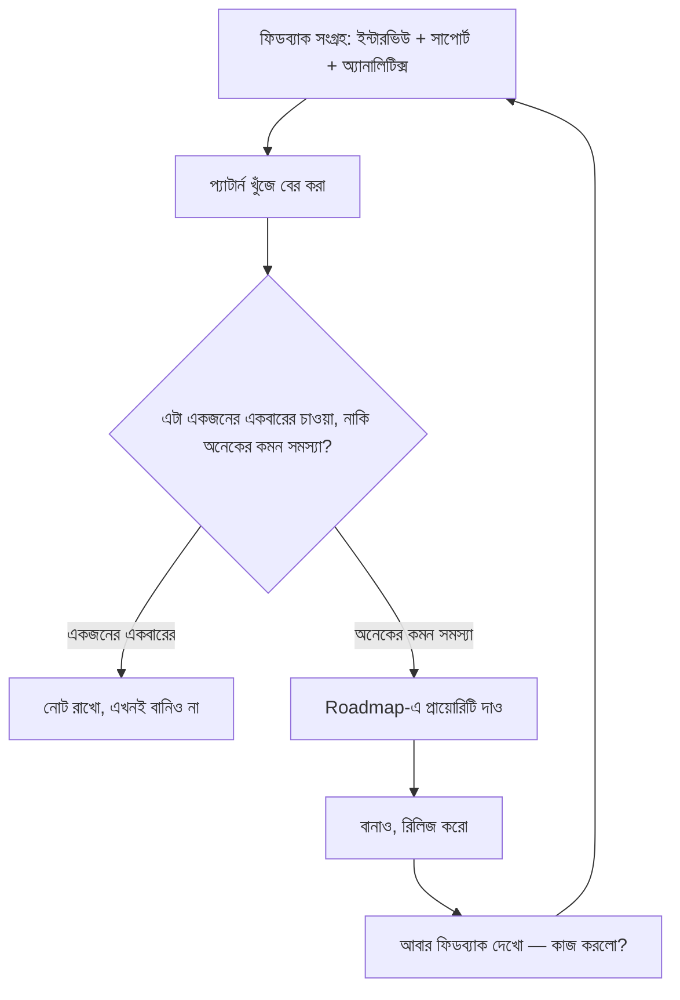

# ০৯. User Feedback & Product Iteration

গ্রাহক পাওয়া গেলো, তারা প্রোডাক্ট ব্যবহারও শুরু করলো — কিন্তু এখানেই কাজ শেষ না, বরং এখান থেকেই আসল কাজ শুরু। প্রোডাক্ট কখনো একবার বানিয়ে ফেলে রাখার জিনিস না; এটা গ্রাহকের প্রতিক্রিয়া শুনে ক্রমাগত পরিবর্তন করার একটা চলমান চক্র।

ফিডব্যাক সংগ্রহের উৎস অনেক রকম হতে পারে — সরাসরি ইউজার ইন্টারভিউ (Module 43-এর ০৩ লেসনে যেটা শিখেছি), সাপোর্ট টিকেট, ফিচার রিকোয়েস্ট ফর্ম, অ্যাপের ভেতরে ছোট সার্ভে, আর ব্যবহারের ডেটা (analytics) — মানুষ কোন ফিচার ব্যবহার করছে, কোনটা ছুঁয়েও দেখছে না। এই বিভিন্ন উৎসের মধ্যে একটা গুরুত্বপূর্ণ পার্থক্য বোঝা দরকার — মানুষ কী **বলে** সেটা আর মানুষ কী **করে** সেটা প্রায়ই আলাদা জিনিস। কেউ হয়তো বলবে "আমার একটা ডার্ক মোড দরকার", কিন্তু তার আসল ব্যবহারের ডেটা দেখাবে সে আসলে রিপোর্ট এক্সপোর্ট করতে গিয়ে বারবার আটকে যাচ্ছে।

এই কারণেই ফিডব্যাক শোনার সময় "গ্রাহক যা চাইছে তা সরাসরি বানানো" আর "গ্রাহকের আসল সমস্যা বোঝা" — এই দুটোর মধ্যে পার্থক্য করতে শিখতে হয়। বিখ্যাত একটা কথা আছে — Henry Ford বলেছিলেন বলে প্রচলিত, "মানুষকে জিজ্ঞেস করলে তারা বলতো আরো দ্রুত ঘোড়া চাই, গাড়ি চাইতো না।" গ্রাহক তার সমস্যাটা ভালো জানে, কিন্তু সমাধানের ডিজাইন করাটা তোমার কাজ।

এই চক্রটাকে বলা হয় **Build-Measure-Learn লুপ** (Eric Ries-এর Lean Startup থেকে আসা ধারণা) — কিছু বানাও, ফলাফল মাপো, তা থেকে শেখো, তারপর আবার বানাও। এই লুপ যত দ্রুত ঘোরানো যায়, প্রোডাক্ট তত দ্রুত উন্নত হয়। এখানেই ছোট টিম বা সোলো ডেভেলপারের একটা লুকানো সুবিধা আছে — বড় কোম্পানিতে একটা ফিচার রিলিজ করতে অনেক মিটিং, অনুমোদন লাগে; একা কাজ করলে সকালে আইডিয়া পেয়ে বিকেলেই রিলিজ করা সম্ভব।

ফিচার প্রায়োরিটি ঠিক করার একটা ব্যবহারিক পদ্ধতি হলো প্রতিটা রিকোয়েস্টকে দুইটা প্রশ্নে ফেলা — এটা কত মানুষকে সাহায্য করবে (Impact), আর এটা বানাতে কতটা সময়/শ্রম লাগবে (Effort)।

| | কম Effort | বেশি Effort |
|---|---|---|
| **বেশি Impact** | এখনই বানাও (Quick win) | পরিকল্পনা করে বানাও (Big bet) |
| **কম Impact** | ফাঁকা সময়ে করো | এড়িয়ে যাও |

এই ম্যাট্রিক্সটা ব্যবহার করলে দেখা যায় সবচেয়ে চিৎকার করে চাওয়া ফিচার সবসময় সবচেয়ে গুরুত্বপূর্ণ না — কখনো কখনো একটা ছোট UI ফিক্স অনেক বেশি মানুষের দৈনন্দিন হতাশা কমায় একটা বড় নতুন ফিচারের চেয়ে।

একটা সতর্কতাও মনে রাখা দরকার — সব ফিডব্যাক সমানভাবে গুরুত্বপূর্ণ না। যে গ্রাহক তোমার মূল persona-র বাইরে (মনে করো ইনভয়েসিং টুলে একজন বড় এন্টারপ্রাইজ ক্লায়েন্ট বিশাল কমপ্লেক্স ফিচার চাইছে), তার চাওয়া মেনে নিলে প্রোডাক্ট মূল ভ্যালু প্রোপোজিশন থেকে সরে যেতে পারে। প্রতিটা ফিডব্যাককে persona আর ভ্যালু প্রোপোজিশনের ফিল্টার দিয়ে যাচাই করা — এই অভ্যাসটাই প্রোডাক্টকে ফোকাসড রাখে।

এই পুরো ফিডব্যাক লুপ যখন কার্যকরভাবে চলতে থাকে, প্রোডাক্ট নিজে থেকেই ধীরে ধীরে বাজারের চাহিদার সাথে আরো নিখুঁতভাবে মিলে যায়। এখন সময় এসেছে এই সবকিছুকে — persona, ভ্যালু প্রোপোজিশন, মেট্রিক্স, প্রাইসিং, অ্যাকুইজিশন, ফিডব্যাক — একটা সুসংগঠিত পরিকল্পনায় একত্র করার, যেটাই আমাদের এই মডিউলের শেষ লেসন — গো-টু-মার্কেট স্ট্র্যাটেজি ডেভেলপমেন্ট।
