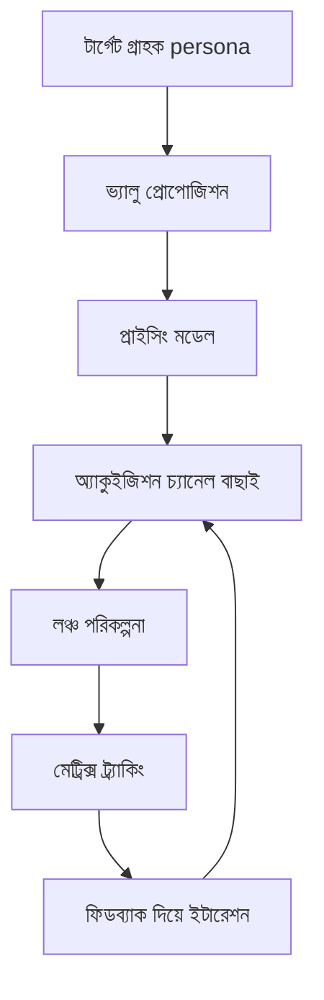

# ১০. Go-to-Market Strategy Development

এই মডিউলের প্রতিটা লেসন একেকটা পাজল-পিস দিয়েছে — SaaS মডেল কী (০১), বাজার আর কম্পিটিটর বোঝা (০২), কাস্টমার ডিসকভারি আর persona (০৩), ভ্যালু প্রোপোজিশন (০৪), PMF মাপা (০৫), মেট্রিক্স (০৬), প্রাইসিং (০৭), অ্যাকুইজিশন (০৮), ফিডব্যাক লুপ (০৯)। এই শেষ লেসনে আমরা এই সবকিছু একসাথে জোড়া লাগিয়ে একটা সুসংগঠিত **Go-to-Market (GTM) Strategy** বানাবো — একটা লিখিত পরিকল্পনা যেটা বলে দেয় প্রোডাক্ট লঞ্চের আগে, চলাকালীন, আর পরে কী করতে হবে।

GTM স্ট্র্যাটেজিকে একটা রোডম্যাপের মতো ভাবতে পারো — এটা না থাকলে প্রতিটা সিদ্ধান্ত ছন্নছাড়া মনে হয় (আজকে ফেসবুকে বিজ্ঞাপন দিলাম, কালকে একটা ব্লগ লিখলাম, পরশু দাম কমিয়ে দিলাম), কিন্তু GTM থাকলে প্রতিটা কাজ একটা বড় লক্ষ্যের সাথে যুক্ত থাকে।

একটা ভালো GTM ডকুমেন্টে সাধারণত কয়েকটা প্রশ্নের নির্দিষ্ট উত্তর থাকে। কে টার্গেট গ্রাহক (persona থেকে আসে)? কেন তারা কিনবে (ভ্যালু প্রোপোজিশন থেকে আসে)? দাম কত আর কোন টায়ারে (প্রাইসিং থেকে আসে)? কোন চ্যানেলে তাদের কাছে পৌঁছাবো (অ্যাকুইজিশন থেকে আসে)? সাফল্য কীভাবে মাপবো (মেট্রিক্স থেকে আসে)? এই প্রশ্নগুলো আলাদা আলাদা লেসনে শেখা হলেও, GTM-এ এসে এগুলো একটা সংগত গল্পে পরিণত হয়।

লঞ্চের ক্ষেত্রে একটা ব্যবহারিক পরামর্শ হলো — একবারে বিশাল লঞ্চের চেষ্টা না করে ধাপে ধাপে এগোনো। প্রথমে একটা ছোট **beta গ্রুপ** (হয়তো তোমার ইন্টারভিউ করা সেই ১০-১৫ জনের কয়েকজন) দিয়ে শুরু করা, তাদের ফিডব্যাক দিয়ে বড় সমস্যাগুলো ঠিক করা, তারপর ধীরে ধীরে বৃহত্তর বাজারে খোলা। এতে করে বড় ভুল প্রকাশ্যে হওয়ার আগেই ধরা পড়ে, আর প্রথম কয়েকজন গ্রাহক নিজেরাই পরবর্তী গ্রাহকদের জন্য সামাজিক প্রমাণ (social proof) হয়ে ওঠে — testimonial, রিভিউ, রেফারেল।

| ধাপ | সময়কাল (উদাহরণ) | লক্ষ্য |
|---|---|---|
| Private Beta | ২-৪ সপ্তাহ | মূল বাগ আর ঘর্ষণ ঠিক করা, প্রথম testimonial সংগ্রহ |
| Soft Launch | ২-৪ সপ্তাহ | সীমিত চ্যানেলে (যেমন একটা Reddit কমিউনিটি) পরীক্ষা |
| Public Launch | চলমান | সব চ্যানেলে পূর্ণ মার্কেটিং, PR |

GTM স্ট্র্যাটেজি একবার লিখে ফেললেই শেষ না — এটা একটা জীবন্ত ডকুমেন্ট। PMF লেসনে (০৫) যেমন শিখেছি, বাজারের প্রতিক্রিয়া বলে দেবে কোথায় স্ট্র্যাটেজি বদলাতে হবে — হয়তো দেখা যাবে যে চ্যানেল কাজ করবে ভেবেছিলে সেটা কাজ করছে না, বা যে persona টার্গেট করেছিলে তার চেয়ে অন্য একটা persona বেশি সাড়া দিচ্ছে। GTM স্ট্র্যাটেজির আসল শক্তি পরিকল্পনায় না, দ্রুত শেখা আর সামঞ্জস্য করার ক্ষমতায়।

এই মডিউলে আমরা একটা প্রোডাক্টকে ব্যবসায়িক দৃষ্টিকোণ থেকে দেখতে শিখলাম — মার্কেট রিসার্চ থেকে শুরু করে GTM পর্যন্ত পুরো যাত্রা। কিন্তু এই সবকিছু জানা আর নিজে একা হাতে বাস্তবায়ন করা — দুটো ভিন্ন চ্যালেঞ্জ। বড় কোম্পানিতে এই কাজগুলো আলাদা আলাদা টিম করে (মার্কেটিং টিম, প্রোডাক্ট টিম, সেলস টিম), কিন্তু একজন সোলো ডেভেলপারকে এই সব ভূমিকা একাই পালন করতে হয় — কোডার, প্রোডাক্ট ম্যানেজার, মার্কেটার, সব একসাথে। ঠিক এই বাস্তবতা নিয়েই পরের মডিউল শুরু হচ্ছে — ইনডি হ্যাকিং আর সোলো এন্টারপ্রেনরশিপ।
