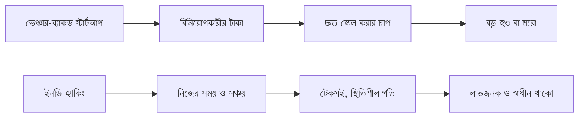

# ০১. Introduction to Indie Hacking

Module 43-এ আমরা GTM স্ট্র্যাটেজি নিয়ে শেষ করেছিলাম একটা পর্যবেক্ষণ দিয়ে — বড় কোম্পানিতে প্রোডাক্ট, মার্কেটিং, সেলস আলাদা আলাদা টিম সামলায়, কিন্তু একজনকে যদি এই সবকিছু একা করতে হয়? এই বাস্তবতারই নাম **Indie Hacking** — একা বা খুব ছোট (১-৩ জনের) টিম নিয়ে, বাইরের বিনিয়োগ ছাড়া, নিজের সম্পদ দিয়ে একটা টেকসই সফটওয়্যার ব্যবসা গড়ে তোলা।

Indie Hacker শব্দটা প্রচলিত হয়েছে মূলত IndieHackers.com কমিউনিটির মাধ্যমে, যেখানে ডেভেলপাররা তাদের ছোট ছোট SaaS বা টুলের রেভিনিউ, শেখা, আর সংগ্রাম প্রকাশ্যে শেয়ার করে। এটা "স্টার্টআপ ফাউন্ডার" থেকে আলাদা একটা মানসিকতা — একজন ভেঞ্চার-ব্যাকড স্টার্টআপ ফাউন্ডার লক্ষ্য রাখে দ্রুত বড় হওয়া, বিলিয়ন-ডলার কোম্পানি বানানো, বিনিয়োগকারীদের টাকা ফেরত দেয়া। একজন ইনডি হ্যাকার লক্ষ্য রাখে টেকসই আয়, স্বাধীনতা, আর নিজের শর্তে কাজ করা — মাসে $৫,০০০ আয় করা একটা প্রোডাক্ট, যেটা একাই চালানো যায়, অনেক ইনডি হ্যাকারের কাছে $৫০ মিলিয়ন ফান্ডিং পাওয়া স্টার্টআপের চেয়ে বেশি আকর্ষণীয়।

এই দুটো পথের মধ্যে কোনোটাই "ভালো" বা "খারাপ" না — এগুলো ভিন্ন ভিন্ন লক্ষ্য আর ঝুঁকি সহনশীলতার মানুষের জন্য। কিন্তু যে বইয়ে আমরা এতদিন Python/FastAPI, ডাটাবেজ, আর্কিটেকচার, আর এখন বিজনেস অ্যানালাইসিস শিখেছি, তার স্বাভাবিক পরবর্তী ধাপ হলো ইনডি হ্যাকিং — কারণ এখানে তুমি শেখা প্রতিটা স্কিল নিজেই প্রয়োগ করবে, কারো অনুমতি ছাড়া।

ইনডি হ্যাকিংয়ের সবচেয়ে বড় সুবিধা হলো **গতি আর স্বাধীনতা**। কোনো মিটিং নেই যেখানে পাঁচজন ম্যানেজার একটা বাটনের রং নিয়ে তর্ক করছে। একটা আইডিয়া মাথায় এলে সেদিনই কোড লেখা শুরু করা যায়, সপ্তাহখানেকের মধ্যে লঞ্চ করা যায়। কিন্তু এর একটা বড় খরচও আছে — **একাকীত্ব আর সব দায়িত্ব একার কাঁধে**। কোড লেখা, বাগ ফিক্স করা, কাস্টমার সাপোর্ট দেয়া, মার্কেটিং করা, ট্যাক্স হিসাব করা — সব একজনকে করতে হয়, আর ভুল হলে দোষ চাপানোর কেউ নেই।

| দিক | ইনডি হ্যাকিং | ভেঞ্চার-ব্যাকড স্টার্টআপ |
|---|---|---|
| টাকার উৎস | নিজের আয়/সঞ্চয় | বিনিয়োগকারী |
| গতি | নিজের গতিতে | দ্রুত স্কেল করার চাপ |
| ঝুঁকি | সীমিত (নিজের সময়/টাকা) | বেশি (অন্যের টাকা, প্রত্যাশা) |
| লক্ষ্য | টেকসই আয়, স্বাধীনতা | বড় এক্সিট বা IPO |
| সিদ্ধান্ত | একাই নেয়া যায় | বোর্ড/বিনিয়োগকারীর অনুমোদন লাগে |

সফল ইনডি হ্যাকারদের একটা কমন প্যাটার্ন আছে — তারা বিশাল, revolutionary আইডিয়া খোঁজে না; তারা ছোট, নির্দিষ্ট একটা সমস্যা খুঁজে বের করে যেটা একটা ছোট গ্রুপ মানুষের জন্য বাস্তব ব্যথার কারণ, আর সেটা যথেষ্ট ভালোভাবে সমাধান করে যে মানুষ টাকা দিতে রাজি হয়। Module 43-এ শেখা persona আর ভ্যালু প্রোপোজিশনের ধারণাগুলো এখানে হুবহু কাজে লাগবে — শুধু পার্থক্য হলো এখন পুরো প্রক্রিয়াটা তুমি একাই চালাবে, ছোট বাজেট আর সীমিত সময় নিয়ে।

এই মডিউলে আমরা ইনডি হ্যাকিংয়ের পুরো যাত্রা কভার করবো — আইডিয়া খোঁজা থেকে শুরু করে কোড লেখা, মার্কেটিং, রেভিনিউ মডেল, প্রোডাক্টিভিটি, আর সফল উদাহরণ পর্যন্ত। প্রথম ধাপ হলো সবচেয়ে গুরুত্বপূর্ণ প্রশ্নের উত্তর খোঁজা — কোন আইডিয়াটা নিয়ে কাজ শুরু করবে, আর সেটা আসলেই ভ্যালিড কিনা? সেটাই পরের লেসনের বিষয়।
