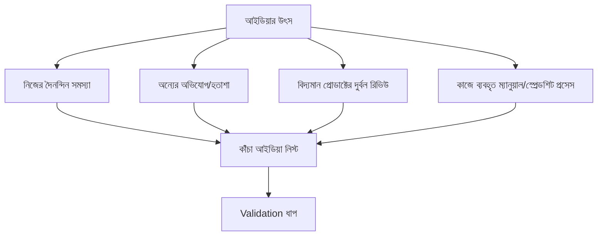

# ০২. Finding & Validating Business Ideas

আগের লেসনে আমরা বললাম সফল ইনডি হ্যাকাররা বিশাল আইডিয়ার পেছনে ছোটে না — তারা ছোট, নির্দিষ্ট সমস্যা খোঁজে। কিন্তু বাস্তবে "আইডিয়া কোথায় পাবো" — এটাই বেশিরভাগ মানুষের প্রথম আটকে যাওয়ার জায়গা। ভালো খবর হলো, ভালো আইডিয়া আকাশ থেকে পড়ে না — এগুলো নির্দিষ্ট জায়গা থেকে খুঁজে বের করা যায়।

সবচেয়ে নির্ভরযোগ্য উৎস হলো **নিজের সমস্যা**। তুমি নিজে যে কাজ করতে গিয়ে বিরক্ত হও, যেটার জন্য বাজারে ভালো সমাধান নেই বা যা আছে তা অতিরিক্ত জটিল বা দামি — সেটাই একটা সম্ভাব্য আইডিয়ার বীজ। এই পদ্ধতির সুবিধা হলো তুমি নিজেই তোমার প্রথম গ্রাহক, তাই কাস্টমার ডিসকভারির (Module 43, লেসন ০৩) অনেকটা কাজ তোমার মধ্যেই আগে থেকে আছে। দ্বিতীয় উৎস হলো **অন্যের অভিযোগ শোনা** — বন্ধু, সহকর্মী, অনলাইন ফোরামে মানুষ যখন বলে "উফ, এই কাজটা করতে এত কষ্ট হয়", প্রতিটা অভিযোগ একটা সম্ভাব্য প্রোডাক্ট আইডিয়া।

আইডিয়া পাওয়ার পর সবচেয়ে বিপজ্জনক ভুল হলো সরাসরি কোড লেখা শুরু করা। এখানে দরকার **validation** — খরচ আর সময় ঢালার আগে প্রমাণ খোঁজা যে মানুষ এই সমস্যার জন্য সত্যিই টাকা দেবে। Module 43-এ শেখা মার্কেট রিসার্চ আর কাস্টমার ডিসকভারির কৌশল এখানে সরাসরি প্রয়োগ হয় — সম্ভাব্য গ্রাহকদের সাথে কথা বলা, তারা এখন কীভাবে সমস্যাটা সামলাচ্ছে জানা, আর প্রতিযোগী প্রোডাক্ট খুঁজে দেখা তারা কতটা ভালো সমাধান দিচ্ছে।

একটা কার্যকর, কম-ঝুঁকির validation পদ্ধতি হলো **"Landing Page Test"** — পুরো প্রোডাক্ট বানানোর আগে শুধু একটা সিম্পল ওয়েবসাইট বানানো, যেখানে ভ্যালু প্রোপোজিশন লেখা থাকবে আর একটা "আগ্রহী? ইমেইল দাও" ফর্ম থাকবে। এই পেজে সামান্য ট্রাফিক পাঠিয়ে (বন্ধুদের মধ্যে শেয়ার করে, নির্দিষ্ট কমিউনিটিতে পোস্ট করে) দেখা যায় কতজন সত্যিই ইমেইল দিচ্ছে। কেউ ইমেইল না দিলে এটা একটা শক্তিশালী সিগন্যাল — সমস্যাটা যত বড় ভেবেছিলে ততটা না, অথবা ভ্যালু প্রোপোজিশনে সমস্যা আছে।

| Validation পদ্ধতি | খরচ | সময় | কী প্রমাণ করে |
|---|---|---|---|
| কাস্টমার ইন্টারভিউ | কম | কয়েক দিন | সমস্যা আসলেই আছে কিনা |
| Landing page + ইমেইল সাইন-আপ | কম | ১ সপ্তাহ | মানুষ আগ্রহী কিনা |
| Pre-order/ওয়েটলিস্ট পেমেন্ট | কম | ১-২ সপ্তাহ | মানুষ টাকা দিতে রাজি কিনা (সবচেয়ে শক্তিশালী প্রমাণ) |
| MVP বানিয়ে ছেড়ে দেয়া | মাঝারি | ২-৪ সপ্তাহ | বাস্তব ব্যবহারে ভ্যালু আছে কিনা |

আরেকটা গুরুত্বপূর্ণ ফিল্টার হলো — আইডিয়াটা একজন সোলো ডেভেলপারের জন্য বাস্তবসম্মত কিনা। এমন একটা আইডিয়া যেটায় বিশাল সেলস টিম, রেগুলেটরি অনুমোদন, বা কোটি টাকার ইনফ্রাস্ট্রাকচার লাগে — সেটা হয়তো ভালো ব্যবসা হতে পারে, কিন্তু ইনডি হ্যাকিং-এর জন্য উপযুক্ত না। যে আইডিয়া তুমি কয়েক সপ্তাহে একা বানিয়ে বাজারে ছাড়তে পারো, ছোট শুরু করে ধীরে ধীরে বড় করতে পারো — সেটাই আসল সোনার খনি।

আইডিয়া ভ্যালিডেট হয়ে গেলে, এরপর আসল কাজ শুরু — সেটা বাস্তবে বানানো, একা হাতে, সীমিত সময় নিয়ে। এই একা বানানোর প্রক্রিয়ায় কী কী বাস্তব চ্যালেঞ্জ আসে আর কীভাবে সেগুলো সামলাতে হয় — সেটাই পরের লেসনের বিষয়।
