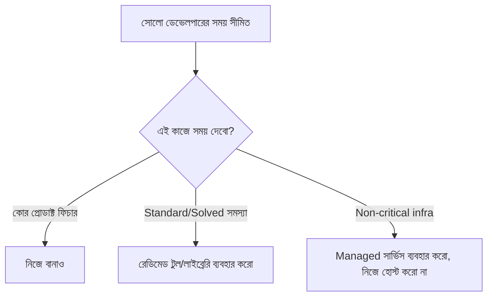

# ০৩. Building as a Solo Developer

আইডিয়া ভ্যালিডেট হয়ে গেলে এবার আসল চ্যালেঞ্জ — এটা বানানো, একা। এই কোর্সের প্রথম চল্লিশটার বেশি মডিউলে আমরা টেকনিক্যাল স্কিল শিখেছি — Python/FastAPI, ডাটাবেজ, আর্কিটেকচার, টেস্টিং, সিকিউরিটি। একজন সোলো ডেভেলপারের চ্যালেঞ্জ এই স্কিলগুলোর অভাব না, বরং এই সবগুলোকে একজন মানুষ, সীমিত সময়ে, সঠিক অগ্রাধিকার দিয়ে ব্যবহার করা।

একজন টিমে কাজ করা ডেভেলপারের সাথে সোলো ডেভেলপারের সবচেয়ে বড় পার্থক্য হলো — টিমে প্রতিটা সিদ্ধান্তের পেছনে যাচাই-বাছাই থাকে (কোড রিভিউ, আর্কিটেকচার মিটিং), কিন্তু একা কাজ করলে প্রতিটা সিদ্ধান্ত তোমার নিজের। এটা একদিকে স্বাধীনতা, অন্যদিকে বিপদ — কারণ ভুল সিদ্ধান্ত ধরার কেউ নেই। এই বিপদ কমানোর একটা উপায় হলো ইচ্ছাকৃতভাবে **সিদ্ধান্তের সংখ্যা কমিয়ে ফেলা** — যতটা সম্ভব প্রমাণিত, বোরিং টুল ব্যবহার করা, নিজে নতুন কিছু আবিষ্কার করার চেষ্টা না করা।

উদাহরণ দিয়ে বুঝি — একজন সোলো ডেভেলপার যদি নিজের ইনভয়েসিং SaaS বানায়, তার অথেন্টিকেশন সিস্টেম (Module 12, ২৯), পেমেন্ট প্রসেসিং, ইমেইল পাঠানো — এগুলো নিজে থেকে স্ক্র্যাচ থেকে বানানো সময়ের অপচয়। Stripe দিয়ে পেমেন্ট, Auth0 বা Clerk দিয়ে অথ, Resend বা SendGrid দিয়ে ইমেইল — এই "boring" পছন্দগুলো তোমাকে সময় দেয় সেই জায়গায় মনোযোগ দিতে যেটা তোমার প্রোডাক্টকে আলাদা করে — মূল ভ্যালু প্রোপোজিশন (Module 43, লেসন ০৪)।

এই নীতিটার একটা নাম আছে — **"Build vs Buy"** সিদ্ধান্ত। প্রশ্নটা সবসময় "আমি কি এটা বানাতে পারবো?" না, বরং "এটা বানানো কি আমার সময়ের সবচেয়ে ভালো ব্যবহার?" যেই জিনিস তোমার প্রোডাক্টকে ইউনিক করে না, সেটা কেনা বা রেডিমেড ব্যবহার করাই বুদ্ধিমানের কাজ।

| কাজ | নিজে বানাবে? | কারণ |
|---|---|---|
| পেমেন্ট প্রসেসিং | না | Stripe/bKash API ব্যবহার করো, সিকিউরিটি ঝুঁকি এড়াও |
| ইউজার অথেন্টিকেশন | সাধারণত না | রেডিমেড লাইব্রেরি/সার্ভিস ব্যবহার করো |
| মূল ফিচার (তোমার ভ্যালু প্রোপোজিশন) | হ্যাঁ | এটাই তোমার প্রতিযোগিতার সুবিধা |
| ইমেইল ডেলিভারি ইনফ্রাস্ট্রাকচার | না | ডেলিভারেবিলিটি জটিল, ম্যানেজড সার্ভিস ব্যবহার করো |

সময় ব্যবস্থাপনার পাশাপাশি সোলো ডেভেলপারকে **টেকনিক্যাল ডেট** নিয়েও ভিন্নভাবে ভাবতে হয়। বড় কোম্পানিতে টেকনিক্যাল ডেট খারাপ শব্দ, কিন্তু একজন সোলো ফাউন্ডারের জন্য শুরুতে ইচ্ছাকৃত টেকনিক্যাল ডেট নেয়া — মানে দ্রুত, কিছুটা অগোছালো কোড লিখে দ্রুত মার্কেটে যাওয়া — অনেক সময় সঠিক সিদ্ধান্ত। কারণ যদি প্রোডাক্টটাই কেউ না কেনে, নিখুঁত কোড লিখে লাভ নেই। Module 22-এ আমরা যে ডিজাইন প্যাটার্ন শিখেছিলাম, সেগুলো তখনই প্রয়োগ করা দরকার যখন প্রোডাক্ট বড় হচ্ছে আর জটিলতা সত্যিই সমস্যা তৈরি করছে — দিন এক থেকে "perfect architecture" বানানোর চেষ্টা করলে লঞ্চ কখনো হবে না।

একা কাজ করার সবচেয়ে বড় শত্রু হলো **স্কোপ ক্রিপ** — নিজের সাথেই নিজে ফিচার যোগ করতে থাকা, কারণ কেউ থামানোর নেই। এখানেই দরকার একটা কাঠামোবদ্ধ পদ্ধতি যা প্রথম ভার্সনকে ছোট আর দ্রুত রাখতে বাধ্য করে — সেটাই পরের লেসনের বিষয়, লিন ডেভেলপমেন্ট আর MVP স্ট্র্যাটেজি।
