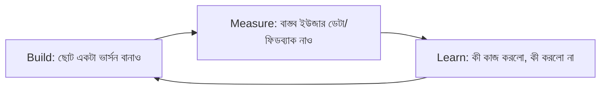

# ০৪. Lean Development & MVP Strategy

আগের লেসনে আমরা "স্কোপ ক্রিপ"-কে সোলো ডেভেলপারের সবচেয়ে বড় শত্রু বলেছিলাম। এই লেসনে আমরা দেখবো কীভাবে একটা কাঠামোবদ্ধ পদ্ধতি — **Lean Development** — এই সমস্যাটা সমাধান করে।

Lean Development-এর মূল ধারণাটা আসে Eric Ries-এর "Lean Startup" বই থেকে — একটা সাইকেলের ছবি দিয়ে বোঝানো যায়: বানাও (Build), মাপো (Measure), শেখো (Learn), আবার বানাও। এই চক্রের প্রতিটা ধাপ যত ছোট আর দ্রুত হবে, তুমি তত দ্রুত শিখবে বাজার আসলে কী চায় — Module 43-এর প্রোডাক্ট-মার্কেট ফিট (লেসন ০৫) খুঁজে বের করার প্রক্রিয়াটাই মূলত এই চক্রের বারবার পুনরাবৃত্তি।



এই চক্রের প্রথম "Build" ধাপের ফলাফলটাকে বলে **MVP (Minimum Viable Product)** — সবচেয়ে ছোট সংস্করণ যা দিয়ে আসল মূল্য যাচাই করা যায়। এখানে একটা সাধারণ ভুল ধারণা পরিষ্কার করা দরকার — MVP মানে "নিম্নমানের প্রোডাক্ট" না, বরং "সংকীর্ণ স্কোপের প্রোডাক্ট"। Module 49-এ আমরা যে InvoiceBari প্রজেক্ট ব্রিফ দেখেছিলাম, সেখানে PDF জেনারেশন আর ইমেইল পাঠানো যতটা ভালো কাজ করা দরকার, ঠিক ততটাই ভালো করে বানাতে হবে — শুধু ফিচারের সংখ্যা কম রাখতে হবে, মান কম না।

একটা কার্যকর মানসিক মডেল হলো স্কেটবোর্ড-থেকে-গাড়ি উদাহরণ। একজন গ্রাহক যদি "শহরের এক প্রান্ত থেকে আরেক প্রান্তে যেতে চায়" — ভুল পদ্ধতি হলো প্রথমে গাড়ির একটা চাকা বানানো, তারপর ইঞ্জিন, তারপর বডি (এতে মাঝপথে কিছুই কাজ করে না)। সঠিক পদ্ধতি হলো প্রথমে একটা স্কেটবোর্ড বানানো (যেটা দিয়ে তাৎক্ষণিকভাবে, যদিও অসম্পূর্ণভাবে, যাতায়াতের মূল প্রয়োজনটা মেটে), তারপর ধাপে ধাপে সাইকেল, মোটরসাইকেল, শেষে গাড়িতে উন্নীত করা।

```mermaid
flowchart TD
    subgraph ভুল["ভুল পদ্ধতি"]
        W1[চাকা] --> W2[ইঞ্জিন] --> W3[বডি] --> W4["সম্পূর্ণ গাড়ি (অবশেষে কাজ করে)"]
    end
    subgraph ঠিক["Lean পদ্ধতি"]
        R1[স্কেটবোর্ড - কাজ করে] --> R2[সাইকেল - উন্নত] --> R3[মোটরসাইকেল - আরও উন্নত] --> R4[গাড়ি]
    end
```

MVP স্কোপ ঠিক করার একটা ব্যবহারিক টেকনিক হলো Module 43-এর লেসন ০৪-এ শেখা Impact/Effort ম্যাট্রিক্স আবার প্রয়োগ করা — শুধু "High Impact, Low Effort" ফিচারগুলো MVP-তে রাখা, বাকি সব "পরে" তালিকায় রাখা। আরেকটা কার্যকর প্রশ্ন হলো — "এই ফিচারটা ছাড়া কি ইউজার তার মূল কাজটা (core job) সম্পন্ন করতে পারবে?" যদি উত্তর হ্যাঁ হয়, ফিচারটা MVP-তে দরকার নেই।

সময়ের একটা সীমা বেঁধে দেয়াও কার্যকর একটা কৌশল — নিজেকে বলা "এই প্রোডাক্টের প্রথম ভার্সন চার সপ্তাহের মধ্যে লঞ্চ করবো, তার বেশি না।" এই সময়ের চাপ (constraint) স্বয়ংক্রিয়ভাবে অপ্রয়োজনীয় ফিচার বাদ দিতে বাধ্য করে, কারণ সময় ফুরিয়ে গেলে যা আছে তাই নিয়ে বের হতে হয়।

লিন ডেভেলপমেন্ট মানসিকতা প্রোডাক্ট বানানোর দিকটা ঠিক করে দিলো, কিন্তু একটা প্রোডাক্ট যতই ভালো হোক, কেউ যদি সেটার কথা না জানে, কেউ কিনবে না। পরের লেসনে আমরা দেখবো একজন ডেভেলপার — যে সাধারণত মার্কেটিং নিয়ে অস্বস্তি বোধ করে — কীভাবে কার্যকরভাবে নিজের কাজ মার্কেট করতে পারে।
