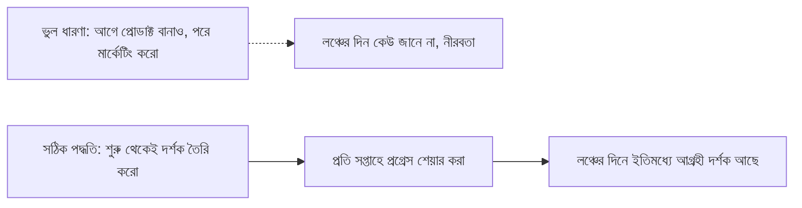

# ০৫. Marketing for Developers

বেশিরভাগ ডেভেলপারের কাছে "মার্কেটিং" শব্দটা শুনলেই একটা অস্বস্তি তৈরি হয় — মনে হয় এটা মিথ্যা প্রতিশ্রুতি বা চাপাচাপি করে বিক্রি করার ব্যাপার। এই ধারণাটা ভাঙা দরকার। মার্কেটিং আসলে একটাই কাজ করে — যাদের সমস্যা তোমার প্রোডাক্ট সমাধান করে, তাদের কাছে সেই তথ্যটা পৌঁছে দেয়া। Module 43-এ আমরা যে persona আর ভ্যালু প্রোপোজিশন তৈরি করেছিলাম, মার্কেটিং হলো সেটাকে সঠিক মানুষের সামনে তুলে ধরার কাজ।

ডেভেলপারদের একটা স্বাভাবিক সুবিধা আছে যেটা তারা প্রায়ই বুঝতে পারে না — তারা **বানাতে** জানে। এই সুবিধাটা ব্যবহার করে "Build in Public" নামের একটা কৌশল কাজ করে, যা নিয়ে আমরা এই মডিউলের লেসন ০৭-এ বিস্তারিত যাবো। কিন্তু তার আগে বুঝতে হবে মার্কেটিং একটা এককালীন ইভেন্ট না, বরং একটা চলমান কাজ, যা প্রোডাক্ট বানানোর প্রথম দিন থেকেই শুরু করা উচিত — লঞ্চের দিন থেকে না।

একজন ডেভেলপারের জন্য সবচেয়ে স্বাভাবিক আর কম-বিরক্তিকর মার্কেটিং চ্যানেল হলো **কনটেন্ট** — যা তুমি শিখেছো, বানিয়েছো, বা যে সমস্যায় পড়েছো সেটা নিয়ে লেখা। এটা বিজ্ঞাপনের মতো চাপাচাপি না, বরং সাহায্যের মতো অনুভূত হয়। যেমন তুমি যদি InvoiceBari (Module 49) বানাচ্ছো, "বাংলাদেশি ফ্রিল্যান্সারদের জন্য bKash ইন্টিগ্রেশন করার সময় যেসব চ্যালেঞ্জ পেয়েছি" — এই ধরনের একটা ব্লগ পোস্ট প্রোডাক্টের বিজ্ঞাপন না হয়েও প্রোডাক্টের প্রতি বিশ্বাসযোগ্যতা তৈরি করে।

মার্কেটিং চ্যানেল বাছাইয়ের একটা সহজ নিয়ম হলো — যেখানে তোমার persona ইতিমধ্যে সময় কাটায়, সেখানে যাওয়া, নতুন দর্শক তৈরির চেষ্টা না করে। রাফির (Module 43, লেসন ০৩) মতো ফ্রিল্যান্সারদের জন্য এটা হতে পারে ফেসবুক ফ্রিল্যান্সিং গ্রুপ; একটা ডেভেলপার টুলের জন্য এটা হতে পারে Hacker News বা GitHub।

| চ্যানেল | কাদের জন্য উপযুক্ত | বিনিয়োগ |
|---|---|---|
| টেকনিক্যাল ব্লগ পোস্ট | ডেভেলপার-টুল, B2B SaaS | সময় (লেখা) |
| Twitter/X বিল্ড-ইন-পাবলিক | ডেভেলপার কমিউনিটি | নিয়মিততা |
| Reddit/ফেসবুক নিশ গ্রুপ | নির্দিষ্ট পেশার গ্রাহক | সততা, স্প্যাম না করা |
| Product Hunt লঞ্চ | ব্যাপক প্রাথমিক এক্সপোজার | একবারের প্রস্তুতি |

একটা গুরুত্বপূর্ণ মানসিকতা বদল দরকার — মার্কেটিংকে "বিক্রি করা" হিসেবে না দেখে "সাহায্য করা এবং সম্পর্ক তৈরি করা" হিসেবে দেখা। কেউ যখন Reddit-এ ইনভয়েসিং নিয়ে সমস্যার কথা লেখে, সরাসরি "আমার প্রোডাক্ট কিনুন" না বলে বরং প্রথমে আন্তরিকভাবে সাহায্য করা, তারপর প্রাসঙ্গিক হলে নিজের প্রোডাক্টের কথা উল্লেখ করা — এই পদ্ধতি অনেক বেশি কার্যকর আর টেকসই।

মার্কেটিং শুরু করার সিদ্ধান্ত নেয়া একটা বড় পদক্ষেপ, কিন্তু এর পেছনে টাকা খরচের প্রশ্নও আসে — একজন সোলো ডেভেলপারের হাতে সাধারণত বড় মার্কেটিং বাজেট থাকে না। ভাগ্যক্রমে, এই সীমাবদ্ধতা আসলে একটা সুযোগ — Module 45-এ আমরা সম্পূর্ণ একটা মডিউল উৎসর্গ করবো শূন্য-বাজেট মার্কেটিং কৌশলের জন্য। কিন্তু তার আগে বুঝে নেয়া দরকার বাজেট না থাকলে টাকা কোথা থেকে আসবে — বুটস্ট্র্যাপিং নাকি ফান্ডিং, যেটা পরের লেসনের বিষয়।
