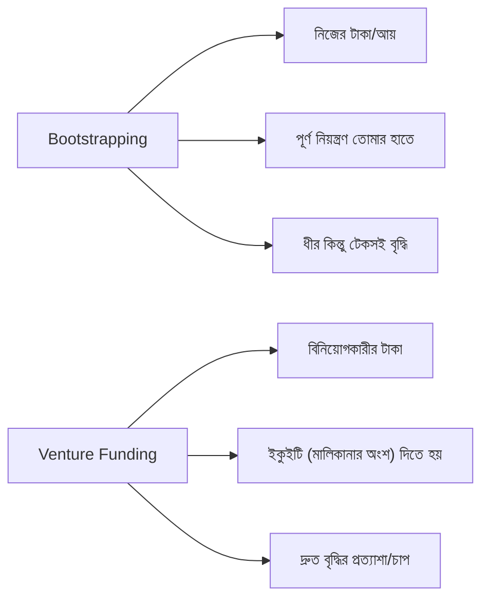

# ০৬. Bootstrapping vs Funding

মার্কেটিং, ইনফ্রাস্ট্রাকচার, হয়তো কাউকে সাহায্যের জন্য কনট্রাক্টে রাখা — এই সব কিছুর পেছনে টাকা লাগে। একজন ফাউন্ডারের সামনে মূলত দুটো পথ থাকে — নিজের সঞ্চয় বা আয় দিয়ে ব্যবসা চালানো (**bootstrapping**), অথবা বিনিয়োগকারীর কাছ থেকে টাকা নেয়া (**funding/venture capital**)। এই সিদ্ধান্তটা শুধু টাকার প্রশ্ন না — এটা তোমার পুরো ব্যবসার গতি, নিয়ন্ত্রণ, আর লক্ষ্য নির্ধারণ করে দেয়।

Bootstrapping-এর সবচেয়ে বড় সুবিধা হলো **স্বাধীনতা** — তোমাকে কারো কাছে জবাবদিহি করতে হয় না, প্রোডাক্ট নিয়ে সিদ্ধান্ত তুমি একাই নিতে পারো। Module 44-এর লেসন ০৩-এ যে "Build vs Buy" সিদ্ধান্তের কথা বলেছিলাম, bootstrapped ব্যবসায় এই সিদ্ধান্তগুলো আরো গুরুত্বপূর্ণ হয়ে ওঠে, কারণ প্রতিটা টাকা নিজের পকেট থেকে যাচ্ছে। অসুবিধা হলো — বৃদ্ধি ধীর হতে পারে, কারণ বড় আকারে বিজ্ঞাপন বা টিম বাড়ানোর টাকা নেই।

Venture Funding-এর সুবিধা হলো দ্রুত স্কেল করার সামর্থ্য — একসাথে অনেক ইঞ্জিনিয়ার নিয়োগ, বড় মার্কেটিং বাজেট। কিন্তু এর একটা লুকানো খরচ আছে — বিনিয়োগকারীরা সাধারণত দ্রুত, বড় রিটার্ন আশা করে, যার মানে তোমাকে প্রায়ই দ্রুত বৃদ্ধির দিকে চাপ দেয়া হয়, এমনকি সেটা প্রোডাক্টের স্বাস্থ্যের জন্য ভালো না হলেও। আর ইকুইটি দেয়ার মানে ভবিষ্যতে কোম্পানি বিক্রি হলে বা লাভ হলে, তার একটা অংশ বিনিয়োগকারীর।

| বিবেচ্য বিষয় | Bootstrapping | Venture Funding |
|---|---|---|
| গতি | ধীর, টেকসই | দ্রুত, ঝুঁকিপূর্ণ |
| নিয়ন্ত্রণ | সম্পূর্ণ তোমার | বিনিয়োগকারীর সাথে ভাগ করা |
| চাপ | গ্রাহকের কাছ থেকে (আয় লাগবে) | বিনিয়োগকারীর কাছ থেকে (গ্রোথ লাগবে) |
| উপযুক্ত মডেল | ছোট/মাঝারি SaaS (Module 43) | বড় মার্কেট, নেটওয়ার্ক-ইফেক্ট নির্ভর প্রোডাক্ট |

ইনডি হ্যাকিং জগতে সাধারণত bootstrapping বেশি প্রচলিত, কারণ এই মডিউলে যে ধরনের প্রোডাক্ট নিয়ে কথা বলছি (Module 49-এর InvoiceBari-র মতো ছোট, ফোকাসড SaaS) — এগুলোর জন্য বিশাল ফান্ডিং দরকার হয় না। প্রথম কয়েকশো গ্রাহকের রেভিনিউ দিয়েই একজন সোলো ফাউন্ডার ব্যবসা চালাতে পারে, আর প্রতি মাসে সামান্য লাভ থাকলেই সেটা টেকসই।

এই সিদ্ধান্তটা একবার নিলেই শেষ না — এটা তোমার ব্যবসার ধরনের সাথে বদলাতে পারে। অনেক সফল প্রোডাক্ট প্রথমে bootstrapped অবস্থায় প্রোডাক্ট-মার্কেট ফিট প্রমাণ করে, তারপর প্রয়োজন হলে ফান্ডিং নেয়। মূল কথা হলো — funding নেয়াটা "সাফল্যের প্রমাণ" না, এটা শুধু একটা টুল, যা সব ব্যবসার জন্য দরকার হয় না।

টাকা যেভাবেই আসুক, প্রোডাক্ট বানানোর প্রক্রিয়াটা প্রকাশ্যে করা একটা শক্তিশালী কৌশল হতে পারে — এটা দর্শক তৈরি করে, বিশ্বাসযোগ্যতা বাড়ায়, এমনকি বিনিয়োগকারীর দৃষ্টি আকর্ষণ করতে পারে। এই "Building in Public" কৌশলটাই আমাদের পরের লেসনের বিষয়।
