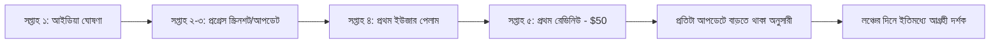

# ০৭. Building in Public

আগের লেসনে আমরা টাকার উৎস নিয়ে কথা বলেছি — bootstrap নাকি ফান্ডিং। কিন্তু টাকার বাইরেও একটা জিনিস প্রতিটা ফাউন্ডারের দরকার, সেটা হলো মনোযোগ (attention) — মানুষ যেন জানে তুমি কী বানাচ্ছো। **Building in Public** এই সমস্যার একটা চমৎকার, প্রায় বিনামূল্যের সমাধান।

Building in Public মানে হলো তোমার প্রোডাক্ট বানানোর প্রক্রিয়াটাই প্রকাশ্যে শেয়ার করা — শুধু চূড়ান্ত ফলাফল না, বরং যাত্রার প্রতিটা ধাপ। রেভিনিউ সংখ্যা, ব্যর্থতা, শেখা নতুন কিছু, এমনকি বাগ ফিক্স করার গল্প — এই সবকিছুই কনটেন্ট। Module 44-এর লেসন ০৫-এ আমরা যেমন বলেছিলাম মার্কেটিং মানে "সাহায্য করা এবং সম্পর্ক তৈরি করা", Building in Public এর সবচেয়ে খাঁটি রূপ, কারণ এখানে বিক্রি করার কোনো ভান নেই — শুধু সততার সাথে যাত্রা শেয়ার করা।

এই কৌশলটা কার্যকর হওয়ার পেছনে একটা মনস্তাত্ত্বিক কারণ আছে — মানুষ **গল্প** অনুসরণ করতে ভালোবাসে, বিজ্ঞাপন না। যখন কেউ তোমার InvoiceBari (Module 49) প্রজেক্টের যাত্রা প্রথম দিন থেকে অনুসরণ করে — আইডিয়া থেকে শুরু, প্রথম কোড লেখা, প্রথম গ্রাহক, প্রথম বাধা — তারা প্রোডাক্টটার সাথে একটা সম্পর্ক তৈরি করে ফেলে, যেটা লঞ্চের দিনে হুট করে দেখা একটা বিজ্ঞাপনের চেয়ে অনেক বেশি শক্তিশালী।

একটা বাস্তব উদাহরণ হিসেবে, Twitter/X বা LinkedIn-এ একটা সাপ্তাহিক আপডেট ফরম্যাট রাখা যায়:

> "সপ্তাহ ৩ আপডেট — InvoiceBari:
> ✅ bKash পেমেন্ট রিমাইন্ডার ফিচার শেষ
> ✅ প্রথম ২ জন পেয়িং গ্রাহক ($১৫/মাস প্রতিজন)
> ❌ PDF জেনারেশনে একটা বাগ পেয়েছি বাংলা ফন্ট নিয়ে, এখনো সমাধান হয়নি
> পরের সপ্তাহে: ৩ জন আরো ফ্রিল্যান্সারের সাথে কথা বলবো"

লক্ষ্য করো, এখানে ব্যর্থতা (বাগ) লুকানো হয়নি — বরং শেয়ার করা হয়েছে। এটা ইচ্ছাকৃত, কারণ শুধু সাফল্যের গল্প বিশ্বাসযোগ্য মনে হয় না, কিন্তু বাস্তব চ্যালেঞ্জসহ শেয়ার করা গল্প মানুষকে আসল মনে হয়।

Building in Public-এর একটা বাড়তি সুবিধা হলো এটা তোমাকে নিজেকেই জবাবদিহি রাখে — যখন তুমি জানো প্রতি সপ্তাহে একটা আপডেট দিতে হবে, এটা তোমাকে আসলেই প্রগ্রেস করতে বাধ্য করে, Module 44-এর লেসন ০৩-এ বলা স্কোপ ক্রিপ এড়াতেও সাহায্য করে।

তবে সতর্কতা দরকার — সবকিছু প্রকাশ্যে শেয়ার করা ঠিক না। প্রতিযোগীর কাছে মূল্যবান হতে পারে এমন কৌশলগত তথ্য (যেমন নির্দিষ্ট প্রাইসিং নেগোসিয়েশনের বিস্তারিত, বা এখনো ভ্যালিডেট না হওয়া বড় আইডিয়া) সাধারণত গোপন রাখাই ভালো।

একা একা প্রগ্রেস শেয়ার করা একটা জিনিস, কিন্তু আরো শক্তিশালী হয় যখন একটা কমিউনিটি তৈরি হয় যারা তোমার যাত্রায় সক্রিয়ভাবে অংশ নেয় — মতামত দেয়, প্রশ্ন করে, একে অপরকে সাহায্য করে। সেই কমিউনিটি বিল্ডিং-এর কৌশলই আমাদের পরের লেসনের বিষয়।
