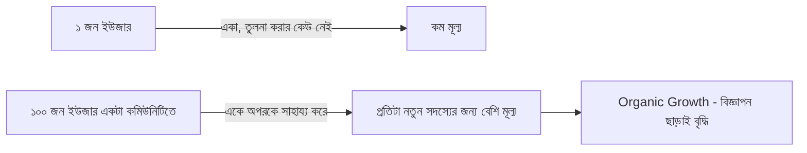

# ০৮. Community Building & Network Effects

Building in Public তোমার প্রগ্রেসের একমুখী সম্প্রচার — তুমি শেয়ার করো, মানুষ দেখে। এই লেসনে আমরা একধাপ এগিয়ে যাবো — কীভাবে একটা দ্বিমুখী সম্পর্ক তৈরি করা যায়, যেখানে মানুষ শুধু দর্শক না, বরং তোমার যাত্রার একটা অংশীদার হয়ে ওঠে। এটাই কমিউনিটি বিল্ডিং।

একটা কমিউনিটির শক্তি কেন এত গুরুত্বপূর্ণ, তা বোঝার জন্য **নেটওয়ার্ক ইফেক্ট** ধারণাটা জানা দরকার — একটা প্রোডাক্ট বা কমিউনিটির মূল্য বাড়ে যখন তার ব্যবহারকারী/সদস্য সংখ্যা বাড়ে। একজন সদস্য থাকা একটা ডিসকর্ড সার্ভারের কোনো মূল্য নেই, কিন্তু ১০০ জন সক্রিয় সদস্য থাকলে, প্রতিটা নতুন সদস্যের জন্য এটা আরো আকর্ষণীয় হয়ে ওঠে — কারণ সেখানে প্রশ্নের উত্তর পাওয়া যায়, অভিজ্ঞতা শেয়ার হয়।

একজন সোলো ফাউন্ডারের জন্য কমিউনিটি বিল্ডিং শুরু করার সবচেয়ে বাস্তবসম্মত উপায় হলো বিশাল কিছু বানানোর চেষ্টা না করে, প্রথম কয়েকজন গ্রাহকের সাথে (Module 43, লেসন ০৩-এর কাস্টমার ডিসকভারি ইন্টারভিউর মতোই) সরাসরি যোগাযোগ রাখা — একটা হোয়াটসঅ্যাপ গ্রুপ, একটা ছোট ডিসকর্ড সার্ভার, এমনকি একটা সাধারণ ইমেইল লিস্ট। এই প্রথম দলটাই ভবিষ্যতে তোমার প্রোডাক্টের সবচেয়ে বড় সমর্থক (advocate) হয়ে ওঠে।

কমিউনিটি টিকে থাকার জন্য একটা স্পষ্ট, চলমান মূল্য দিতে হয় — শুধু প্রোডাক্ট আপডেট না, বরং সদস্যদের একে অপরের কাছ থেকে শেখার সুযোগ। যেমন InvoiceBari (Module 49)-এর একটা কমিউনিটিতে ফ্রিল্যান্সাররা শুধু প্রোডাক্ট নিয়ে কথা বলবে না, একে অপরকে ট্যাক্স নিয়ে, ক্লায়েন্ট ম্যানেজমেন্ট নিয়েও পরামর্শ দেবে — এতে কমিউনিটির মূল্য প্রোডাক্টের বাইরেও ছড়িয়ে যায়, মানুষ প্রোডাক্ট ছেড়ে দিলেও কমিউনিটি ছাড়তে চায় না।

| কমিউনিটি প্ল্যাটফর্ম | উপযুক্ত কখন |
|---|---|
| ডিসকর্ড/স্ল্যাক | রিয়েল-টাইম আলোচনা, ডেভেলপার-কেন্দ্রিক প্রোডাক্ট |
| ফেসবুক গ্রুপ | স্থানীয় (বাংলাদেশি) নন-টেকনিক্যাল গ্রাহক |
| ইমেইল নিউজলেটার | কম-ফ্রিকোয়েন্সি, গভীর কনটেন্ট |
| Twitter/X সার্কেল | Building in Public-এর সম্প্রসারণ |

কমিউনিটি বিল্ডিং-এর একটা গুরুত্বপূর্ণ নীতি হলো — প্রথমে দাও, পরে চাও। একজন ফাউন্ডার যদি কমিউনিটিতে ঢুকেই নিজের প্রোডাক্ট বিক্রি করার চেষ্টা করে, মানুষ সেটা দ্রুত বুঝে ফেলে আর দূরে সরে যায়। বরং প্রশ্নের উত্তর দেয়া, সম্পদ শেয়ার করা, অন্যদের সাফল্য উদযাপন করা — এই ছোট ছোট কাজ দিয়েই আসল বিশ্বাস তৈরি হয়, যেটা দীর্ঘমেয়াদে প্রোডাক্টের প্রতি আনুগত্যে রূপান্তরিত হয়।

কমিউনিটি আর নেটওয়ার্ক ইফেক্ট আমাদের একটা প্রোডাক্টের চারপাশে মানুষ জড়ো করতে শেখালো। কিন্তু এই সবকিছুর চূড়ান্ত লক্ষ্য একটা টেকসই ব্যবসা — যার মানে টাকা আসতে হবে কোনো না কোনো উৎস থেকে। পরের লেসনে আমরা দেখবো কোন কোন রেভিনিউ মডেল একজন ইনডি হ্যাকারের জন্য বাস্তবসম্মত।
