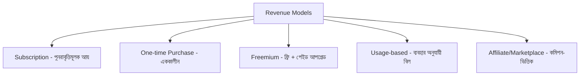

# ০৯. Revenue Models & Monetization

কমিউনিটি আর দর্শক তৈরি হওয়ার পর, এবার আসল প্রশ্ন — কীভাবে এই সবকিছুকে টাকায় রূপান্তরিত করবে? Module 43-এর লেসন ০৭-এ আমরা SaaS প্রাইসিং স্ট্র্যাটেজি নিয়ে বিস্তারিত কথা বলেছিলাম — এই লেসনে আমরা সেটাকে আরো বিস্তৃত করবো, ইনডি হ্যাকারদের জন্য প্রাসঙ্গিক বিভিন্ন রেভিনিউ মডেল দেখে।

সবচেয়ে প্রচলিত মডেল হলো **সাবস্ক্রিপশন** (Module 43-এ বিস্তারিত আলোচনা করা SaaS মডেল) — মাসিক বা বাৎসরিক ফি। এর বাইরেও ইনডি হ্যাকারদের মধ্যে জনপ্রিয় আরো কিছু মডেল আছে, যেগুলো ছোট, সোলো-চালিত প্রোডাক্টের জন্য প্রায়ই বেশি উপযুক্ত।

**One-time purchase** মডেল সরল — একবার কিনলেই আজীবন ব্যবহার। এটা এমন প্রোডাক্টের জন্য ভালো যেখানে ক্রমাগত সার্ভার খরচ কম (যেমন একটা ডেভেলপার টুল বা টেমপ্লেট), কিন্তু SaaS-এর তুলনায় রেভিনিউ কম প্রেডিক্টেবল, কারণ প্রতি মাসে নতুন গ্রাহক লাগবে বৃদ্ধির জন্য।

**Freemium** মডেলে একটা মৌলিক সংস্করণ ফ্রি, উন্নত ফিচারের জন্য টাকা লাগে। InvoiceBari-র (Module 49) উদাহরণে, মাসে ৫টা ইনভয়েস ফ্রি, তার বেশি হলে পেইড প্ল্যান — এই মডেল ইউজার অ্যাকুইজিশন সহজ করে (বাধা কম, তাই বেশি মানুষ ট্রাই করে), কিন্তু কনভার্শন রেট সাধারণত কম হয় (মাত্র ২-৫% ফ্রি ইউজার পেইড হয়)।

**Usage-based** মডেলে গ্রাহক যতটুকু ব্যবহার করে ততটুকুর জন্য টাকা দেয় (যেমন প্রতি API কলে, প্রতি জেনারেট করা ইমেজে) — এই মডেল Module 42-এর AI এজেন্ট প্রোডাক্টের জন্য বিশেষভাবে প্রাসঙ্গিক, কারণ LLM কলের নিজস্ব খরচ থাকে, তাই ব্যবহারের সাথে দাম বাঁধা থাকলে ব্যবসার মার্জিন সুরক্ষিত থাকে।

| মডেল | প্রেডিক্টেবিলিটি | উপযুক্ত প্রোডাক্ট |
|---|---|---|
| Subscription | উচ্চ | চলমান সমস্যা সমাধানকারী SaaS |
| One-time | নিম্ন | টুল, টেমপ্লেট, স্ট্যাটিক প্রোডাক্ট |
| Freemium | মাঝারি | ব্যাপক ব্যবহারকারী দরকার এমন প্রোডাক্ট |
| Usage-based | মাঝারি | AI/কম্পিউট-নির্ভর প্রোডাক্ট |

একজন সোলো ফাউন্ডারের জন্য একটা গুরুত্বপূর্ণ পরামর্শ হলো — প্রথম থেকেই টাকা নেয়া শুরু করা, এমনকি সামান্য পরিমাণেও। অনেক নতুন ফাউন্ডার ভুল করে দীর্ঘদিন সব ফ্রি রাখে "ইউজার বাড়ানোর জন্য", কিন্তু এতে বোঝা যায় না মানুষ আসলে টাকা দিতে রাজি কিনা — যেটা Module 43-এর প্রোডাক্ট-মার্কেট ফিটের (লেসন ০৫) সবচেয়ে জোরালো প্রমাণ। এমনকি প্রথম দিকে সামান্য দামেও (যেমন $৫/মাস) বিক্রি হওয়া, বড় সংখ্যক ফ্রি ইউজারের চেয়ে বেশি মূল্যবান সংকেত দেয়।

সঠিক রেভিনিউ মডেল বেছে নেয়া একটা জিনিস, কিন্তু এটা বাস্তবায়ন আর পরিচালনার জন্য সঠিক টুলও দরকার — পেমেন্ট প্রসেসিং থেকে শুরু করে অ্যানালিটিক্স পর্যন্ত। পরের লেসনে আমরা দেখবো একজন ইনডি হ্যাকারের টুলবক্সে কী কী থাকা উচিত।
