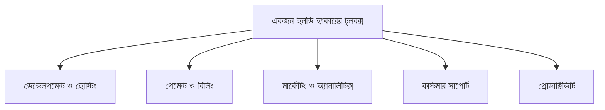

# ১০. Tools & Resources for Indie Hackers

Module 44-এর লেসন ০৩-এ আমরা "Build vs Buy" নীতির কথা বলেছিলাম — নিজের ভ্যালু প্রোপোজিশনের বাইরের সবকিছুর জন্য রেডিমেড টুল ব্যবহার করা। এই লেসনে আমরা একজন ইনডি হ্যাকারের বাস্তব টুলবক্সটা গুছিয়ে দেখবো — কোন কাজের জন্য কোন ধরনের টুল।

**ডেভেলপমেন্ট ও হোস্টিং**-এর ক্ষেত্রে, একজন সোলো ডেভেলপারের লক্ষ্য হওয়া উচিত সার্ভার ম্যানেজমেন্টে যত কম সময় ব্যয় করা যায়। Vercel বা Railway-এর মতো প্ল্যাটফর্ম Module 2-তে শেখা ক্লাউড ডেপ্লয়মেন্টের ধারণাকে আরো সহজ করে দেয় — `git push` করলেই ডেপ্লয় হয়ে যায়, সার্ভার কনফিগারেশন নিয়ে মাথা ঘামাতে হয় না। ডাটাবেজের জন্য Supabase বা Neon-এর মতো ম্যানেজড PostgreSQL সার্ভিস, যেখানে ব্যাকআপ, স্কেলিং সব স্বয়ংক্রিয়।

**পেমেন্ট ও বিলিং**-এর জন্য Module 41-এ শেখা Stripe এখনো সবচেয়ে জনপ্রিয়, বিশেষ করে তাদের **Stripe Billing** ফিচার, যেটা সাবস্ক্রিপশন ম্যানেজমেন্ট (আপগ্রেড, ডাউনগ্রেড, প্রোরেশন হিসাব) নিজে থেকে কোড না লিখেই সামলায় — এটা "Build vs Buy" নীতির একটা নিখুঁত উদাহরণ, কারণ বিলিং লজিক নিজে লেখা জটিল আর ভুল-প্রবণ।

| ক্যাটাগরি | টুল উদাহরণ | সমাধান করে |
|---|---|---|
| হোস্টিং | Vercel, Railway, Render | সার্ভার ম্যানেজমেন্ট |
| ডাটাবেজ | Supabase, Neon, PlanetScale | ব্যাকআপ, স্কেলিং |
| পেমেন্ট | Stripe, LemonSqueezy | বিলিং লজিক, ট্যাক্স |
| ইমেইল | Resend, SendGrid (Module 41) | ডেলিভারেবিলিটি |
| অ্যানালিটিক্স | Plausible, PostHog | প্রাইভেসি-বান্ধব ট্র্যাকিং |
| সাপোর্ট | Crisp, Intercom | কাস্টমার চ্যাট |

মার্কেটিং আর অ্যানালিটিক্সের ক্ষেত্রে, Module 41-এ শেখা Google Analytics-এর পাশাপাশি Plausible বা PostHog-এর মতো প্রাইভেসি-বান্ধব বিকল্পও ইনডি হ্যাকারদের মধ্যে জনপ্রিয়, কারণ এগুলো সহজ, হালকা, আর GDPR-এর মতো প্রাইভেসি নিয়ম মেনে চলা সহজ করে।

একটা গুরুত্বপূর্ণ বিষয় হলো — **LemonSqueezy বা Paddle**-এর মতো "Merchant of Record" পেমেন্ট প্রসেসর, যেগুলো সরাসরি Stripe-এর চেয়ে বেশি ফি নেয়, কিন্তু বিনিময়ে আন্তর্জাতিক ট্যাক্স (VAT, GST) হিসাব আর জমা দেয়ার পুরো জটিল কাজটা নিজেরাই সামলায়। একজন সোলো ফাউন্ডারের জন্য, নিজে ট্যাক্স আইন বোঝার সময় নষ্ট করার চেয়ে এই বাড়তি ফি দেয়া প্রায়ই বুদ্ধিমানের সিদ্ধান্ত — এটাও "Build vs Buy"-এরই একটা রূপ।

প্রোডাক্টিভিটির দিক থেকে, একজন সোলো ফাউন্ডারকে একই সাথে ডেভেলপার, মার্কেটার, সাপোর্ট এজেন্ট, অ্যাকাউন্ট্যান্ট — সব ভূমিকা পালন করতে হয়। তাই টাস্ক ম্যানেজমেন্ট (Notion, Linear), আর সময়ের ট্র্যাকিং রাখা (যা আমরা পরের লেসনে বিস্তারিত দেখবো) দরকারি হয়ে ওঠে।

সঠিক টুল বেছে নেয়া সময় বাঁচায়, কিন্তু সেই বাঁচানো সময়টা যদি সঠিকভাবে ব্যবহার না হয়, তাহলে কোনো লাভ নেই। একজন সোলো ফাউন্ডারের সবচেয়ে সীমিত সম্পদ আসলে টুল না, সময় — আর সেই সময় ব্যবস্থাপনার কৌশলই আমাদের পরের লেসনের বিষয়।
