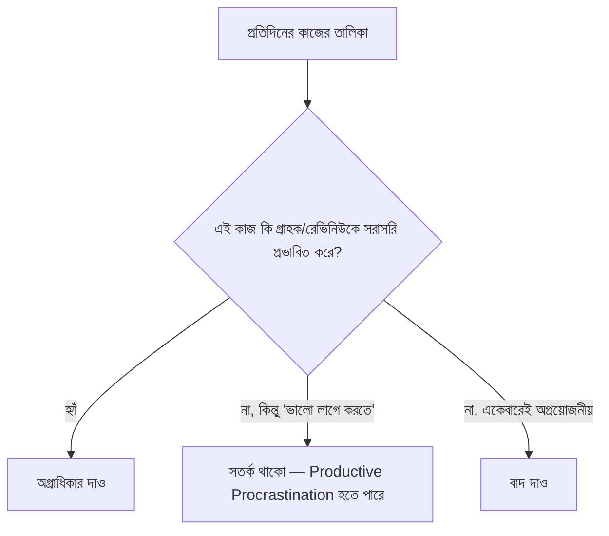

# ১১. Time Management & Productivity

আগের লেসনের শেষ কথাটা ছিলো — সোলো ফাউন্ডারের সবচেয়ে সীমিত সম্পদ সময়। একজন চাকরিজীবী ডেভেলপারের একটা নির্দিষ্ট দায়িত্ব থাকে, কিন্তু একজন সোলো ফাউন্ডারকে কোডিং, মার্কেটিং, সাপোর্ট, অ্যাকাউন্টিং — সবকিছুর জন্য একই ২৪ ঘণ্টা ভাগ করতে হয়। এই লেসনে আমরা দেখবো কীভাবে এই সীমিত সময়টা সবচেয়ে কার্যকরভাবে ব্যবহার করা যায়।

সবচেয়ে গুরুত্বপূর্ণ নীতিটা হলো Module 43-এর লেসন ০৪-এ শেখা Impact/Effort ম্যাট্রিক্সের একটা সময়-ব্যবস্থাপনা সংস্করণ — প্রতিদিন কাজ শুরু করার আগে নিজেকে জিজ্ঞেস করা, "আজকের এই কাজটা কি সরাসরি গ্রাহক বা রেভিনিউর সাথে সম্পর্কিত?" ডেভেলপাররা প্রায়ই একটা ফাঁদে পড়ে — কোড পারফেক্ট করা, নতুন টুল/ফ্রেমওয়ার্ক পরীক্ষা করা, এমন কাজে সময় দেয়া যেগুলো "প্রোডাক্টিভ মনে হয়" কিন্তু আসলে ব্যবসার অগ্রগতিতে সরাসরি অবদান রাখে না।

এই ফাঁদটার একটা নাম আছে — **Productive Procrastination**, মানে এমন কাজে ব্যস্ত থাকা যেগুলো দেখতে কাজের মতো লাগে (কোড রিফ্যাক্টর করা, একটা নতুন লাইব্রেরি শেখা) কিন্তু আসলে কঠিন কাজ (গ্রাহকের সাথে কথা বলা, বিক্রির চেষ্টা করা) থেকে পালানোর একটা উপায়। Module 44-এর লেসন ০৩-এ শেখা "Build vs Buy" নীতির মতোই, এখানেও প্রশ্নটা একই — "এই কাজ কি আমার প্রোডাক্টের মূল ভ্যালু প্রোপোজিশনের (Module 43, লেসন ০৪) সাথে সরাসরি যুক্ত?"

একটা ব্যবহারিক কৌশল হলো সপ্তাহের কাজগুলোকে তিনটা ক্যাটাগরিতে ভাগ করা এবং প্রতিটার জন্য নির্দিষ্ট সময় বরাদ্দ করা (time-blocking):

| ক্যাটাগরি | সাপ্তাহিক সময় (উদাহরণ) | কাজের ধরন |
|---|---|---|
| Build | ৬০% | কোর ফিচার ডেভেলপমেন্ট |
| Market/Sell | ২৫% | Building in Public, কাস্টমার আউটরিচ |
| Support/Maintain | ১৫% | বাগ ফিক্স, গ্রাহক প্রশ্নের উত্তর |

লক্ষ্য করো, এখানে "Build" সবচেয়ে বড় অংশ হলেও ১০০% না — অনেক ডেভেলপার-ফাউন্ডার শুধু কোড লিখতেই সব সময় দিতে চায় কারণ এটাই তাদের আরামের জায়গা, কিন্তু Module 44-এর লেসন ০৫-এ শেখা মার্কেটিং ছাড়া সেরা কোডও কেউ খুঁজে পাবে না।

আরেকটা কার্যকর অভ্যাস হলো **ব্যাচিং** — একই ধরনের কাজ একসাথে করা, বারবার কনটেক্সট সুইচ না করে। যেমন সব গ্রাহক ইমেইলের উত্তর দিনে একবার নির্দিষ্ট সময়ে দেয়া, প্রতি মেসেজে সাথে সাথে না ঝাঁপিয়ে পড়া — কারণ কনটেক্সট সুইচিং (কোডিং থেকে ইমেইলে, আবার কোডিং-এ ফেরা) প্রতিবার মানসিক শক্তি খরচ করে।

শেষ একটা গুরুত্বপূর্ণ কথা — টেকসই গতি বজায় রাখা দ্রুত জ্বলে ওঠার চেয়ে ভালো। অনেক ইনডি হ্যাকার প্রথম কয়েক সপ্তাহ অতিরিক্ত পরিশ্রম করে burnout-এ পড়ে যায়, তারপর পুরো প্রজেক্ট ছেড়ে দেয়। Module 44-এর লেসন ০৪-এ শেখা Lean Development-এর "ছোট ছোট চক্র" দর্শনটা এখানেও প্রযোজ্য — একটা মাসের মধ্যে সব কিছু শেষ করার চাপ না নিয়ে, বছরের পর বছর টিকে থাকার মতো একটা গতি বজায় রাখা।

সময় ব্যবস্থাপনা আর অগ্রাধিকার ঠিক করা তত্ত্বে সহজ শোনালেও, বাস্তবে শেখার সবচেয়ে ভালো উপায় হলো যারা এটা সফলভাবে করেছে তাদের গল্প দেখা। এই মডিউলের শেষ লেসনে আমরা কয়েকজন সফল ইনডি হ্যাকারের বাস্তব কেস স্টাডি বিশ্লেষণ করবো।
