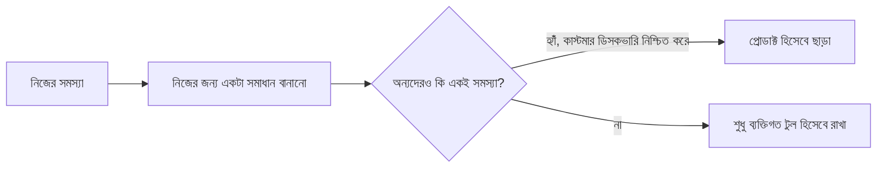

# ১২. Case Studies: Successful Indie Hackers

এই মডিউলের এগারোটা লেসনে আমরা তত্ত্ব শিখেছি — আইডিয়া ভ্যালিডেশন, লিন ডেভেলপমেন্ট, মার্কেটিং, ফান্ডিং সিদ্ধান্ত, বিল্ডিং ইন পাবলিক, কমিউনিটি, রেভিনিউ মডেল, টুল, সময় ব্যবস্থাপনা। এই শেষ লেসনে আমরা দেখবো এই সবগুলো নীতি বাস্তব জীবনে কীভাবে একসাথে কাজ করেছে, কয়েকটা পরিচিত ইনডি হ্যাকিং প্যাটার্নের মাধ্যমে (নির্দিষ্ট কোম্পানির নাম বা দাবির বদলে, আমরা সাধারণ প্যাটার্নগুলোতে মনোযোগ দেবো, যা বাস্তবে বহু সফল সোলো প্রোডাক্টে বারবার দেখা যায়)।

**প্যাটার্ন ১ — "Scratch Your Own Itch" (নিজের সমস্যা নিজে সমাধান করা)।** অনেক সফল ইনডি প্রোডাক্টের জন্ম হয়েছে ফাউন্ডার নিজে একটা সমস্যায় পড়ে, বাজারে কোনো ভালো সমাধান না পেয়ে নিজেই বানিয়ে ফেলার মাধ্যমে। এটা Module 43-এর লেসন ০৩-এ শেখা কাস্টমার ডিসকভারির একটা শর্টকাট — ফাউন্ডার নিজেই প্রথম persona। ঝুঁকিটা হলো, নিজের সমস্যা যে সবার সমস্যা না, তা যাচাই করা জরুরি — তাই এমনকি নিজের সমস্যা সমাধান করলেও, বাইরের মানুষের সাথে কথা বলে নিশ্চিত হওয়া দরকার এটা যথেষ্ট বড় একটা বাজারের সমস্যা কিনা।

**প্যাটার্ন ২ — "Niche Down" (সংকীর্ণ বাজারে ফোকাস করা)।** বড় প্রতিষ্ঠিত কোম্পানির সাথে সরাসরি প্রতিযোগিতা করার বদলে, সফল ইনডি হ্যাকাররা প্রায়ই একটা নির্দিষ্ট, ছোট, অবহেলিত সেগমেন্টে ফোকাস করে — ঠিক Module 43-এর লেসন ০৪-এ আমরা InvoiceBari-র উদাহরণে দেখেছিলাম, "সবার জন্য ইনভয়েসিং টুল" না বানিয়ে "বাংলাদেশি ফ্রিল্যান্সারদের জন্য" বানানো। একটা ছোট বাজারে #১ হওয়া, একটা বড় বাজারে #১০০ হওয়ার চেয়ে সহজ আর লাভজনক।

**প্যাটার্ন ৩ — "Audience First" (আগে দর্শক, পরে প্রোডাক্ট)।** কিছু ফাউন্ডার প্রথমে Building in Public (লেসন ০৭) বা কনটেন্ট (লেসন ০৫) দিয়ে একটা দর্শক তৈরি করে, তারপর সেই দর্শকের সমস্যা শুনে প্রোডাক্ট বানায়। এই পদ্ধতির সুবিধা হলো, প্রোডাক্ট লঞ্চের দিনেই একটা প্রস্তুত গ্রাহক-ভিত্তি থাকে, শূন্য থেকে শুরু করতে হয় না।

**প্যাটার্ন ৪ — "Ship Fast, Iterate Faster" (দ্রুত লঞ্চ, দ্রুত উন্নতি)।** Module 44-এর লেসন ০৪-এ শেখা Lean Development-এর সবচেয়ে স্পষ্ট বাস্তবায়ন — একদম ছোট, এমনকি "লজ্জাজনকভাবে ছোট" একটা MVP লঞ্চ করে, বাস্তব ইউজার ফিডব্যাক দিয়ে দ্রুত উন্নত করা, নিখুঁত করার অপেক্ষায় মাসের পর মাস বসে না থেকে।

| প্যাটার্ন | মূল শিক্ষা | সম্পর্কিত লেসন |
|---|---|---|
| Scratch Your Own Itch | নিজের সমস্যা একটা বৈধ শুরুর পয়েন্ট, কিন্তু যাচাই করা লাগবে | Module 43, লেসন ০৩ |
| Niche Down | ছোট বাজারে #১ হওয়া সহজ ও লাভজনক | Module 43, লেসন ০৪ |
| Audience First | দর্শক তৈরি প্রোডাক্টের আগেও শুরু করা যায় | Module 44, লেসন ০৫, ০৭ |
| Ship Fast, Iterate | নিখুঁততার চেয়ে দ্রুত শেখা বেশি গুরুত্বপূর্ণ | Module 44, লেসন ০৪ |

এই প্যাটার্নগুলোর একটা সাধারণ সুতো আছে — প্রতিটাতেই বড় ঝুঁকি নেয়ার বদলে, ছোট, পরিমাপযোগ্য পদক্ষেপ নেয়া হয়েছে, আর বাস্তব প্রমাণের ভিত্তিতে সিদ্ধান্ত বদলানো হয়েছে। এটাই এই পুরো মডিউলের কেন্দ্রীয় বার্তা — ইনডি হ্যাকিং কোনো জাদুকরী "রাতারাতি সাফল্য"-এর গল্প না, বরং একটা নিয়মতান্ত্রিক প্রক্রিয়া, যেটা একজন দক্ষ ডেভেলপার শিখে প্রয়োগ করতে পারে।

আমরা এই মডিউলে দেখলাম কীভাবে বানানো যায়, কীভাবে দর্শক তৈরি করা যায়, কীভাবে টাকা আয় করা যায় — কিন্তু এই সবকিছুর জন্য একটা বড় খরচ প্রয়োজন হয় বলে ধরে নেয়া ভুল। পরের মডিউলে আমরা সরাসরি দেখবো, শূন্য বাজেটে কীভাবে কার্যকর মার্কেটিং করা যায় — প্রতিটা কৌশল যা এই মডিউলে সংক্ষেপে উল্লেখ করেছি, তার গভীর, ব্যবহারিক বিস্তারিত।
