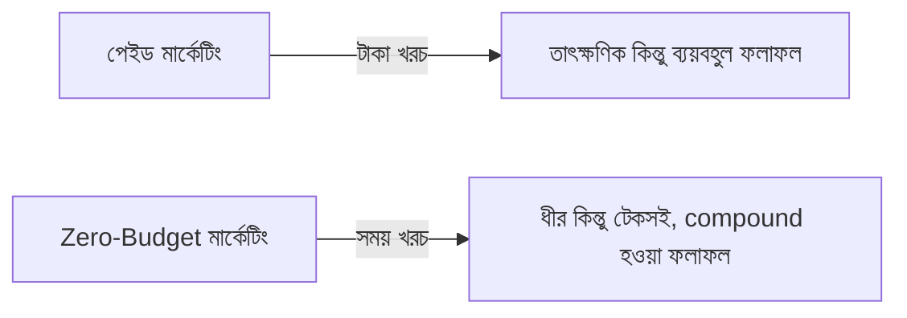
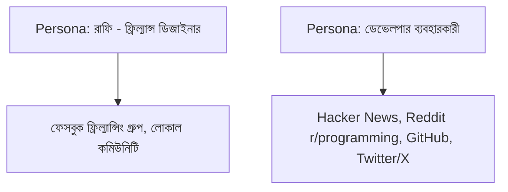

# ০১. Introduction to Zero-Budget Marketing

Module 44-এর লেসন ০৫-এ আমরা মার্কেটিং নিয়ে ডেভেলপারদের স্বাভাবিক অস্বস্তির কথা বলেছিলাম, আর বলেছিলাম মার্কেটিং মানে আসলে "সঠিক মানুষের কাছে সঠিক তথ্য পৌঁছানো"। কিন্তু একটা বাস্তব প্রশ্ন থেকে যায় — একজন সোলো ফাউন্ডারের হাতে যদি বিজ্ঞাপনের বাজেট না থাকে, তাহলে কীভাবে সেই তথ্যটা পৌঁছাবে? এই পুরো মডিউল সেই প্রশ্নের উত্তর — টাকা ছাড়া, শুধু সময় আর কৌশল দিয়ে কীভাবে মার্কেটিং করা যায়।

শূন্য-বাজেট মার্কেটিংয়ের একটা মৌলিক সত্য বুঝে নেয়া দরকার — এটা "বিনামূল্যে" না, বরং **সময়ের বিনিময়ে**। বিজ্ঞাপন দিলে টাকা খরচ হয়, কিন্তু কনটেন্ট লিখলে, কমিউনিটিতে অংশ নিলে, প্রোডাক্ট পরিচিত করালে — সময় খরচ হয়। এটা বোঝা জরুরি, কারণ এই মডিউলের কোনো কৌশলই "জাদু" না — প্রতিটার পেছনে ধারাবাহিক পরিশ্রম দরকার।

"Compound" শব্দটা এখানে গুরুত্বপূর্ণ। একটা ব্লগ পোস্ট যেটা আজ লিখলে, সেটা গুগলে ইনডেক্স হয়ে বছরের পর বছর ধরে ট্রাফিক আনতে থাকে (Module 45-এর লেসন ০২-তে SEO নিয়ে বিস্তারিত)। একটা টুইট থ্রেড যেটা ভাইরাল হয়, নতুন অনুসারী নিয়ে আসে যারা ভবিষ্যতের প্রতিটা পোস্ট দেখবে। বিজ্ঞাপনের বিপরীতে, যেখানে টাকা দেয়া বন্ধ করলেই ট্রাফিক বন্ধ হয়ে যায়, কনটেন্ট-ভিত্তিক মার্কেটিং সময়ের সাথে সাথে সুদের মতো বাড়তে থাকে।

শূন্য-বাজেট মার্কেটিংয়ের সবচেয়ে গুরুত্বপূর্ণ প্রথম ধাপ হলো — কোথায় সময় দেবে তা বেছে নেয়া। Module 43-এর লেসন ০৩-এ তৈরি করা persona-টা আবার এখানে কাজে লাগবে। রাফির (ফ্রিল্যান্স ডিজাইনার) মতো একজন গ্রাহকের কাছে পৌঁছানোর জন্য প্রয়োজনীয় চ্যানেল, আর একজন ডেভেলপার-টুল ব্যবহারকারীর কাছে পৌঁছানোর চ্যানেল সম্পূর্ণ ভিন্ন হবে।

এই মডিউলের বাকি লেসনগুলোতে আমরা একেকটা নির্দিষ্ট কৌশল গভীরভাবে দেখবো — SEO আর কনটেন্ট মার্কেটিং, সোশ্যাল মিডিয়া গ্রোথ, ইমেইল লিস্ট বানানো, Reddit/HackerNews/Product Hunt-এ লঞ্চ করা, পার্সোনাল ব্র্যান্ডিং, টেকনিক্যাল ব্লগিং, Twitter/X গ্রোথ, ডেভেলপার-কেন্দ্রিক কনটেন্ট, ওপেন সোর্স মার্কেটিং, ক্রস-প্রোমোশন, আর সবশেষে বাজেট ছাড়া কীভাবে ফলাফল মাপবে।

একটা গুরুত্বপূর্ণ সতর্কতা দিয়ে শুরু করা যাক — শূন্য-বাজেট মার্কেটিং সহজ না, দ্রুতও না। যে ফাউন্ডার আশা করে একটা টুইট পোস্ট করলেই হাজার হাজার গ্রাহক আসবে, সে হতাশ হবে। বাস্তবতা হলো, এই কৌশলগুলো ছোট ছোট, ধারাবাহিক পদক্ষেপ, যেগুলো মাস আর বছরের পর জমে বড় ফলাফল দেয় — ঠিক Module 44-এর লেসন ০৭-এ শেখা Building in Public-এর দর্শনের মতোই।

প্রথম বাস্তব কৌশল হিসেবে আমরা যাবো এমন একটা চ্যানেলে, যেটা দীর্ঘমেয়াদে সবচেয়ে বেশি compound effect দেয় — কনটেন্ট মার্কেটিং আর সার্চ ইঞ্জিন অপ্টিমাইজেশন।
