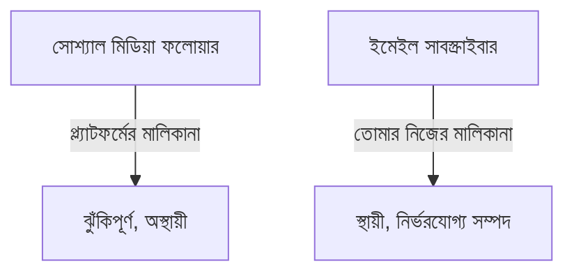
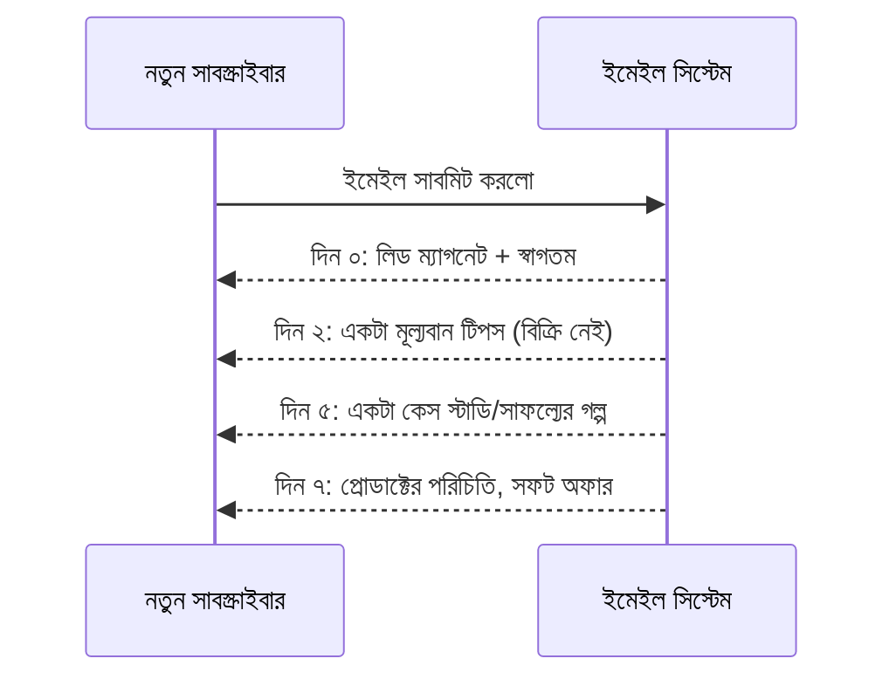

# ০৪. Building an Email List from Scratch

আগের লেসনের শেষে একটা গুরুত্বপূর্ণ পর্যবেক্ষণ ছিলো — সোশ্যাল মিডিয়া ফলোয়ার আসলে তোমার সম্পদ না, প্ল্যাটফর্মের সম্পদ। যেকোনো দিন একটা প্ল্যাটফর্ম তাদের অ্যালগরিদম বদলাতে পারে, তোমার অ্যাকাউন্ট সাসপেন্ড হতে পারে, বা প্ল্যাটফর্মটাই জনপ্রিয়তা হারাতে পারে — আর তোমার সব ফলোয়ারের সাথে যোগাযোগের উপায় হারিয়ে যায়। একটা **ইমেইল লিস্ট** এই ঝুঁকি থেকে মুক্ত — এটা সম্পূর্ণভাবে তোমার নিয়ন্ত্রণে, কোনো তৃতীয় পক্ষের অ্যালগরিদমের দয়ার উপর নির্ভর করে না।

ইমেইল লিস্টের এই "মালিকানা" ধারণাটা এতটাই গুরুত্বপূর্ণ যে, অভিজ্ঞ মার্কেটাররা প্রায়ই বলেন "The money is in the list" — কারণ একটা ভালো ইমেইল লিস্ট সরাসরি, ব্যক্তিগত যোগাযোগের একটা চ্যানেল, যেটা সোশ্যাল মিডিয়া পোস্টের চেয়ে অনেক বেশি কনভার্শন রেট দেয়।



একটা ইমেইল লিস্ট বানানোর প্রথম ধাপ হলো একটা **lead magnet** — এমন কিছু মূল্যবান জিনিস যা বিনামূল্যে দেয়া হয়, ইমেইল ঠিকানার বিনিময়ে। এটা হতে পারে একটা ছোট ই-বুক, একটা চেকলিস্ট, একটা ফ্রি টুল, বা InvoiceBari-র (Module 49) ক্ষেত্রে "ফ্রিল্যান্সারদের জন্য ৫টা ইনভয়েস টেমপ্লেট, ফ্রি ডাউনলোড।"

```js
// একটা সাধারণ ইমেইল সাবস্ক্রিপশন এন্ডপয়েন্ট — Module 41-এ শেখা SendGrid/Mailchimp-এর সাথে মিলিয়ে
app.post('/api/subscribe', async (req, res) => {
  const { email } = req.body;

  if (!/^[^\s@]+@[^\s@]+\.[^\s@]+$/.test(email)) {
    return res.status(400).json({ error: 'সঠিক ইমেইল ঠিকানা দিন' });
  }

  await addToMailingList(email); // Module 41, লেসন ০৭-এ শেখা Mailchimp API
  await sendLeadMagnetEmail(email); // Module 41, লেসন ০১-এ শেখা SendGrid দিয়ে

  res.json({ message: 'ধন্যবাদ! আপনার ইমেইলে ফ্রি গাইড পাঠানো হয়েছে।' });
});
```

লক্ষ্য করো, এই কোডটা সরাসরি Module 41-এ শেখা থার্ড-পার্টি ইন্টিগ্রেশন প্যাটার্নের একটা বাস্তব প্রয়োগ — SendGrid দিয়ে তাৎক্ষণিক ইমেইল পাঠানো, আর Mailchimp-এ (বা যেকোনো ইমেইল মার্কেটিং টুলে) সাবস্ক্রাইবার যোগ করা।

একবার সাবস্ক্রাইবার পাওয়ার পর, তালিকাটা "উষ্ণ" রাখা জরুরি — নিয়মিত মূল্যবান কনটেন্ট পাঠানো, শুধু বিক্রির চেষ্টা না করে। একটা ভালো কৌশল হলো একটা **welcome sequence** বানানো — নতুন সাবস্ক্রাইবার যোগ হওয়ার পর কয়েকদিন ধরে ধারাবাহিক কয়েকটা ইমেইল যায়, যেখানে ধীরে ধীরে বিশ্বাস তৈরি হয়, তারপর প্রোডাক্টের কথা আসে।



ইমেইল লিস্ট ব্যবস্থাপনায় Module 41-এর লেসন ০৭-এ শেখা Mailchimp-এর মতো টুল ব্যবহার করা বুদ্ধিমানের কাজ, কারণ এই ধরনের সিকোয়েন্স ম্যানুয়ালি পাঠানো অসম্ভব, কিন্তু একটা ইমেইল মার্কেটিং প্ল্যাটফর্ম স্বয়ংক্রিয়ভাবে এটা করে দিতে পারে (automation)।

একটা গুরুত্বপূর্ণ নৈতিক নিয়ম — সাবস্ক্রাইবারকে সবসময় সহজে আনসাবস্ক্রাইব করার সুযোগ দেয়া, আর কখনো তাদের অনুমতি ছাড়া তথ্য বিক্রি না করা। বিশ্বাস একবার ভাঙলে ফিরিয়ে আনা কঠিন, আর এই বিশ্বাসই একটা ইমেইল লিস্টের আসল মূল্য।

ইমেইল লিস্ট ধীরে ধীরে বাড়ে, কিন্তু কখনো কখনো একজন ফাউন্ডারের দরকার হয় একটা বড়, তাৎক্ষণিক এক্সপোজার — বিশেষ করে লঞ্চের দিনে। সেই বড় এক্সপোজার পাওয়ার নির্দিষ্ট প্ল্যাটফর্ম কৌশল নিয়েই আমাদের পরের লেসন — Reddit, HackerNews, আর Product Hunt।
