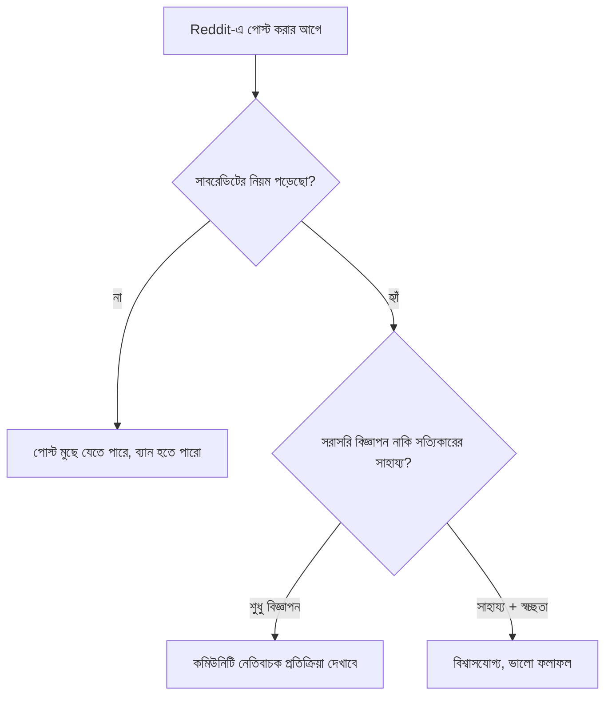

# ০৫. Reddit, HackerNews & Product Hunt Strategies

আগের লেসনগুলোতে আমরা ধীর, দীর্ঘমেয়াদী কৌশল দেখেছি — SEO, ইমেইল লিস্ট। এই লেসনে আমরা এমন তিনটা প্ল্যাটফর্ম দেখবো যেগুলো একদিনে বড় পরিমাণ ট্রাফিক আর মনোযোগ এনে দিতে পারে — কিন্তু প্রতিটার নিজস্ব সংস্কৃতি আছে, যা না বুঝলে ফলাফল ভালো হওয়ার বদলে উল্টো ক্ষতি হতে পারে।

**Reddit**-এর মূল নিয়ম হলো — প্রতিটা সাবরেডিটের নিজস্ব কমিউনিটি নিয়ম আছে, আর সরাসরি নিজের প্রোডাক্টের বিজ্ঞাপন দেয়াকে (self-promotion) প্রায়ই খারাপ চোখে দেখা হয় (একে বলে "spam" হিসেবে গণ্য হওয়া)। কার্যকর কৌশল হলো Module 44-এর লেসন ০৫-এ শেখা "সাহায্য আগে" নীতি অনুসরণ করা — একটা প্রাসঙ্গিক সাবরেডিটে (যেমন `r/freelance`) কারো সমস্যার আন্তরিক সমাধান দেয়া, আর শুধু সত্যিই প্রাসঙ্গিক হলে নিজের প্রোডাক্টের কথা উল্লেখ করা, স্বীকার করে যে "আমিই এটা বানিয়েছি" — এই স্বচ্ছতা রেডিটে অত্যন্ত গুরুত্বপূর্ণ।

**Hacker News** (HN) মূলত টেকনিক্যাল কমিউনিটি, ডেভেলপার আর স্টার্টআপ ফাউন্ডারে ভরা। এখানে "Show HN" নামের একটা বিশেষ পোস্ট ফরম্যাট আছে, যেখানে ফাউন্ডাররা নিজেদের বানানো প্রোজেক্ট শেয়ার করে। HN কমিউনিটি খুবই টেকনিক্যালি সমালোচনামূলক (critical) — তারা মার্কেটিং ভাষার বদলে সততা আর টেকনিক্যাল গভীরতা পছন্দ করে। একটা "Show HN: আমি একা হাতে একটা Go দিয়ে বানানো রিয়েল-টাইম ইনভয়েসিং API বানিয়েছি" পোস্ট, যেখানে আর্কিটেকচারের বিস্তারিত (Module 40, 46-47-এ শেখা ধরনের) শেয়ার করা হয়, বিপণনী ভাষার চেয়ে অনেক ভালো সাড়া পায়।

**Product Hunt** সম্পূর্ণ ভিন্ন — এটা একটা কিউরেটেড প্ল্যাটফর্ম, যেখানে প্রতিদিন নতুন প্রোডাক্ট "লঞ্চ" হয় আর কমিউনিটি ভোট দেয়। এখানে সফলতার মূল চাবিকাঠি প্রস্তুতি — লঞ্চের দিনের আগে থেকেই একটা "coming soon" পেজ বানিয়ে আগ্রহী মানুষদের জানানো, লঞ্চের দিনে তাদের ভোট দেয়ার জন্য অনুরোধ করা (কিন্তু সরাসরি "vote for me" বলা প্ল্যাটফর্মের নিয়ম ভঙ্গ করে, তাই কৌশলে করতে হয়)।

| প্ল্যাটফর্ম | সংস্কৃতি | সেরা সময় |
|---|---|---|
| Reddit | কমিউনিটি-প্রথম, স্বচ্ছতা জরুরি | চলমান, নিয়মিত অংশগ্রহণ |
| Hacker News | টেকনিক্যাল গভীরতা, সততা | একবার বড় ফিচার লঞ্চে "Show HN" |
| Product Hunt | কিউরেটেড লঞ্চ ইভেন্ট | প্রধান প্রোডাক্ট লঞ্চের দিনে |

Module 43-এর গো-টু-মার্কেট লেসনে আমরা দেখেছিলাম একটা GTM স্ট্র্যাটেজিতে "Private Beta → Soft Launch → Public Launch" ধাপ থাকে — এই তিনটা প্ল্যাটফর্ম মূলত সেই "Soft Launch" আর "Public Launch" ধাপে ব্যবহার করা হয়, বিশেষ করে যখন Module 44-এর লেসন ০৩-এ শেখা প্রথম কয়েকজন ব্যবহারকারী (beta) থেকে ইতিমধ্যে ভালো প্রতিক্রিয়া (testimonial) পাওয়া গেছে।

একটা গুরুত্বপূর্ণ সতর্কতা — এই প্ল্যাটফর্মগুলোতে একবার নেতিবাচক প্রতিক্রিয়া পেলে (বিশেষ করে HN-এ), সেটা দীর্ঘমেয়াদী সুনামের ক্ষতি করতে পারে। তাই লঞ্চ করার আগে প্রোডাক্ট আসলেই কাজ করছে কিনা তা নিশ্চিত হওয়া জরুরি — একটা ভাঙা লিংক বা ক্র্যাশ করা সার্ভার (Module 41-এর Sentry দিয়ে আগেই ধরা যেতো) প্রথম ইমপ্রেশন নষ্ট করে দিতে পারে।

এই প্ল্যাটফর্মগুলো দ্রুত এক্সপোজার দেয়, কিন্তু দীর্ঘমেয়াদে টিকে থাকার জন্য একজন ফাউন্ডারের নিজস্ব পরিচিতি — একটা ব্র্যান্ড হিসেবে নিজেকে প্রতিষ্ঠিত করা — সমান গুরুত্বপূর্ণ। সেই পার্সোনাল ব্র্যান্ডিং-এর কৌশলই আমাদের পরের লেসনের বিষয়।
