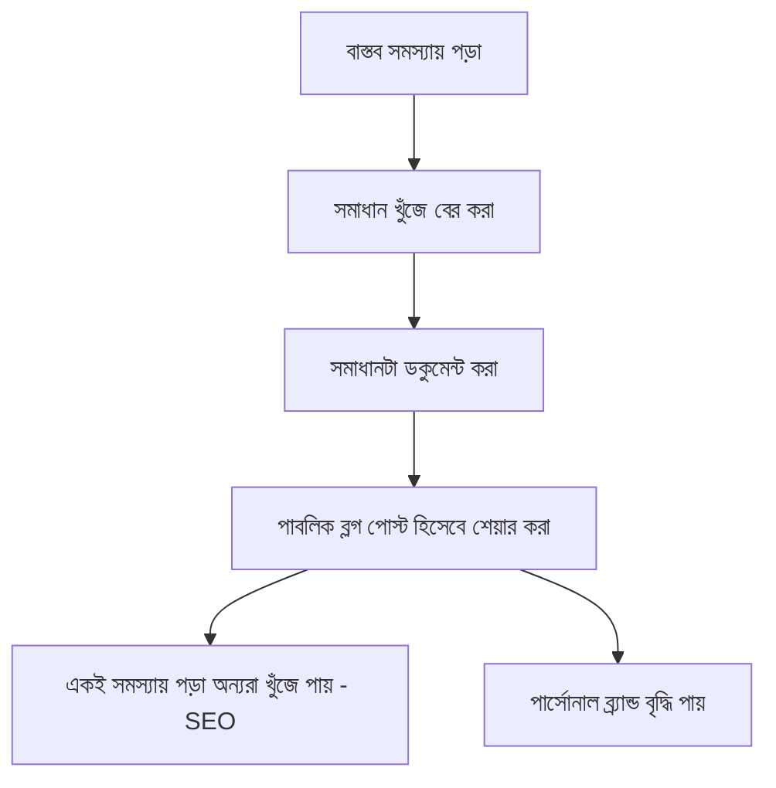

# ০৭. Writing Technical Blog Posts

আগের লেসনে আমরা বলেছিলাম লেখা পার্সোনাল ব্র্যান্ড তৈরির সবচেয়ে কার্যকর মাধ্যম। Module 45-এর লেসন ০২-তে আমরা SEO-এর দৃষ্টিকোণ থেকে কনটেন্ট দেখেছিলাম — এই লেসনে আমরা দেখবো একটা টেকনিক্যাল ব্লগ পোস্ট আসলে কীভাবে লিখতে হয়, যা পাঠকের জন্য সত্যিই মূল্যবান হয়, শুধু সার্চ ইঞ্জিনের জন্য অপ্টিমাইজড না।

একটা ভালো টেকনিক্যাল ব্লগ পোস্টের সবচেয়ে গুরুত্বপূর্ণ উপাদান হলো — এটা একটা সত্যিকারের সমস্যা থেকে শুরু হয়, তত্ত্ব থেকে না। সবচেয়ে কার্যকর পোস্টগুলো প্রায়ই আসে ফাউন্ডারের নিজের সমাধান করা একটা বাস্তব সমস্যা থেকে। যেমন InvoiceBari (Module 49) বানানোর সময় যদি bKash ইন্টিগ্রেশনে একটা নির্দিষ্ট সমস্যায় পড়া হয়, "bKash Payment Gateway Integration-এ যে ৩টা Edge Case আমাকে সবচেয়ে বেশি ভুগিয়েছে" — এই ধরনের পোস্ট নির্দিষ্ট, বাস্তব, আর একই সমস্যায় পড়া অন্য ডেভেলপারদের কাছে সরাসরি মূল্যবান।



একটা ভালো টেকনিক্যাল পোস্টের গঠন সাধারণত সমস্যা দিয়ে শুরু হয় (প্রেক্ষাপট, কেন এটা গুরুত্বপূর্ণ), তারপর সমাধানের দিকে যাত্রা (কী কী চেষ্টা করা হয়েছে, কোনটা কাজ করেনি এবং কেন), শেষে চূড়ান্ত সমাধান কোডসহ। এই "যাত্রা" দেখানো — শুধু চূড়ান্ত উত্তর না — পাঠককে বেশি শেখায়, কারণ তারা বোঝে কেন এই সমাধান, শুধু কী সমাধান তা না।

```markdown
## সমস্যা
Gin দিয়ে JWT মিডলওয়্যার বানানোর সময় (Module 47, লেসন ৬) আমি একটা race
condition-এ পড়েছিলাম, যেখানে একাধিক গোরুটিন (Module 46, লেসন ৭) একসাথে
টোকেন ভেরিফাই করার সময় ক্র্যাশ করছিলো।

## যা কাজ করেনি
প্রথমে ভেবেছিলাম টোকেন ক্যাশ করলে সমস্যা সমাধান হবে, কিন্তু...

## সমাধান
আসল সমস্যাটা ছিলো shared map-এ mutex ছাড়া অ্যাক্সেস (Module 46, লেসন ২০)।
```

কোড উদাহরণ দেয়ার সময় একটা গুরুত্বপূর্ণ নিয়ম — কোডটা কপি-পেস্ট করে চালানো যায় এমন হওয়া উচিত, অর্ধেক-লেখা "..." দিয়ে ভরা না। একজন পাঠক যখন কোড কপি করে নিজে চালিয়ে দেখতে পারে, সেই পোস্ট অনেক বেশি বিশ্বাসযোগ্য আর কার্যকর মনে হয়।

কোথায় এই পোস্ট প্রকাশ করবে তা নিয়েও একটা সিদ্ধান্ত দরকার — নিজের ডোমেইনে ব্লগ (SEO-এর জন্য দীর্ঘমেয়াদে ভালো, Module 45 লেসন ০২), নাকি dev.to বা Medium-এর মতো প্ল্যাটফর্মে (তাৎক্ষণিক দর্শকের জন্য ভালো, কারণ এদের নিজস্ব পাঠক-ভিত্তি আছে)। বাস্তবে সবচেয়ে ভালো কৌশল দুটোই করা — নিজের ব্লগে মূল পোস্ট, তারপর dev.to-তে ক্রস-পোস্ট করে সেখান থেকে নিজের সাইটে লিংক দেয়া (এই ক্রস-পোস্টিং কৌশল নিয়ে আমরা লেসন ১১-এ আরো বিস্তারিত যাবো)।

একটা শেষ, কিন্তু গুরুত্বপূর্ণ পরামর্শ — প্রতিটা টেকনিক্যাল পোস্টের শেষে একটা স্বাভাবিক, চাপাচাপি-বিহীন উপায়ে নিজের প্রোডাক্টের কথা উল্লেখ করা যায় ("এই সমস্যাটা সমাধান করতে গিয়েই আমি InvoiceBari বানানো শুরু করি") — কিন্তু এটা পোস্টের মূল লক্ষ্য হওয়া উচিত না, শুধু একটা স্বাভাবিক প্রসঙ্গ।

ব্লগ পোস্ট লেখা একটা দীর্ঘমেয়াদী চ্যানেল, কিন্তু প্রতিদিনের, তাৎক্ষণিক উপস্থিতির জন্য আরেকটা মাধ্যম দরকার — যেখানে ছোট, ঘন ঘন আপডেট শেয়ার করা যায়। সেই মাধ্যমটাই Twitter/X, যা নিয়ে আমরা পরের লেসনে বিস্তারিত আলোচনা করবো।
