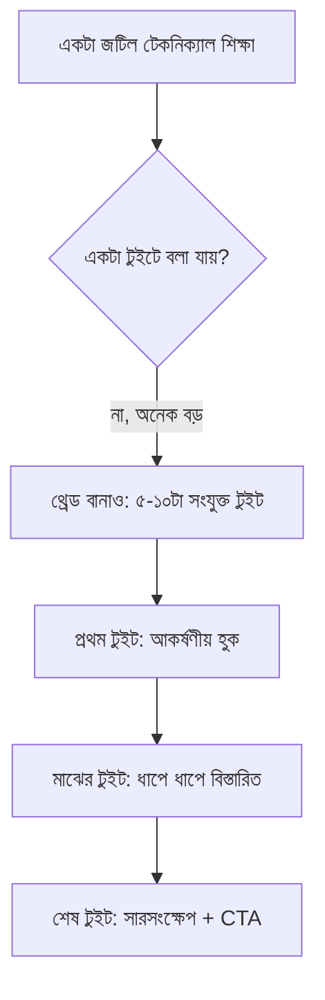

# ০৮. Twitter/X Growth Strategies

আগের কয়েকটা লেসনে আমরা লম্বা কনটেন্ট (ব্লগ পোস্ট) আর একবারের বড় ইভেন্ট (Product Hunt লঞ্চ) দেখেছি। Twitter/X ভিন্ন একটা ভূমিকা পালন করে — এটা দৈনন্দিন, ছোট, ঘন ঘন যোগাযোগের মাধ্যম, যেখানে ডেভেলপার আর ইনডি হ্যাকার কমিউনিটির একটা বড় অংশ সক্রিয়। Module 44-এর লেসন ০৭-এ শেখা Building in Public-এর সবচেয়ে স্বাভাবিক ঘর এই প্ল্যাটফর্মটাই।

Twitter/X-এ গ্রোথের মূল ভিত্তি হলো ধারাবাহিকতা আর প্রাসঙ্গিকতা। Module 45-এর লেসন ০৩-এ শেখা সাধারণ সোশ্যাল মিডিয়া নীতিগুলোই এখানে প্রযোজ্য, কিন্তু Twitter/X-এর নিজস্ব কিছু বিশেষত্ব আছে — বিশেষ করে **থ্রেড** ফরম্যাট, যেখানে একটা জটিল বিষয় ছোট ছোট, একের পর এক টুইটে ভাগ করে বলা যায়।

একটা কার্যকর থ্রেডের প্রথম টুইট (hook) সবচেয়ে গুরুত্বপূর্ণ — এটাই ঠিক করে মানুষ পুরো থ্রেড পড়বে কিনা। একটা দুর্বল হুক ("আজকে আমি একটা bug fix করলাম") আর একটা শক্তিশালী হুক ("৩ ঘণ্টা ধরে একটা bug খুঁজেছি যা আসলে ১ লাইনের ভুল ছিলো — এখানে পুরো ডিবাগিং প্রক্রিয়া") — এই দুটোর মধ্যে পার্থক্য বিশাল।

Building in Public আপডেটের জন্য একটা কার্যকর ফরম্যাট হলো নিয়মিত, পূর্বানুমানযোগ্য প্যাটার্ন রাখা — যেমন প্রতি শুক্রবার একটা "সাপ্তাহিক আপডেট" থ্রেড, যেখানে থাকে সংখ্যা (রেভিনিউ, ইউজার সংখ্যা), শেখা কিছু, আর পরের সপ্তাহের পরিকল্পনা। এই পূর্বানুমানযোগ্যতা অনুসারীদের অভ্যাস তৈরি করে — তারা জানে কখন নতুন আপডেট আসবে।

| টুইটের ধরন | উদ্দেশ্য | ফ্রিকোয়েন্সি (উদাহরণ) |
|---|---|---|
| Building in Public আপডেট | স্বচ্ছতা, বিশ্বাস তৈরি | সাপ্তাহিক |
| টেকনিক্যাল টিপস/থ্রেড | দক্ষতা প্রদর্শন, ভ্যালু দেয়া | সপ্তাহে ২-৩ বার |
| কমিউনিটি এনগেজমেন্ট (রিপ্লাই, কোট) | সম্পর্ক তৈরি | দৈনিক |
| প্রোডাক্ট আপডেট/লঞ্চ | সরাসরি প্রমোশন | কম ফ্রিকোয়েন্সি, উপলক্ষ্যভিত্তিক |

লক্ষ্য করার মতো একটা বিষয় — টেবিলে "কমিউনিটি এনগেজমেন্ট" সবচেয়ে বেশি ফ্রিকোয়েন্সিতে আছে, কিন্তু নতুনরা প্রায়ই এটা উপেক্ষা করে, শুধু নিজের পোস্ট করায় মনোযোগ দেয়। বাস্তবে, অন্যদের পোস্টে চিন্তাশীল রিপ্লাই দেয়া (শুধু "ভালো!" না, বরং কিছু যোগ করা মন্তব্য) — এটা নিজের অ্যাকাউন্টে নতুন মানুষ নিয়ে আসার অন্যতম কার্যকর উপায়, কারণ তোমার রিপ্লাই তাদের ফলোয়ারদের কাছেও দৃশ্যমান হয়।

একটা সতর্কতা — গ্রোথ-হ্যাকিং কৌশল (যেমন ফলোয়ার কেনা, বট ব্যবহার করে এনগেজমেন্ট বাড়ানো) স্বল্পমেয়াদে সংখ্যা বাড়ালেও দীর্ঘমেয়াদে ক্ষতিকর — প্ল্যাটফর্ম এগুলো ধরে ফেলে অ্যাকাউন্ট শাস্তি দিতে পারে, আর আসল, প্রাসঙ্গিক দর্শক তৈরি হয় না। Module 44-এর লেসন ১১-এ শেখা "টেকসই গতি" নীতিটা এখানেও প্রযোজ্য — ধীরে কিন্তু প্রকৃত বৃদ্ধি, দ্রুত কিন্তু নকল বৃদ্ধির চেয়ে ভালো।

Twitter/X-এ ধারাবাহিক উপস্থিতি একটা সাধারণ, ডেভেলপার-কেন্দ্রিক দর্শক তৈরি করে। কিন্তু কনটেন্টের ধরন যদি আরো নির্দিষ্টভাবে ডেভেলপারদের সমস্যা সমাধানে ফোকাস করে, সেটা আরো গভীর বিশ্বাসযোগ্যতা তৈরি করতে পারে — সেই নির্দিষ্ট কৌশলটাই আমাদের পরের লেসনের বিষয়।
