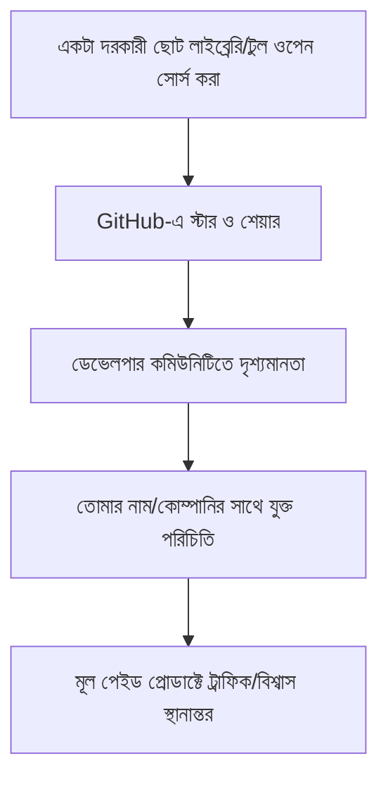

# ১০. Open Source Marketing

আগের লেসনে আমরা দেখেছি ডেভেলপাররা প্রমাণ-ভিত্তিক কনটেন্ট বিশ্বাস করে। এর সবচেয়ে শক্তিশালী রূপ হলো — সরাসরি কোড পাবলিক করে দেয়া। **ওপেন সোর্স মার্কেটিং** মানে হলো তোমার কাজের একটা অংশ (হতে পারে পুরো প্রোডাক্ট, বা একটা ছোট সহায়ক টুল/লাইব্রেরি) বিনামূল্যে, ওপেন সোর্স হিসেবে প্রকাশ করা, যাতে এটা নিজে থেকেই মনোযোগ আর বিশ্বাসযোগ্যতা টেনে আনে।

ওপেন সোর্স মার্কেটিংয়ের পেছনের যুক্তিটা বোঝা জরুরি — এটা সরাসরি রেভিনিউ আনে না (কোড ফ্রি), কিন্তু এটা তিনটা জিনিস তৈরি করে যা পরোক্ষভাবে ব্যবসাকে সাহায্য করে: বিশ্বাসযোগ্যতা (কোড মানের প্রমাণ), দৃশ্যমানতা (GitHub-এ স্টার, শেয়ার), আর সম্পর্ক (কন্ট্রিবিউটর কমিউনিটি)।



একটা বাস্তব কৌশল হলো পুরো প্রোডাক্ট ওপেন সোর্স না করে, প্রোডাক্ট বানানোর সময় তৈরি হওয়া একটা ছোট, সাধারণ-উদ্দেশ্যের উপাদান আলাদা করে ওপেন সোর্স করা। ধরো InvoiceBari (Module 49) বানানোর সময় বাংলা সংখ্যা/তারিখ ফরম্যাট করার একটা ছোট ইউটিলিটি লাইব্রেরি বানানো হয়েছে — এই ছোট, ফোকাসড টুলটাই একটা আলাদা pip প্যাকেজ হিসেবে প্রকাশ করা যায়:

```python
# bangla-date-format একটা ছোট, স্বাধীন ওপেন সোর্স প্যাকেজ
from bangla_date_format import format_bangla_date
from datetime import datetime

print(format_bangla_date(datetime.now()))  # "৮ আগস্ট, ২০২৬"
```

```markdown
<!-- README.md -->
# bangla-date-format

Python-এ বাংলা তারিখ ফরম্যাট করার একটা হালকা লাইব্রেরি।
InvoiceBari (invoicebari.com) প্রোজেক্টের অংশ হিসেবে তৈরি।

## ইনস্টলেশন
pip install bangla-date-format
```

লক্ষ্য করো, README-তে সরাসরি মূল প্রোডাক্টের (InvoiceBari) উল্লেখ আছে — এটাই ওপেন সোর্স মার্কেটিংয়ের মূল কৌশল। যে কেউ এই ছোট, উপযোগী লাইব্রেরিটা ব্যবহার করে উপকৃত হবে, সে স্বাভাবিকভাবে জানবে এটা কে বানিয়েছে আর কোন বড় প্রোডাক্টের অংশ, কোনো চাপাচাপি ছাড়াই।

ওপেন সোর্স প্রজেক্ট রক্ষণাবেক্ষণের একটা বাস্তব দায়িত্ব আছে যা অনেকে ভুলে যায় — issue-তে সাড়া দেয়া, pull request রিভিউ করা, ডকুমেন্টেশন আপডেট রাখা। একটা অবহেলিত, দীর্ঘদিন আপডেট না হওয়া রিপোজিটরি আসলে বিশ্বাসযোগ্যতার ক্ষতি করে, উপকারের বদলে। তাই ওপেন সোর্স করার সিদ্ধান্তটা একটা দীর্ঘমেয়াদী প্রতিশ্রুতি, শুধু এক-কালীন মার্কেটিং স্টান্ট না।

| ওপেন সোর্স করার সুবিধা | ঝুঁকি/দায়িত্ব |
|---|---|
| বিশ্বাসযোগ্যতা ও দৃশ্যমানতা | নিয়মিত রক্ষণাবেক্ষণ প্রয়োজন |
| কমিউনিটি কন্ট্রিবিউশন | কোড কোয়ালিটি পাবলিকলি দৃশ্যমান |
| GitHub প্রোফাইলে পোর্টফোলিও তৈরি | প্রতিযোগীরাও কোড দেখতে পারে |

Module 46-47-এ শেখা Go-এর মতো ভাষায় লেখা প্রজেক্টের জন্য ওপেন সোর্স বিশেষভাবে কার্যকর, কারণ Go কমিউনিটি ওপেন সোর্স সংস্কৃতিতে খুবই সক্রিয় — একটা ভালো লেখা, ভালো ডকুমেন্টেড Go লাইব্রেরি দ্রুত মনোযোগ পেতে পারে।

ওপেন সোর্স একটা কনটেন্ট আর বিশ্বাসযোগ্যতা তৈরির কৌশল একা একা কাজ করে, কিন্তু আরো শক্তিশালী হয় যখন অন্য ফাউন্ডার বা প্রোডাক্টের সাথে যৌথভাবে কাজ করা হয়। সেই ক্রস-প্রোমোশন আর পার্টনারশিপ কৌশলই আমাদের পরের লেসনের বিষয়।
