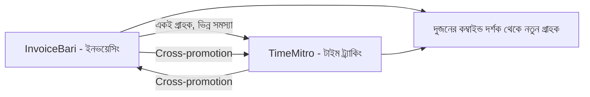

# ১১. Cross-Promotion & Partnerships

এতদিন আমরা এমন কৌশল দেখেছি যা একজন ফাউন্ডার একা করতে পারে — লেখা, পোস্ট করা, ওপেন সোর্স করা। এই লেসনে আমরা দেখবো কীভাবে অন্য ফাউন্ডার বা প্রোডাক্টের সাথে সহযোগিতা করে দুজনেরই লাভ হয় — **ক্রস-প্রোমোশন**।

মূল ধারণাটা সহজ — যদি তোমার আর আরেকজন ফাউন্ডারের প্রোডাক্ট একই ধরনের গ্রাহকের কাছে যায়, কিন্তু একে অপরের সরাসরি প্রতিযোগী না (competitor না), তাহলে একে অপরের দর্শকের কাছে পরিচিতি বিনিময় করা দুজনের জন্যই লাভজনক। যেমন InvoiceBari (ইনভয়েসিং টুল) আর একটা ফ্রিল্যান্স টাইম-ট্র্যাকিং টুল — এই দুটো একই persona-কে (Module 43, লেসন ০৩-এর রাফি) সার্ভ করে, কিন্তু একে অপরের প্রতিযোগী না, বরং পরিপূরক।



ক্রস-প্রোমোশনের ব্যবহারিক রূপ অনেক ধরনের হতে পারে — একে অপরের নিউজলেটারে (Module 45, লেসন ০৪-এ শেখা ইমেইল লিস্ট) উল্লেখ করা, যৌথভাবে একটা ওয়েবিনার বা লাইভ স্ট্রিম করা, একে অপরের ব্লগে গেস্ট পোস্ট লেখা, বা এমনকি প্রোডাক্ট পর্যায়ে ইন্টিগ্রেশন বানানো (Module 41-এ শেখা ইন্টিগ্রেশন প্যাটার্নের একটা ব্যবসায়িক প্রয়োগ) — যেমন InvoiceBari-তে সরাসরি TimeMitro থেকে ট্র্যাক করা ঘণ্টা ইমপোর্ট করার সুবিধা।

```js
// একটা সাধারণ পার্টনার ইন্টিগ্রেশন এন্ডপয়েন্ট
app.post('/api/partners/timemitro/import-hours', async (req, res) => {
  const { clientId, hours, rate } = req.body;
  // Module 41-এর মতো, একটা পার্টনার সার্ভিস থেকে ডেটা গ্রহণ করে নিজের সিস্টেমে ব্যবহার
  const invoice = await createInvoiceFromHours(clientId, hours, rate);
  res.json({ invoiceId: invoice.id });
});
```

গেস্ট পোস্টিং একটা বিশেষভাবে কার্যকর কৌশল — Module 45-এর লেসন ০৭-এ শেখা টেকনিক্যাল ব্লগিং দক্ষতা ব্যবহার করে অন্য কারো (বড় দর্শকের) ব্লগে একটা মূল্যবান পোস্ট লেখা, বিনিময়ে সেই পোস্টে নিজের প্রোডাক্টের একটা সংক্ষিপ্ত পরিচিতি (author bio) জুড়ে দেয়া। এটা একদিকে হোস্ট ব্লগের জন্য ফ্রি ভালো কনটেন্ট, অন্যদিকে লেখকের জন্য নতুন দর্শকের কাছে পৌঁছানোর সুযোগ।

| পার্টনারশিপ ধরন | উদাহরণ |
|---|---|
| ইমেইল লিস্ট শেয়ারিং | একে অপরের নিউজলেটারে উল্লেখ |
| গেস্ট পোস্টিং | অন্যের ব্লগে লেখা, নিজের bio |
| প্রোডাক্ট ইন্টিগ্রেশন | দুই টুলের মধ্যে ডেটা শেয়ারিং |
| যৌথ ইভেন্ট | একসাথে ওয়েবিনার/লাইভ স্ট্রিম |

একটা গুরুত্বপূর্ণ বিষয় হলো পার্টনার বাছাই করার সময় সততা আর সমতা বজায় রাখা — একটা পার্টনারশিপ তখনই টেকসই যখন দুই পক্ষই মোটামুটি সমান উপকৃত হয়। যদি একজন ফাউন্ডারের দর্শক আরেকজনের চেয়ে অনেক বড় হয়, ছোট ফাউন্ডারকে অতিরিক্ত মূল্য দিতে হতে পারে (যেমন বেশি কনটেন্ট লেখা) ভারসাম্য বজায় রাখতে।

Module 44-এর লেসন ০৮-এ শেখা কমিউনিটি বিল্ডিং-এর সাথে ক্রস-প্রোমোশনের একটা প্রাকৃতিক যোগসূত্র আছে — অন্য ফাউন্ডারদের কমিউনিটিতে (যেমন ইনডি হ্যাকার ফেসবুক/ডিসকর্ড গ্রুপ) সক্রিয় থাকলে স্বাভাবিকভাবেই এই ধরনের পার্টনারশিপের সুযোগ তৈরি হয়।

আমরা এই মডিউলে অনেকগুলো কৌশল দেখেছি — SEO, সোশ্যাল মিডিয়া, ইমেইল, প্ল্যাটফর্ম লঞ্চ, ব্র্যান্ডিং, ব্লগিং, ওপেন সোর্স, পার্টনারশিপ। কিন্তু একটা গুরুত্বপূর্ণ প্রশ্ন এখনো বাকি — এই সবকিছুর মধ্যে কোনটা আসলে কাজ করছে, কোনটা সময়ের অপচয়? সেই প্রশ্নের উত্তর খুঁজতেই আমাদের শেষ লেসন, বাজেট ছাড়া মার্কেটিং মেট্রিক্স মাপা।
