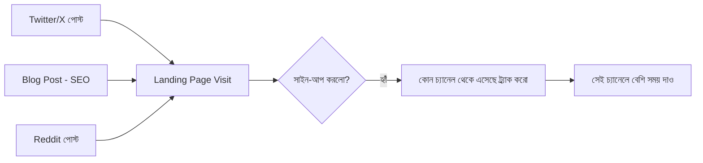

# ১২. Analytics & Marketing Metrics on a Budget

এই মডিউলে আমরা এগারোটা ভিন্ন মার্কেটিং কৌশল শিখেছি — SEO, সোশ্যাল মিডিয়া, ইমেইল, Reddit/HN/Product Hunt, ব্র্যান্ডিং, ব্লগিং, Twitter/X, ডেভেলপার কনটেন্ট, ওপেন সোর্স, পার্টনারশিপ। কিন্তু সময় সীমিত, তাই সবগুলো একসাথে সমান মনোযোগ দিয়ে চালানো অসম্ভব। এই শেষ লেসনে আমরা দেখবো কীভাবে মাপতে হয় কোন কৌশল আসলে কাজ করছে — যাতে সীমিত সময় সবচেয়ে কার্যকর চ্যানেলে কেন্দ্রীভূত করা যায়।

Module 43-এর লেসন ০৬-এ আমরা SaaS মেট্রিক্স (MRR, Churn, LTV/CAC) নিয়ে কথা বলেছিলাম। মার্কেটিং অ্যানালিটিক্স তারই একটা সম্প্রসারণ — প্রতিটা মার্কেটিং চ্যানেলকে আলাদাভাবে মাপা, যাতে বোঝা যায় কোনটা আসলে গ্রাহক আনছে।



এই ট্র্যাকিং সম্ভব করার একটা সাধারণ কৌশল হলো **UTM parameter** ব্যবহার করা — লিংকের সাথে ছোট একটা ট্যাগ জুড়ে দেয়া, যা বলে দেয় কোন চ্যানেল থেকে ক্লিক এসেছে:

```
https://invoicebari.com/?utm_source=twitter&utm_medium=social&utm_campaign=launch_week
https://invoicebari.com/?utm_source=reddit&utm_medium=social&utm_campaign=r_freelance_post
```

Module 41-এর লেসন ১০-এ শেখা Google Analytics, বা Plausible/PostHog-এর মতো প্রাইভেসি-বান্ধব বিকল্প, স্বয়ংক্রিয়ভাবে এই UTM প্যারামিটার অনুযায়ী ট্রাফিক ভাগ করে দেখাতে পারে — কোন চ্যানেল থেকে কত ভিজিটর, আর তার মধ্যে কতজন সাইন-আপ করলো।

```js
// সার্ভার-সাইডেও কনভার্শন ট্র্যাক করা যায়, Module 41-এর অ্যানালিটিক্স প্যাটার্নে
app.post('/api/signup', async (req, res) => {
  const { email, utm_source } = req.body;
  await createUser(email);
  await trackEvent('signup_completed', { source: utm_source || 'direct' });
  res.json({ message: 'স্বাগতম!' });
});
```

একটা সহজ, সাপ্তাহিক ড্যাশবোর্ড রাখা যায় (এমনকি একটা সাধারণ স্প্রেডশিটেই যথেষ্ট) যেখানে প্রতিটা চ্যানেলের ফলাফল তুলনা করা হয়:

| চ্যানেল | ভিজিটর (এই সপ্তাহে) | সাইন-আপ | কনভার্শন রেট | সময় বিনিয়োগ |
|---|---|---|---|---|
| Twitter/X | ৫০০ | ৮ | ১.৬% | ৩ ঘণ্টা/সপ্তাহ |
| SEO ব্লগ | ২০০ | ১০ | ৫% | ৫ ঘণ্টা (এককালীন লেখা) |
| Reddit | ১৫০ | ১২ | ৮% | ২ ঘণ্টা |

এই ধরনের টেবিল থেকে একটা গুরুত্বপূর্ণ সিদ্ধান্ত নেয়া যায় — যদি Reddit সবচেয়ে কম সময়ে সবচেয়ে বেশি কনভার্শন দেয়, পরের সপ্তাহে সেখানে বেশি মনোযোগ দেয়া বুদ্ধিমানের কাজ, Twitter/X-এ কম সময় দিয়ে। এটাই Module 44-এর লেসন ০৪-এ শেখা "Build, Measure, Learn" চক্রের মার্কেটিং সংস্করণ।

একটা গুরুত্বপূর্ণ সতর্কতা — শুধু ভিজিটর সংখ্যার (ভ্যানিটি মেট্রিক্স) পেছনে না দৌড়ে, সবসময় শেষ পর্যন্ত ফলাফল (সাইন-আপ, পেয়িং গ্রাহক) পর্যন্ত ট্র্যাক করা জরুরি। ১০ হাজার ভিজিটর এনে ০ গ্রাহক পাওয়ার চেয়ে, ১০০ ভিজিটর এনে ১০ জন গ্রাহক পাওয়া অনেক বেশি মূল্যবান।

এই পুরো মডিউল জুড়ে আমরা শিখলাম কীভাবে টাকা ছাড়া, শুধু কৌশল আর ধারাবাহিক পরিশ্রম দিয়ে একটা প্রোডাক্টের জন্য দর্শক আর গ্রাহক তৈরি করা যায়। Module 43-এ শেখা ব্যবসায়িক তত্ত্ব, Module 44-এ শেখা সোলো ফাউন্ডার মানসিকতা, আর এই মডিউলে শেখা মার্কেটিং কৌশল — এই তিনটা মডিউল মিলে একজন ডেভেলপারকে শুধু কোড লেখা না, একটা সম্পূর্ণ ব্যবসা চালানোর সক্ষমতা দেয়। এরপর আমরা আবার টেকনিক্যাল জগতে ফিরে যাবো — একটা সম্পূর্ণ নতুন ভাষা, Go, দিয়ে ব্যাকএন্ড ডেভেলপমেন্টের আরেকটা মাত্রা শেখা শুরু করবো।
