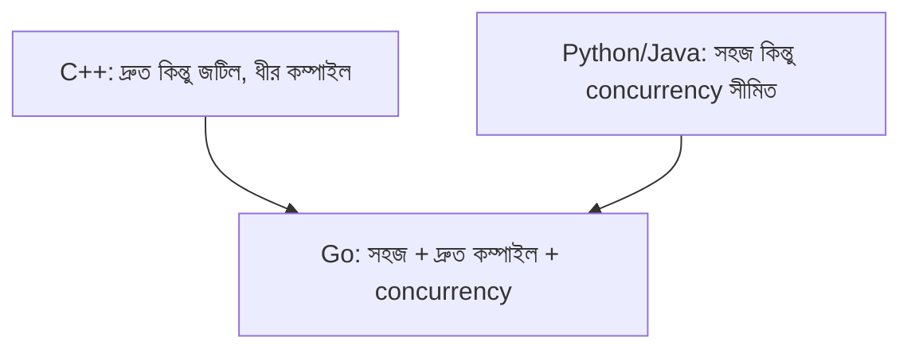

# ০১. Introduction to Go Language

এতদিন আমরা যে কোর্সটা পড়ে এসেছি, তার প্রায় পুরোটাই Node.js আর JavaScript-কেন্দ্রিক — Express দিয়ে API বানানো, async/await দিয়ে asynchronous কাজ সামলানো, npm দিয়ে প্যাকেজ ম্যানেজ করা। তাহলে হঠাৎ একটা সম্পূর্ণ নতুন ভাষা, Go, শেখার দরকার কী? এই প্রশ্নটার উত্তর খুঁজতে গেলে আমাদের আরেকবার ইতিহাসে ফিরতে হবে — ঠিক যেভাবে Module 3-এ Node.js-এর জন্ম নিয়ে আমরা কথা বলেছিলাম।

২০০৭ সালের দিকে Google-এর তিনজন ইঞ্জিনিয়ার — **Robert Griesemer, Rob Pike, আর Ken Thompson** — একটা বিরক্তিকর সমস্যায় পড়েছিলেন। Google-এর ভেতরে তখন বিশাল বিশাল C++ কোডবেস কম্পাইল হতে ঘণ্টার পর ঘণ্টা সময় লাগতো। একজন ডেভেলপার একটা লাইন পরিবর্তন করে কম্পাইল বাটনে চাপ দিয়ে কফি খেতে যেতে পারতো, এতটাই ধীর ছিলো প্রক্রিয়াটা। অন্যদিকে Java বা Python-এর মতো ভাষা তুলনামূলক সহজ ছিলো, কিন্তু performance আর concurrency (একসাথে অনেক কাজ চালানো) নিয়ে তাদের নিজস্ব সীমাবদ্ধতা ছিলো। তাঁরা ভাবলেন — এমন একটা ভাষা বানানো যায় না, যেটা C++-এর মতো দ্রুত চলবে, কিন্তু Python-এর মতো সহজ হবে, আর concurrency-কে ভাষার মূল অংশ হিসেবে ধরে নেবে?

এই চিন্তা থেকেই ২০০৯ সালে জন্ম নিলো **Go** (মাঝে মাঝে Golang নামেও ডাকা হয়)। Node.js যেমন একটা নির্দিষ্ট সমস্যার সমাধান হিসেবে জন্মেছিলো (browser আর server-এর জন্য একই ভাষা), Go-ও ঠিক তেমনি একটা নির্দিষ্ট সমস্যার সমাধান — বড় স্কেলে, দ্রুত কম্পাইল হওয়া, সহজে পড়া যায় এমন সার্ভার সফটওয়্যার লেখার সমাধান।

Go-এর দর্শনটা কয়েকটা মূলনীতির উপর দাঁড়িয়ে।

- **Simplicity (সরলতা)** — Go-তে ইচ্ছাকৃতভাবে খুব কম "ফিচার" রাখা হয়েছে। কোনো class নেই, কোনো inheritance নেই, exception নেই। এতে ভাষাটা শিখতে যেমন সহজ, তেমনি বড় টিমে সবাই একই স্টাইলে কোড লেখে।
- **Fast Compilation** — একটা বড় Go প্রজেক্টও কয়েক সেকেন্ডে কম্পাইল হয়ে যায়, কারণ ভাষাটা সেভাবেই ডিজাইন করা।
- **Built-in Concurrency** — JavaScript-এ concurrency মানে event loop আর callback/promise-এর উপর নির্ভর করা (এটা নিয়ে বিস্তারিত আমরা Module 5-এ দেখেছিলাম)। Go-তে concurrency ভাষারই একটা অংশ — মাত্র `go` কিওয়ার্ড লিখেই একটা ফাংশনকে আলাদাভাবে, সমান্তরালে চালানো যায়। এই বিষয়টা নিয়ে বিস্তারিত থাকবে এই মডিউলেরই একটা লেসনে।
- **Garbage Collection** — C++-এর মতো ম্যানুয়ালি মেমরি পরিষ্কার করতে হয় না, আবার C++-এর মতো গতিও কিছুটা ধরে রাখে।
- **Static Typing** — JavaScript-এ ভ্যারিয়েবলের টাইপ রানটাইমে বদলাতে পারে, কিন্তু Go-তে প্রতিটা ভ্যারিয়েবলের টাইপ কম্পাইল টাইমেই নির্দিষ্ট থাকে, ফলে অনেক ভুল কোড রান করার আগেই ধরা পড়ে।

আজকের দুনিয়ায় Go-এর প্রভাব বিশাল। **Docker** আর **Kubernetes** — যে দুটো টুল আধুনিক ব্যাকএন্ড ডেপ্লয়মেন্টের মেরুদণ্ড — দুটোই Go দিয়ে লেখা। এছাড়া অনেক কোম্পানি তাদের হাই-পারফরম্যান্স ব্যাকএন্ড API, microservices, এমনকি CLI টুল বানাতে Go বেছে নেয়, কারণ এটা একইসাথে দ্রুত এবং সহজে maintain করা যায়।

তাহলে এই কোর্সে Node.js-এর পাশাপাশি Go কেন? কারণ বাস্তব industry-তে একজন ব্যাকএন্ড ডেভেলপারকে প্রায়ই একাধিক ভাষায় কাজ করতে হয় — Node.js যেখানে দ্রুত ডেভেলপমেন্ট আর বড় ইকোসিস্টেমের জন্য ভালো, সেখানে Go বেছে নেওয়া হয় performance-critical বা high-concurrency সিস্টেমের জন্য। দুটো ভাষার তুলনামূলক অভিজ্ঞতা তোমাকে একজন পরিণত ব্যাকএন্ড ইঞ্জিনিয়ার হতে সাহায্য করবে।

একটা উপমা দিয়ে ব্যাপারটা আরও পরিষ্কার করা যাক। ধরো Node.js একজন দক্ষ, বহুমুখী রাঁধুনির মতো — খুব দ্রুত হাতে থাকা উপকরণ দিয়ে সুস্বাদু রান্না নামিয়ে ফেলতে পারে, আর তার রান্নাঘরে হাজারও মশলা (npm প্যাকেজ) মজুদ আছে। Go যেন একজন ইঞ্জিনিয়ার-রাঁধুনি — একটু বেশি নিয়মকানুন মেনে চলে, কিন্তু যখন একসাথে হাজার হাজার প্লেট রান্না করতে হয় নিখুঁত গতিতে, নির্ভরযোগ্যভাবে, তখন তার সিস্টেমটাই সবচেয়ে ভালো কাজ করে। দুই ধরনের রাঁধুনিকেই চেনা থাকলে, যেকোনো রান্নাঘরে কাজ করার সামর্থ্য তৈরি হয়।

এই মডিউল জুড়ে আমরা ধাপে ধাপে এগোবো — এনভায়রনমেন্ট সেটআপ থেকে শুরু করে সিনট্যাক্স, control structures, function, struct, interface, আর সবশেষে Go-এর সবচেয়ে গর্বের জায়গা concurrency পর্যন্ত। প্রতিটা ধাপেই আমরা তুলনা করে যাবো Node.js-এ যেভাবে একই কাজ করা হয়, তার সাথে — যাতে নতুন কিছু মুখস্থ না করে, বরং ইতিমধ্যে জানা জ্ঞানের উপর ভিত্তি করে নতুন ভাষাটা বোঝা যায়।

পরের লেসনে আমরা হাতেকলমে Go ইনস্টল করে প্রথম প্রোগ্রামটা রান করবো।
