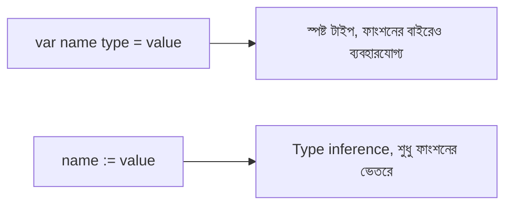

# ০৩. Understanding Go Syntax & Data Types

আগের লেসনে যে ছোট প্রোগ্রামটা রান করেছিলাম, সেটার প্রতিটা লাইনের অর্থ এখন ভেঙে বোঝা দরকার, কারণ এই কাঠামোটাই প্রতিটা Go ফাইলের ভিত্তি।

```go
package main

import "fmt"

func main() {
    fmt.Println("Hello, Go!")
}
```

প্রথম লাইনে `package main` — Go-এর প্রতিটা ফাইল কোনো না কোনো **package**-এর অংশ, আর `main` নামের প্যাকেজটা বিশেষ, কারণ এটাই বলে দেয় যে এই ফাইলটা একটা চালানোর-যোগ্য (executable) প্রোগ্রাম, লাইব্রেরি নয়। এরপর `import "fmt"` দিয়ে আমরা Go-এর built-in "format" প্যাকেজ আনছি, যেটাতে প্রিন্ট করার ফাংশনগুলো আছে। আর `func main()` হলো প্রোগ্রামের প্রবেশদ্বার — JavaScript-এ যেমন `index.js` ফাইলের টপ-লেভেল কোড থেকে এক্সিকিউশন শুরু হয়, Go-তে ঠিক `main` ফাংশন থেকে শুরু হয়।

Go একটা **statically typed** ভাষা, মানে প্রতিটা ভ্যারিয়েবলের টাইপ কম্পাইল টাইমেই ঠিক হয়ে যায় এবং পরে বদলানো যায় না — JavaScript-এর dynamic typing থেকে এটা একদম বিপরীত অভিজ্ঞতা। মূল বেসিক টাইপগুলো হলো `int` (পূর্ণসংখ্যা), `float64` (দশমিক সংখ্যা), `string` (টেক্সট), আর `bool` (true/false)।

ভ্যারিয়েবল ঘোষণা করার দুইটা প্রধান উপায় আছে। প্রথমটা `var` কিওয়ার্ড দিয়ে, যেখানে টাইপ স্পষ্টভাবে লেখা যায়:

```go
var age int = 25
var name string = "Arman"
```

কিন্তু Go-এর একটা সুবিধাজনক ফিচার হলো **type inference** — টাইপ না লিখলেও Go মান দেখে নিজেই বুঝে নেয়:

```go
var city = "Dhaka" // Go নিজেই বুঝে নেয় এটা string
```

আর সবচেয়ে বেশি ব্যবহৃত হয় **short declaration** সিনট্যাক্স, `:=` দিয়ে, যেটা শুধু ফাংশনের ভেতরেই ব্যবহার করা যায়:

```go
func main() {
    score := 90
    passed := true
    fmt.Println(score, passed)
}
```

Go-এর আরেকটা মজার নিয়ম হলো **zero values** — JavaScript-এ ডিক্লেয়ার করা কোনো ভ্যারিয়েবলে মান না দিলে সেটা `undefined` হয়, কিন্তু Go-তে প্রতিটা টাইপের একটা নির্দিষ্ট ডিফল্ট মান থাকে। `int`-এর zero value `0`, `string`-এর zero value খালি স্ট্রিং `""`, আর `bool`-এর zero value `false`। এর মানে Go-তে কখনোই সত্যিকারের "undefined" ভ্যারিয়েবল থাকে না, যা অনেক বাগ আগেই ঠেকিয়ে দেয়।

শেষে, **constants** — যে মান কখনো বদলাবে না, সেটা `const` দিয়ে ঘোষণা করা হয়:

```go
const Pi = 3.1416
```



এই বেসিক বিল্ডিং ব্লকগুলো নিয়ে এখন আমরা প্রস্তুত পরের লেসনের জন্য, যেখানে দেখবো Go-তে কীভাবে সিদ্ধান্ত নেওয়া (conditionals) আর পুনরাবৃত্তি (loops) করা হয়।
