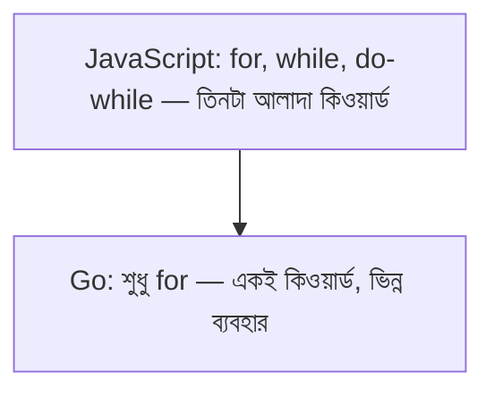

# ০৪. Control Structures (Loops, Conditionals)

প্রতিটা প্রোগ্রামিং ভাষার প্রাণ হলো সিদ্ধান্ত নেওয়া আর পুনরাবৃত্তি করা — "যদি এটা সত্যি হয়, তাহলে এটা করো" আর "এই কাজটা বারবার করো"। Go-তে এই দুটো ধারণাই আছে, কিন্তু চমৎকারভাবে সরল করে দেওয়া।

শুরু করা যাক **if/else** দিয়ে, যেটা প্রায় JavaScript-এর মতোই দেখতে, শুধু একটা পার্থক্য — শর্তের চারপাশে বন্ধনী `()` লাগে না:

```go
age := 20

if age >= 18 {
    fmt.Println("প্রাপ্তবয়স্ক")
} else {
    fmt.Println("নাবালক")
}
```

Go-তে `if`-এর একটা চমৎকার বৈশিষ্ট্য হলো শর্তের আগে একটা ছোট স্টেটমেন্ট চালিয়ে নেওয়া যায়, যেটার স্কোপ শুধু সেই `if` ব্লকের ভেতরেই সীমাবদ্ধ থাকে:

```go
if score := 85; score > 80 {
    fmt.Println("চমৎকার স্কোর:", score)
}
```

**switch** স্টেটমেন্টও আছে, আর এটা JavaScript-এর switch থেকে একটু বেশি সহজ — প্রতিটা কেসের শেষে `break` লেখার দরকার নেই, Go নিজে থেকেই একটা কেস ম্যাচ হলে বাকিগুলো স্কিপ করে দেয়:

```go
day := "Sunday"

switch day {
case "Friday", "Saturday":
    fmt.Println("সাপ্তাহিক ছুটি")
default:
    fmt.Println("কর্মদিবস")
}
```

এবার সবচেয়ে আকর্ষণীয় অংশ। JavaScript-এ আমরা তিন ধরনের লুপ ব্যবহার করে অভ্যস্ত — `for`, `while`, আর `do...while`। Go একটা সাহসী সিদ্ধান্ত নিয়েছে — শুধু একটাই লুপ কিওয়ার্ড রেখেছে, `for`, কিন্তু সেটাকেই কয়েকটা ভিন্ন রূপে ব্যবহার করা যায়।

প্রথম রূপ, ক্লাসিক তিন-অংশের লুপ (JavaScript-এর for-loop-এর মতোই):

```go
for i := 0; i < 5; i++ {
    fmt.Println(i)
}
```

দ্বিতীয় রূপ, শুধু একটা শর্ত দিয়ে — এটাই আসলে JavaScript-এর `while` লুপের Go-সংস্করণ:

```go
count := 0
for count < 3 {
    fmt.Println("গণনা:", count)
    count++
}
```

তৃতীয় রূপ, কোনো শর্ত ছাড়াই — একটা অসীম লুপ, যেটা ভেতর থেকে `break` দিয়ে থামাতে হয়:

```go
for {
    fmt.Println("এটা চলতেই থাকবে যতক্ষণ না break হয়")
    break
}
```



লক্ষণীয় ব্যাপার হলো, Go-এর ডিজাইনাররা ইচ্ছাকৃতভাবে `while` বা `do...while` কিওয়ার্ড রাখেননি — এটা সেই একই "simplicity" দর্শনের প্রতিফলন, যেটা নিয়ে আমরা প্রথম লেসনে কথা বলেছিলাম। একটা কিওয়ার্ড দিয়েই যদি সব কাজ চালানো যায়, তাহলে অতিরিক্ত কিওয়ার্ড শেখার আর মনে রাখার বোঝা কমে যায়।

পরের লেসনে আমরা দেখবো Go-তে কীভাবে ফাংশন লেখা হয়, আর error handling-এর জন্য Go-এর নিজস্ব, একদম ভিন্ন দর্শন কী।
