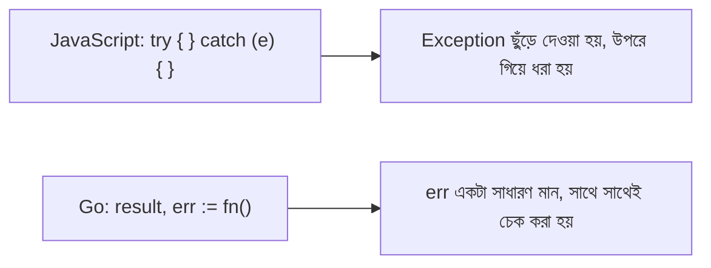

# ০৫. Functions and Error Handling

JavaScript-এ যখন কোনো ফাংশন খারাপ কিছু হলে সমস্যা জানাতে চায়, তখন সাধারণত একটা `Error` **throw** করা হয়, আর কলিং কোডকে সেটা `try/catch` দিয়ে ধরতে হয়। Go এই ব্যাপারে সম্পূর্ণ ভিন্ন দর্শন নিয়ে চলে, আর সেটা বুঝতে হলে প্রথমে Go-এর ফাংশন কীভাবে কাজ করে সেটা জানা দরকার।

একটা সাধারণ Go ফাংশন দেখতে এমন:

```go
func add(a int, b int) int {
    return a + b
}
```

লক্ষ্য করো, প্যারামিটার আর রিটার্ন টাইপ দুটোই স্পষ্টভাবে লেখা — JavaScript-এর dynamic ফাংশনের তুলনায় এটা অনেক বেশি নির্দিষ্ট। Go-এর একটা অনন্য বৈশিষ্ট্য হলো একটা ফাংশন একসাথে **একাধিক মান রিটার্ন করতে পারে**:

```go
func divide(a, b float64) (float64, error) {
    if b == 0 {
        return 0, errors.New("শূন্য দিয়ে ভাগ করা যায় না")
    }
    return a / b, nil
}
```

এখানেই Go-এর error handling-এর আসল চেহারাটা দেখা যাচ্ছে। JavaScript-এ error হলে ফাংশন একটা exception **throw** করে, যেটা প্রোগ্রামের স্বাভাবিক প্রবাহ ভেঙে দেয়, আর কলিং কোডকে সেটা `try/catch` ব্লকে ধরতে হয়। Go-তে error হলো একটা সাধারণ মান, যেটাকে একটা রিটার্ন ভ্যালু হিসেবেই পাঠানো হয় — যেন ফাংশনটা বলছে, "এই নাও তোমার আসল উত্তর, আর সাথে এই একটা মান যেটা বলে দেবে কিছু ভুল হয়েছে কিনা।" Go-এর built-in `error` একটা **interface**, যেটা নিয়ে বিস্তারিত থাকবে পরের লেসনে, তবে এখন এটুকু জানাই যথেষ্ট যে এটা একটা মান যেটা হয় `nil` (কিছু ভুল হয়নি) নয়তো একটা বার্তাসহ error object হয়।

এই ফাংশনটা কল করার সময় Go-তে একটা অত্যন্ত পরিচিত, প্রায় idiomatic (ভাষার নিজস্ব রীতি হয়ে ওঠা) প্যাটার্ন দেখা যায়:

```go
result, err := divide(10, 0)
if err != nil {
    fmt.Println("সমস্যা হয়েছে:", err)
    return
}
fmt.Println("ফলাফল:", result)
```

`if err != nil` — এই লাইনটা তুমি একজন Go ডেভেলপারের কোডে হাজারবার দেখবে। শুরুতে এটা কিছুটা repetitive মনে হতে পারে, বিশেষ করে যদি তুমি `try/catch`-এ অভ্যস্ত হয়ে থাকো, কিন্তু এর একটা বড় সুবিধা আছে — error হ্যান্ডলিং এখানে লুকানো থাকে না, বরং প্রতিটা জায়গায় স্পষ্টভাবে দেখা যায় কোথায় কী ভুল হতে পারে।



Go-তে আরেকটা দরকারি ফিচার হলো **named returns**, যেখানে রিটার্ন ভ্যারিয়েবলের নাম আগেই দিয়ে রাখা যায়:

```go
func rectangleArea(width, height float64) (area float64) {
    area = width * height
    return
}
```

আর যদি কোনো ফাংশনে অনির্দিষ্টসংখ্যক আর্গুমেন্ট নিতে চাও, তার জন্য আছে **variadic functions**, `...` দিয়ে:

```go
func sum(numbers ...int) int {
    total := 0
    for _, n := range numbers {
        total += n
    }
    return total
}

sum(1, 2, 3, 4) // 10
```

পরের লেসনে আমরা দেখবো Go-তে কীভাবে নিজস্ব ডেটা টাইপ (struct) বানানো যায়, আর interface দিয়ে কীভাবে duck-typing স্টাইলে কোড লেখা যায়।
