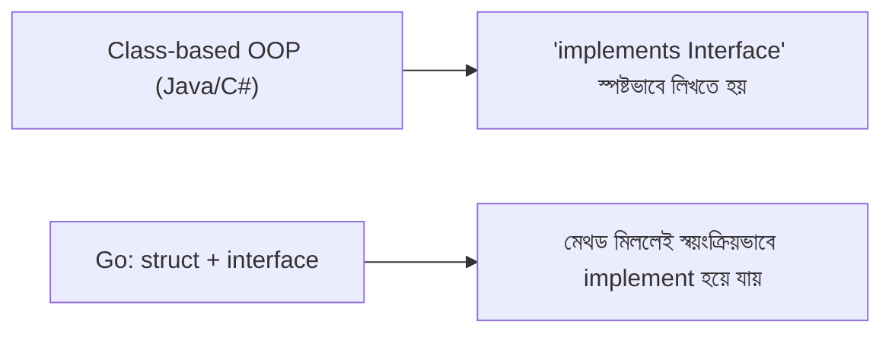

# ০৬. Working with Structs and Interfaces

Module 8-এ আমরা Object-Oriented Programming নিয়ে কথা বলেছিলাম — class, object, inheritance এই ধরনের ধারণা। Go-তে গিয়ে প্রথম যে বিস্ময়টা অপেক্ষা করছে, তা হলো: **Go-তে কোনো class নেই**। কিন্তু তার মানে এই না যে Go-তে কাস্টম ডেটা টাইপ বা "অবজেক্টের মতো" জিনিস বানানো যায় না — বরং Go এটাকে অন্যভাবে সমাধান করে, দুইটা আলাদা টুল দিয়ে: **struct** আর **interface**।

একটা **struct** হলো related ডেটাকে একসাথে গুচ্ছ করে রাখার উপায় — অনেকটা JavaScript-এর একটা প্লেইন অবজেক্টের মতো, কিন্তু আগে থেকেই টাইপ নির্দিষ্ট করা:

```go
type User struct {
    Name string
    Age  int
}

u := User{Name: "Arman", Age: 28}
fmt.Println(u.Name) // Arman
```

এখন struct-এর সাথে আচরণ (behavior) জুড়তে হলে Go ব্যবহার করে **methods**, যেগুলো একটা struct-এর সাথে "receiver" দিয়ে সংযুক্ত করা হয়:

```go
func (u User) Greet() string {
    return "হ্যালো, আমি " + u.Name
}

fmt.Println(u.Greet())
```

এখানে `(u User)` অংশটাকে বলে **receiver** — এটা বলে দিচ্ছে এই মেথডটা `User` টাইপের সাথে যুক্ত। কিন্তু একটা গুরুত্বপূর্ণ পার্থক্য আছে receiver-এর দুই রকমের মধ্যে। উপরের উদাহরণে `u User` হলো **value receiver** — মানে মেথডটা struct-এর একটা কপি নিয়ে কাজ করে, আসল ডেটা বদলাতে পারে না। কিন্তু যদি আসল struct-টাকেই পরিবর্তন করতে চাও, দরকার **pointer receiver**:

```go
func (u *User) Birthday() {
    u.Age++
}

u.Birthday()
fmt.Println(u.Age) // এখন Age বেড়ে গেছে, কারণ আসল ডেটাই পরিবর্তিত হয়েছে
```

`*User` মানে হলো এই মেথডটা `User`-এর একটা মেমরি ঠিকানা (pointer) নিয়ে কাজ করছে, কপি নয় — অনেকটা JavaScript-এ একটা অবজেক্ট রেফারেন্স দিয়ে পাস করার মতো ধারণা।

এবার আসি **interface**-এ, যেটা Go-এর সবচেয়ে elegant অংশগুলোর একটা। একটা interface বলে দেয় "কোন কোন মেথড থাকতে হবে", কিন্তু কে সেটা implement করছে তা নিয়ে কোনো ঘোষণা লাগে না — Go নিজেই বুঝে নেয় কোন টাইপ কোন interface পূরণ করছে, যাকে বলে **implicit implementation** বা duck typing ("যদি হাঁসের মতো হাঁটে আর হাঁসের মতো ডাকে, তবে সেটা হাঁসই")।

```go
type Greeter interface {
    Greet() string
}

func introduce(g Greeter) {
    fmt.Println(g.Greet())
}

introduce(u) // User struct-এর Greet() মেথড আছে, তাই এটা কাজ করবে
```

লক্ষ্য করো, `User` কোথাও লিখেনি "আমি Greeter implement করছি" — যেহেতু তার একটা `Greet() string` মেথড আছে, Go নিজে থেকেই ধরে নেয় এটা একটা `Greeter`। Java বা C#-এ যেমন `implements` কিওয়ার্ড দিয়ে স্পষ্টভাবে ঘোষণা দিতে হয়, Go-তে সেই বাড়তি আনুষ্ঠানিকতা নেই।



এভাবে Go ক্লাসিক OOP-এর সুবিধাগুলো (ডেটা আর আচরণ একসাথে বাঁধা, পলিমরফিজম) ধরে রাখে, কিন্তু inheritance-এর জটিল hierarchy ছাড়াই, অনেক হালকা আর নমনীয় একটা পদ্ধতিতে।

পরের লেসনে আমরা ঢুকবো Go-এর সবচেয়ে বিখ্যাত ফিচারে — goroutines আর channels দিয়ে concurrency।
