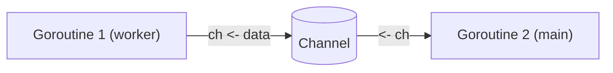

# ০৭. Concurrency in Go (Goroutines & Channels)

Module 5-এ আমরা Node.js-এর **event loop** নিয়ে বিস্তারিত কথা বলেছিলাম — কীভাবে একটা সিঙ্গেল থ্রেড হয়েও Node.js একসাথে অনেক কাজ সামলায়, callback আর promise queue ব্যবহার করে। সেটা এক ধরনের concurrency, কিন্তু আসলে একই সময়ে একটাই কাজ চলে, শুধু স্মার্টভাবে সুইচ করা হয় কাজগুলোর মধ্যে। Go সম্পূর্ণ ভিন্ন পথে হাঁটে — এখানে সত্যিকারের multiple কাজ একসাথে, সমান্তরালে চলতে পারে, একাধিক CPU কোর ব্যবহার করে।

এই সুপারপাওয়ারের নাম **goroutine**। যেকোনো ফাংশন কলের আগে শুধু `go` কিওয়ার্ড লিখলেই সেটা একটা আলাদা, হালকা-ওজনের thread-এর মতো ইউনিটে চলতে শুরু করে, মূল প্রোগ্রামকে ব্লক না করেই:

```go
func sayHello() {
    fmt.Println("হ্যালো থেকে goroutine")
}

func main() {
    go sayHello()
    fmt.Println("main ফাংশন চলছে")
    time.Sleep(time.Second) // goroutine শেষ হওয়ার সময় দেওয়া হলো
}
```

একটা goroutine একটা OS thread-এর চেয়ে অনেক হালকা — একটা Go প্রোগ্রাম অনায়াসে লক্ষ লক্ষ goroutine চালাতে পারে, যেখানে হাজার হাজার OS thread চালানো ব্যবহারিকভাবে অসম্ভব। এই কারণেই Go সার্ভার-সাইড সফটওয়্যারে এত জনপ্রিয় — একটা সার্ভার প্রতিটা incoming request-কে আলাদা goroutine-এ চালাতে পারে, কোনো বাড়তি জটিলতা ছাড়াই।

কিন্তু একাধিক goroutine যদি একসাথে চলে, তাদের মধ্যে নিরাপদে তথ্য আদান-প্রদান করা দরকার — এখানেই আসে **channels**। একটা channel হলো একটা পাইপ, যার মধ্য দিয়ে একটা goroutine আরেকটা goroutine-কে ডেটা পাঠাতে পারে:

```go
func worker(ch chan string) {
    ch <- "কাজ শেষ হয়েছে"
}

func main() {
    ch := make(chan string)
    go worker(ch)
    message := <-ch
    fmt.Println(message)
}
```

এখানে `ch <- "..."` মানে channel-এ ডেটা পাঠানো, আর `<-ch` মানে channel থেকে ডেটা গ্রহণ করা। এই যোগাযোগটাই Go-এর concurrency দর্শনের মূল কথা — একটা বিখ্যাত Go প্রবাদ আছে, "মেমরি শেয়ার করে যোগাযোগ কোরো না, বরং যোগাযোগ করেই মেমরি শেয়ার করো।"



উপরের উদাহরণটা ছিলো একটা **unbuffered channel** — এখানে পাঠানো আর গ্রহণ করা দুটোই একসাথে ঘটতে হয়, একজন অপেক্ষা করে আরেকজনের জন্য। কিন্তু চাইলে একটা **buffered channel**ও বানানো যায়, যেখানে একটা নির্দিষ্ট সংখ্যক মান জমা রাখা যায় গ্রহণকারী প্রস্তুত না হওয়া পর্যন্ত:

```go
ch := make(chan int, 3) // ৩টা পর্যন্ত মান জমা রাখতে পারবে
ch <- 1
ch <- 2
ch <- 3
```

তুলনা করলে, Node.js-এর event loop একটা রেস্তোরাঁর একজন ওয়েটারের মতো, যে দ্রুত টেবিল থেকে টেবিলে ঘুরে সবাইকে সামলায় কিন্তু একবারে একটা কাজই করে। Go-এর goroutine model যেন একসাথে অনেকজন ওয়েটার কাজ করছে, প্রয়োজনে একে অপরের সাথে চিরকুট (channel) আদান-প্রদান করে সমন্বয় করছে।

পরের লেসনে আমরা দেখবো কীভাবে একটা Go প্রজেক্টে dependency ম্যানেজমেন্ট করা হয় Go Modules দিয়ে।
