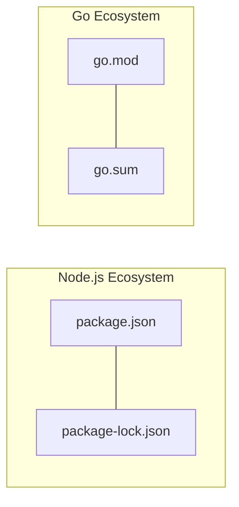

# ০৮. Working with Go Modules

Node.js-এ প্রতিটা প্রজেক্টের শুরুতে আমরা `npm init` চালাই, যেটা একটা `package.json` তৈরি করে — প্রজেক্টের নাম, ভার্সন, আর ডিপেন্ডেন্সিগুলোর তালিকা রাখার জায়গা। Go-তেও ঠিক একই ধরনের একটা ব্যবস্থা আছে, যার নাম **Go Modules**, আর Module 2-এ আমরা সংক্ষেপে এটার কথা উল্লেখ করেছিলাম। এই লেসনে এটাকে গভীরভাবে বোঝা যাক।

একটা নতুন প্রজেক্ট শুরু করতে হলে টার্মিনালে চালাতে হয়:

```bash
go mod init github.com/arman/my-project
```

এই কমান্ডটা একটা **go.mod** ফাইল তৈরি করে, যেটা দেখতে অনেকটা এমন:

```
module github.com/arman/my-project

go 1.22
```

এই ফাইলটা `package.json`-এর মতোই কাজ করে — এটা বলে দেয় প্রজেক্টের নাম কী, আর Go-এর কোন ভার্সন প্রয়োজন। যখন কোনো external প্যাকেজ যোগ করা হয়, তখন `go.mod`-এ সেটার এন্ট্রিও যুক্ত হয়ে যায়।

কোনো তৃতীয়-পক্ষের লাইব্রেরি ইনস্টল করতে হলে ব্যবহার করা হয় `go get` — অনেকটা `npm install`-এর মতো:

```bash
go get github.com/gin-gonic/gin
```

এই কমান্ড চালানোর পর একটা দ্বিতীয় ফাইল তৈরি হয়, নাম **go.sum**। এটা `package-lock.json`-এর Go-সংস্করণ — এতে প্রতিটা ডিপেন্ডেন্সির সঠিক ভার্সন আর একটা cryptographic checksum (হ্যাশ) সংরক্ষিত থাকে, যাতে নিশ্চিত করা যায় ভবিষ্যতে ঠিক একই কোড ডাউনলোড হচ্ছে, কেউ মাঝপথে প্যাকেজটা বদলে দেয়নি।



ভার্সন নির্দিষ্ট করার ক্ষেত্রে Go অনুসরণ করে **Semantic Versioning (SemVer)** — ঠিক যেমনটা npm-প্যাকেজেও দেখা যায়। একটা ভার্সন নম্বর দেখতে হয় `v1.4.2`-এর মতো, যেখানে প্রথম সংখ্যাটা (Major) বড় ধরনের পরিবর্তন বোঝায় যা পুরনো কোডকে ভাঙতে পারে, দ্বিতীয়টা (Minor) নতুন ফিচার যোগ বোঝায় যা পুরনো কোড ভাঙে না, আর তৃতীয়টা (Patch) শুধু বাগ ফিক্স বোঝায়।

`go.mod` ফাইলে গিয়ে দেখলে ডিপেন্ডেন্সি এন্ট্রি এমন দেখাবে:

```
require github.com/gin-gonic/gin v1.9.1
```

একটা গুরুত্বপূর্ণ পার্থক্য অবশ্য আছে npm আর Go Modules-এর মধ্যে — Node.js-এ সব ডিপেন্ডেন্সি একটা `node_modules` ফোল্ডারে কপি হয়ে প্রজেক্টের ভেতরেই থাকে, কিন্তু Go একটা গ্লোবাল ক্যাশ ব্যবহার করে (`$GOPATH/pkg/mod`), যাতে একই লাইব্রেরির একই ভার্সন একাধিক প্রজেক্টে বারবার ডাউনলোড করতে না হয় — এটা ডিস্ক স্পেস আর সময় দুটোই বাঁচায়।

পরের লেসনে, এই মডিউলের শেষ পাঠে, আমরা দেখবো কীভাবে Go দিয়ে JSON ডেটা প্রসেস করা যায় আর ফাইল সিস্টেমের সাথে কাজ করা যায়।
