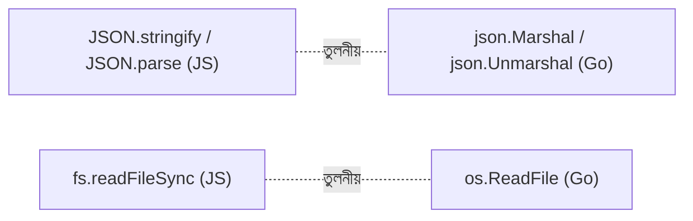

# ০৯. Handling JSON and File I/O

আগের মডিউলগুলোতে আমরা দেখেছি JSON কতটা কেন্দ্রীয় ভূমিকা রাখে ব্যাকএন্ড ডেভেলপমেন্টে — একটা API থেকে ডেটা পাঠানো বা গ্রহণ করার প্রায় universal ফরম্যাট এটাই। JavaScript-এ JSON হ্যান্ডেল করা প্রায় বিনামূল্যেই আসে, কারণ JSON আসলে "JavaScript Object Notation" — `JSON.stringify()` আর `JSON.parse()` দিয়ে কাজ শেষ। Go-তে এটা কিছুটা বেশি explicit, কিন্তু ঠিক ততটাই শক্তিশালী।

Go-এর built-in **encoding/json** প্যাকেজ দিয়ে একটা struct-কে JSON-এ রূপান্তর করা হয় `Marshal` দিয়ে, আর JSON থেকে struct-এ ফিরিয়ে আনা হয় `Unmarshal` দিয়ে:

```go
package main

import (
    "encoding/json"
    "fmt"
)

type User struct {
    Name string `json:"name"`
    Age  int    `json:"age"`
}

func main() {
    u := User{Name: "Arman", Age: 28}

    data, _ := json.Marshal(u)
    fmt.Println(string(data)) // {"name":"Arman","age":28}

    var parsed User
    json.Unmarshal(data, &parsed)
    fmt.Println(parsed.Name) // Arman
}
```

এখানে struct-এর ভেতরে `` `json:"name"` `` অংশটাকে বলা হয় **struct tag** — এটা Go-কে বলে দেয় যে `Name` ফিল্ডটা JSON-এ ছোট হাতের `name` কী হিসেবে যাবে। Go-তে struct ফিল্ডের নাম সবসময় বড় হাতের অক্ষর দিয়ে শুরু করতে হয় (যাতে সেটা প্যাকেজের বাইরে থেকেও ব্যবহারযোগ্য হয়), কিন্তু JSON-এর প্রচলিত রীতি হলো ছোট হাতের camelCase — struct tag এই দুইয়ের মাঝে সেতুবন্ধনের কাজ করে।

লক্ষ্য করো `json.Marshal(u)` দুটো মান রিটার্ন করছে — ডেটা আর error — যেটা আমরা Lesson 5-এ দেখা সেই familiar প্যাটার্ন। বাস্তব কোডে `_` দিয়ে error উপেক্ষা না করে সবসময় `if err != nil` দিয়ে চেক করা উচিত।

এবার ফাইল সিস্টেমের দিকে আসা যাক। Go-এর **os** প্যাকেজ দিয়ে ফাইল পড়া আর লেখা যায়:

```go
package main

import (
    "os"
    "fmt"
)

func main() {
    // ফাইলে লেখা
    os.WriteFile("data.txt", []byte("Hello from Go"), 0644)

    // ফাইল পড়া
    content, err := os.ReadFile("data.txt")
    if err != nil {
        fmt.Println("ফাইল পড়তে সমস্যা:", err)
        return
    }
    fmt.Println(string(content))
}
```

`os.WriteFile` আর `os.ReadFile` ফাংশন দুটো Node.js-এর `fs.writeFileSync` আর `fs.readFileSync`-এর সমতুল্য — সরাসরি, ব্লকিং স্টাইলে ফাইল অপারেশন। পার্থক্য হলো, Node.js-এ async ভার্সনও (`fs.promises`) সাধারণত ব্যবহার করা হয় যাতে event loop ব্লক না হয়, কিন্তু Go-তে যেহেতু প্রতিটা অপারেশন সহজেই একটা আলাদা goroutine-এ চালানো যায় (Lesson 7 মনে করো), তাই ব্লকিং ফাইল I/O নিয়েও চিন্তার তেমন কারণ থাকে না — দরকার হলেই `go` কিওয়ার্ড দিয়ে আলাদা করে দেওয়া যায়।



এখানেই এই মডিউলের যাত্রা শেষ — শুরু করেছিলাম Go-এর জন্ম-ইতিহাস দিয়ে, শেষ করলাম বাস্তব ডেটা প্রসেসিং দিয়ে। এই ন'টা লেসনের ভিত্তির উপর দাঁড়িয়ে এখন তুমি প্রস্তুত পরবর্তী মডিউলে Go দিয়ে সত্যিকারের ওয়েব সার্ভার আর API বানানো শেখার জন্য।
