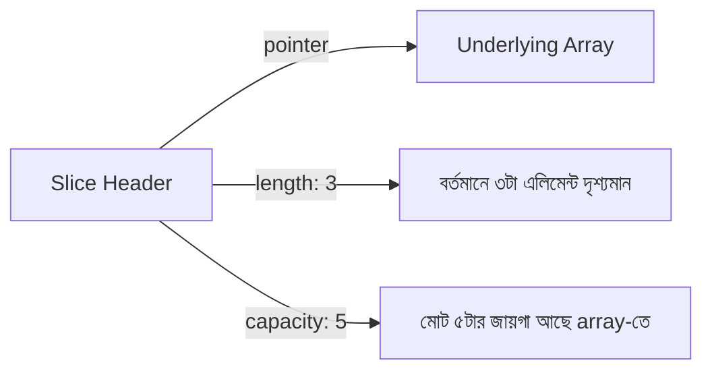

# ১১. Slices and Arrays in Go

কল্পনা করো তুমি একটা ডিমের ট্রে কিনলে — ঠিক ১২টা ঘর, না কম না বেশি। এই ট্রেটাই হলো Go-এর **array**-এর মতো: সাইজ ফিক্সড, একবার বানানোর পর তুমি ঘর বাড়াতে-কমাতে পারবে না। কিন্তু বাস্তব জীবনে বেশিরভাগ সময় আমরা জানি না কতগুলো ডিম লাগবে — আজ ৫টা, কাল ২০টা। তখন দরকার একটা এমন পাত্র যেটা প্রয়োজনমতো বড়-ছোট হতে পারে — Go-তে এটাই **slice**।

```go
var arr [5]int // ফিক্সড সাইজ array, ঠিক ৫টা int-এর জায়গা
arr[0] = 10

nums := []int{1, 2, 3} // slice, সাইজ নির্দিষ্ট নয়
nums = append(nums, 4) // সহজেই বড় করা যায়
fmt.Println(nums)      // [1 2 3 4]
```

array খুব একটা ব্যবহার হয় না বাস্তব প্রজেক্টে, কারণ এর সাইজ টাইপের অংশ — `[5]int` আর `[10]int` আসলে দুইটা সম্পূর্ণ ভিন্ন টাইপ। slice অনেক নমনীয়, তাই প্রায় সব জায়গায় slice-ই ব্যবহৃত হয়।

slice আসলে ভেতরে ভেতরে একটা array-কেই মুড়িয়ে রাখে। প্রতিটা slice-এর তিনটা জিনিস থাকে — একটা **underlying array**-এর দিকে পয়েন্টার, একটা **length** (এখন কতগুলো এলিমেন্ট আছে), আর একটা **capacity** (নতুন array না বানিয়ে আর কতগুলো এলিমেন্ট রাখা যাবে)।



`append()` করার সময় যদি capacity যথেষ্ট থাকে, একই array ব্যবহার হয়, কোনো নতুন মেমোরি বরাদ্দ হয় না। কিন্তু capacity শেষ হয়ে গেলে Go নিজে থেকেই একটা বড় নতুন array তৈরি করে, পুরনো ডেটা কপি করে সেখানে নিয়ে যায় — এটা `append`-এর ভেতরের "জাদু", যা আমাদের হাতে করতে হয় না।

slicing syntax দিয়ে array বা slice-এর একটা অংশ কাটা যায়:

```go
letters := []string{"a", "b", "c", "d", "e"}
sub := letters[1:3] // index 1 থেকে শুরু, 3 পর্যন্ত (3 বাদে)
fmt.Println(sub)    // [b c]
```

এখানেই একটা সাধারণ ফাঁদ (pitfall) লুকিয়ে আছে, যেটা নতুন Go ডেভেলপারদের প্রায়ই বিভ্রান্ত করে — `sub` একটা নতুন array নয়, এটা `letters`-এর একই underlying array-কেই শেয়ার করে। তাই `sub`-এ পরিবর্তন করলে `letters`-ও বদলে যেতে পারে:

```go
sub[0] = "X"
fmt.Println(letters) // [a X c d e] — মূল slice-ও বদলে গেলো!
```

এটা অনেকটা একই বাড়ির দুইটা জানালা দিয়ে তাকানোর মতো — জানালা আলাদা, কিন্তু ভেতরের ঘরটা একই। যদি সম্পূর্ণ স্বাধীন একটা কপি চাও, `copy()` ফাংশন ব্যবহার করতে হয়:

```go
independent := make([]string, len(sub))
copy(independent, sub) // এখন independent সম্পূর্ণ আলাদা array-তে থাকে
```

এই আচরণটা মনে রাখা জরুরি, কারণ বড় প্রজেক্টে (বিশেষ করে যখন একটা slice অনেক জায়গায় পাস করা হয়) এই শেয়ার্ড আর্রে-এর কারণে অদ্ভুত bug তৈরি হতে পারে, যেখানে এক ফাংশনের পরিবর্তন আরেক জায়গায় অপ্রত্যাশিতভাবে প্রভাব ফেলে।

পরের লেসনে আমরা দেখবো Go-তে key-value ডেটা রাখার পাত্র — map — এবং range দিয়ে কীভাবে slice, map, string-এর মধ্য দিয়ে লুপ চালানো যায়।
