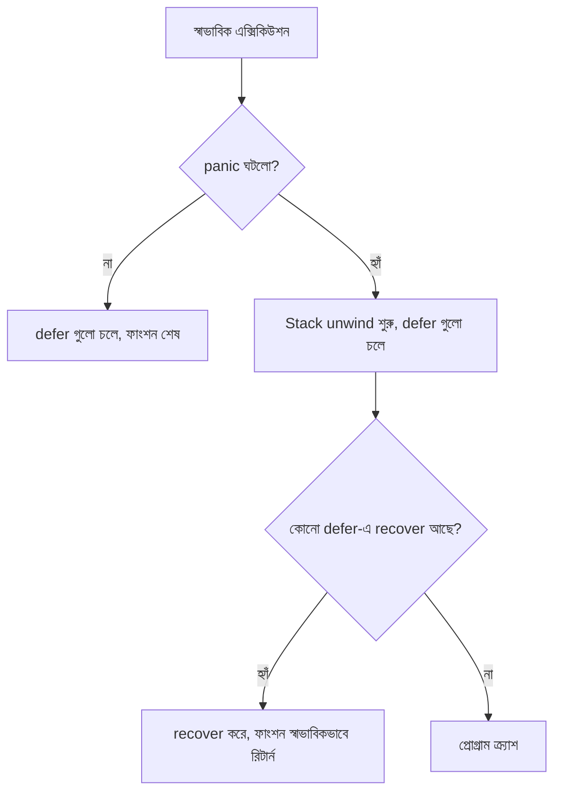

# ১৩. Defer, Panic, and Recover in Go

ধরো তুমি রান্নাঘরে গ্যাসের চুলা জ্বালিয়ে রান্না করছো। রান্না যেভাবেই শেষ হোক — সফলভাবে, নাকি মাঝপথে পুড়িয়ে ফেলে — একটা কাজ তোমাকে অবশ্যই করতে হবে: চুলা বন্ধ করা। এই "যা-ই হোক, শেষে এই কাজটা করবোই" ধরনের প্রতিশ্রুতিকে Go-তে বলে **defer**।

```go
func readFile() {
    fmt.Println("ফাইল খোলা হচ্ছে...")
    defer fmt.Println("ফাইল বন্ধ করা হলো") // ফাংশন শেষ হওয়ার ঠিক আগে চলবে

    fmt.Println("ফাইল পড়া হচ্ছে...")
}
```

আউটপুট হবে: "ফাইল খোলা হচ্ছে...", "ফাইল পড়া হচ্ছে...", তারপর "ফাইল বন্ধ করা হলো"। `defer` দিয়ে যে লাইনটা লেখা হয়, সেটা তখনই এক্সিকিউট হয় না — বরং সারিতে জমা থাকে, আর ফাংশনটা শেষ হওয়ার ঠিক আগমুহূর্তে চলে। যারা JavaScript থেকে এসেছো, এটাকে অনেকটা `try/finally`-এর `finally` ব্লকের সাথে তুলনা করতে পারো — যা-ই ঘটুক, এই কাজটা হবেই। ফাইল বন্ধ করা, ডাটাবেজ কানেকশন ছেড়ে দেওয়া, লক (lock) মুক্ত করা — এই ধরনের ক্লিনআপ কাজের জন্য defer আদর্শ।

একাধিক defer থাকলে তাদের এক্সিকিউশন অর্ডার হয় **LIFO** (Last In, First Out) — মানে সবার শেষে যেটা defer করা হয়েছে, সেটাই সবার আগে চলে। অনেকটা একগাদা প্লেট স্ট্যাক করে রাখার মতো — সবার উপরেরটাই আগে নামাতে হয়।

```go
func demo() {
    defer fmt.Println("এক")
    defer fmt.Println("দুই")
    defer fmt.Println("তিন")
}
// আউটপুট: তিন, দুই, এক
```

এবার আসি **panic**-এ। কখনো কখনো প্রোগ্রামে এমন কিছু ঘটে যা থেকে স্বাভাবিকভাবে এগোনো অসম্ভব — যেমন একটা array-এর সীমার বাইরে ইনডেক্স অ্যাক্সেস করা, বা nil পয়েন্টার dereference করার চেষ্টা। এসব ক্ষেত্রে Go নিজে থেকেই **panic** করে, প্রোগ্রাম থামিয়ে দেয়। তুমি নিজেও ইচ্ছাকৃতভাবে panic ট্রিগার করতে পারো, যখন বুঝবে পরিস্থিতি সত্যিই "চালিয়ে যাওয়ার মতো নয়":

```go
func divide(a, b int) int {
    if b == 0 {
        panic("শূন্য দিয়ে ভাগ করা যায় না")
    }
    return a / b
}
```

কিন্তু সতর্ক থাকতে হবে — panic হলো জরুরি অবস্থার বোতাম, রোজকার এরর হ্যান্ডলিং-এর টুল নয়। ফাইল না পাওয়া গেলে, বা ইউজার ভুল ইনপুট দিলে panic করা উচিত না — সেসব সাধারণ, প্রত্যাশিত ভুল, যেগুলো লেসন ০৫-এ শেখা সাধারণ `error` রিটার্ন করেই সামলানো উচিত। panic শুধু তখনই, যখন প্রোগ্রামের এমন একটা অবস্থায় পৌঁছে গেছো যেখান থেকে অর্থবহভাবে এগোনো সম্ভব না।

panic হলে প্রোগ্রাম সরাসরি ক্র্যাশ করে ফেলার আগে, তাকে "ধরে ফেলার" একটা সুযোগ থাকে — **recover**। এটা কেবল defer-এর ভেতর থেকেই কাজ করে:

```go
func safeDivide(a, b int) (result int) {
    defer func() {
        if r := recover(); r != nil {
            fmt.Println("সমস্যা সামলে নেওয়া হলো:", r)
            result = 0
        }
    }()
    return divide(a, b)
}
```

এখানে `recover()` panic-টাকে ধরে ফেলে, প্রোগ্রামকে ক্র্যাশ হওয়া থেকে বাঁচায়, আর ফাংশনটা স্বাভাবিকভাবে রিটার্ন করতে পারে। এটা অনেকটা JavaScript-এর `try/catch`-এর মতোই কাজ করে, তবে পার্থক্য হলো Go-তে এটা ব্যতিক্রমী পরিস্থিতির জন্য সংরক্ষিত, দৈনন্দিন error handling-এর জন্য নয় — যেখানে JS-এ `try/catch` প্রায় সব জায়গাতেই ব্যবহার হয়।



পরের লেসনে আমরা দেখবো Go-এর `time` প্যাকেজ দিয়ে কীভাবে সময় আর তারিখ নিয়ে কাজ করা যায়, আর Go-এর সেই অদ্ভুত রেফারেন্স ফরম্যাট নিয়েও কথা বলবো।
