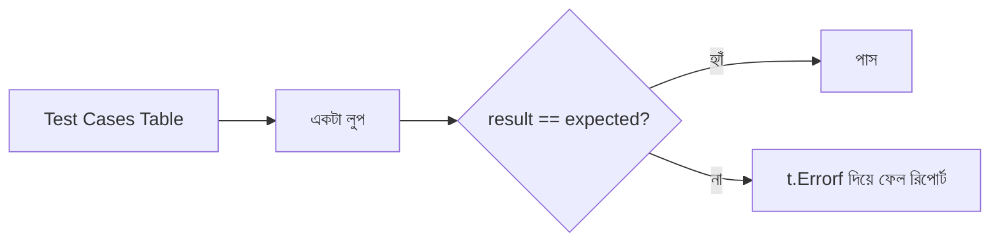

# ১৫. Unit Testing in Go with testing Package

JavaScript ইকোসিস্টেমে টেস্ট লিখতে গেলে প্রথমেই একটা সিদ্ধান্ত নিতে হয় — Jest নাকি Mocha, নাকি Jasmine? তারপর সেটা ইনস্টল করতে হয়, কনফিগার করতে হয়, কখনো কখনো আলাদা রানার সেটআপ করতে হয়। Go-তে এই পুরো সিদ্ধান্ত-নেওয়ার ঝামেলাটাই নেই, কারণ Go-এর টেস্টিং টুল standard library-এর ভেতরেই বিল্ট-ইন — নাম `testing` প্যাকেজ।

Go-তে টেস্ট লেখার নিয়মটা খুবই সহজ একটা কনভেনশন মেনে চলে। যে ফাইলে টেস্ট থাকবে তার নাম শেষ হতে হবে `_test.go` দিয়ে, আর প্রতিটা টেস্ট ফাংশনের নাম শুরু হতে হবে `Test` দিয়ে, আর্গুমেন্ট নিতে হবে `*testing.T`।

ধরো আমাদের একটা সাধারণ ফাংশন আছে `math.go` ফাইলে:

```go
package mathutil

func Add(a, b int) int {
    return a + b
}
```

এর টেস্ট লিখবো `math_test.go` নামের ফাইলে:

```go
package mathutil

import "testing"

func TestAdd(t *testing.T) {
    result := Add(2, 3)
    expected := 5

    if result != expected {
        t.Errorf("Add(2, 3) = %d; আশা করেছিলাম %d", result, expected)
    }
}
```

এখানে `t.Errorf` কল করলে টেস্টটা **fail** হিসেবে চিহ্নিত হয়, কিন্তু প্রোগ্রাম থেমে যায় না, বাকি টেস্টগুলোও চলতে থাকে। রান করতে হলে টার্মিনালে লিখতে হবে:

```
go test ./...
```

এটা কারেন্ট ডিরেক্টরি আর তার সাব-ডিরেক্টরিগুলোর সব `_test.go` ফাইল খুঁজে বের করে চালায়।

একই লজিক অনেকগুলো ইনপুট-আউটপুট কম্বিনেশনে টেস্ট করতে চাইলে প্রতিবার আলাদা ফাংশন না লিখে Go-তে একটা জনপ্রিয় প্যাটার্ন আছে — **table-driven tests**। এখানে সব টেস্ট কেস একটা স্লাইসে (table) সাজিয়ে রেখে একটা মাত্র লুপে চালানো হয়:

```go
func TestAddTableDriven(t *testing.T) {
    cases := []struct {
        a, b, expected int
    }{
        {2, 3, 5},
        {0, 0, 0},
        {-1, 1, 0},
        {10, -5, 5},
    }

    for _, c := range cases {
        result := Add(c.a, c.b)
        if result != c.expected {
            t.Errorf("Add(%d, %d) = %d; আশা করেছিলাম %d", c.a, c.b, result, c.expected)
        }
    }
}
```

লক্ষ করো, লেসন ১২-এ শেখা `range` এখানে কীভাবে কাজে লাগছে — টেস্ট কেসগুলোর উপর দিয়ে লুপ চালিয়ে একই যাচাইয়ের কোড বারবার লেখা এড়ানো গেছে। নতুন কোনো কেস যোগ করতে হলে শুধু টেবিলে একটা লাইন যোগ করলেই হয়, নতুন ফাংশন লেখার দরকার নেই।



এখানে দার্শনিক একটা পার্থক্যও লক্ষণীয়। JS-এর জগতে টেস্টিং মানেই একটা ভারী ইকোসিস্টেম — assertion library, mocking library, রানার — সব আলাদা প্যাকেজ। Go-এর দর্শন উল্টো — "যতটুকু দরকার ঠিক ততটুকুই দাও, বাকিটা সহজ রাখো।" `if` আর `t.Errorf` দিয়েই বেশিরভাগ কাজ চলে যায়, বাড়তি assertion লাইব্রেরির দরকার পড়ে না।

পরের লেসনে আমরা দেখবো একই `testing` প্যাকেজ দিয়ে কীভাবে কোডের **পারফরম্যান্স** মাপা যায় — বেঞ্চমার্ক টেস্টিং।
