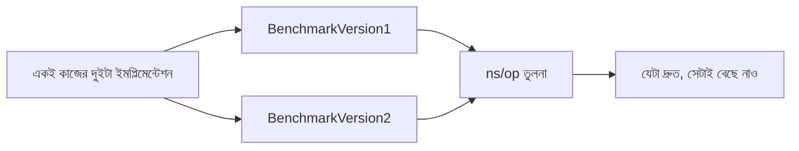

# ১৬. Writing Benchmark Tests in Go

লেসন ১৫-এ আমরা শিখেছিলাম কোনো ফাংশন **সঠিক** কাজ করছে কিনা তা কীভাবে যাচাই করা যায়। কিন্তু সঠিক হওয়া আর **দ্রুত** হওয়া দুইটা আলাদা প্রশ্ন। একটা ফাংশন হয়তো সব টেস্ট পাস করছে, কিন্তু প্রতিবার কল করতে ১ সেকেন্ড সময় নিচ্ছে — যদি সেই ফাংশনটা প্রতি সেকেন্ডে হাজারবার কল হওয়ার কথা থাকে, তাহলে এটা একটা সমস্যা। এই ধরনের প্রশ্নের উত্তর দেয় **benchmark test**।

Go-এর সৌন্দর্য হলো, বেঞ্চমার্ক টেস্টিং-এর জন্যও আলাদা কোনো টুল বা লাইব্রেরি লাগে না — একই `testing` প্যাকেজেই এই সুবিধা বিল্ট-ইন। শুধু ফাংশনের নাম `Test` না দিয়ে `Benchmark` দিয়ে শুরু হবে, আর আর্গুমেন্ট নেবে `*testing.B`:

```go
package mathutil

import "testing"

func BenchmarkAdd(b *testing.B) {
    for i := 0; i < b.N; i++ {
        Add(2, 3)
    }
}
```

এখানে `b.N` একটা বিশেষ ভ্যারিয়েবল — এর ভ্যালু তুমি নিজে ঠিক করো না, Go নিজেই ঠিক করে। Go প্রথমে অল্প কয়েকবার ফাংশনটা চালিয়ে দেখে কত সময় লাগছে, তারপর `N`-এর মান বাড়াতে থাকে যতক্ষণ না একটা নির্ভরযোগ্য, স্থিতিশীল পরিমাপ পাওয়া যায়। এটা অনেকটা রান্নার রেসিপি টেস্ট করার মতো — একবার রেঁধে বলা যায় না রেসিপিটা কতটা সময়সাপেক্ষ, বারবার রেঁধে গড় সময় বের করতে হয়।

বেঞ্চমার্ক চালাতে হয় এই কমান্ড দিয়ে:

```
go test -bench=.
```

আউটপুট দেখতে এমন হবে:

```
BenchmarkAdd-8    1000000000    0.25 ns/op
```

এখানে `-8` মানে ৮টা CPU কোর ব্যবহার হয়েছে, আর `ns/op` মানে প্রতিটা অপারেশনে গড়ে কত ন্যানোসেকেন্ড সময় লেগেছে। সংখ্যাটা যত ছোট, ফাংশনটা তত দ্রুত।

এখন প্রশ্ন হতে পারে, একটা সাধারণ ব্যাকএন্ড ডেভেলপার হিসেবে বেঞ্চমার্কিং নিয়ে এত মাথা ঘামানোর দরকার কী? উত্তরটা বাস্তব প্রজেক্টের অভিজ্ঞতা থেকে আসে — একটা API endpoint যদি প্রতি রিকোয়েস্টে কয়েক মাইক্রোসেকেন্ড বেশি সময় নেয়, সেটা একজন ইউজারের কাছে টের পাওয়া যায় না। কিন্তু যখন সেই endpoint প্রতি সেকেন্ডে হাজার হাজার বার কল হয় (যেমন একটা জনপ্রিয় অ্যাপের লগইন সিস্টেম), তখন সেই ছোট্ট অতিরিক্ত সময়টাই পুরো সার্ভারের CPU খেয়ে ফেলতে পারে। বেঞ্চমার্কিং এই ধরনের সমস্যা কোডে যাওয়ার আগেই ধরিয়ে দেয়, অনুমান করার বদলে সংখ্যা দিয়ে সিদ্ধান্ত নিতে সাহায্য করে।



এই মডিউলে আমরা শুধু বেঞ্চমার্ক টেস্ট **লেখার** নিয়মটা দেখলাম — কিন্তু কোনো ফাংশন কেন ধীর, তার গভীর কারণ (মেমোরি allocation, CPU-bound লজিক, ইত্যাদি) খুঁজে বের করার জন্য Go-তে আরও শক্তিশালী একটা টুল আছে, যার নাম **profiling**। সেটা নিয়ে বিস্তারিত আলোচনা হবে Module ৪৫-এ, যেখানে আমরা দেখবো একটা ধীরগতির ফাংশনের ভেতরে ঠিক কোন লাইনে সময় নষ্ট হচ্ছে তা কীভাবে বের করা যায়।

পরের লেসনে আমরা দেখবো Go-তে লগিং কীভাবে করা হয় — standard library-এর `log` প্যাকেজ দিয়ে শুরু করে, তারপর প্রোডাকশন-গ্রেড structured logging-এর জন্য `zap` লাইব্রেরি।
