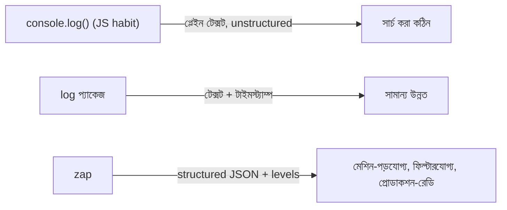

# ১৭. Logging in Go (Using log and zap)

JavaScript শেখার শুরুর দিকে আমাদের প্রায় সবার একটা অভ্যাস তৈরি হয়ে যায় — কোথাও কিছু বুঝতে না পারলেই `console.log()` বসিয়ে দেওয়া। ছোট প্রজেক্টে এটা কাজ চালিয়ে দেয়, কিন্তু একটা প্রোডাকশন সার্ভারে যেখানে প্রতি মিনিটে হাজার হাজার লগ লাইন তৈরি হয়, সেখানে শুধু টেক্সট প্রিন্ট করাটা যথেষ্ট নয় — লগগুলোকে গঠনবদ্ধ (structured), সার্চযোগ্য, আর গুরুত্ব অনুযায়ী শ্রেণীবদ্ধ (leveled) হতে হয়।

Go-এর standard library-তে একটা সাধারণ `log` প্যাকেজ আছে, যেটা দিয়ে বেসিক লগিং করা যায়:

```go
package main

import "log"

func main() {
    log.Println("সার্ভার চালু হয়েছে")
    log.Printf("ব্যবহারকারী %s লগইন করেছে", "arman")

    // log.Fatal প্রিন্ট করে প্রোগ্রাম বন্ধ করে দেয়
    // log.Fatal("ডাটাবেজ কানেকশন ব্যর্থ")
}
```

`log` প্যাকেজ স্বয়ংক্রিয়ভাবে প্রতিটা লাইনের সাথে তারিখ আর সময় জুড়ে দেয়, যা `console.log`-এর তুলনায় একটু এগিয়ে। কিন্তু এখনও এটা মূলত প্লেইন টেক্সট প্রিন্ট করে — আর প্রোডাকশন সিস্টেমে টেক্সট লগ পড়া কষ্টকর, বিশেষ করে যখন হাজারো লাইনের মধ্যে থেকে নির্দিষ্ট একটা এরর খুঁজতে হয়।

এখানেই আসে **structured logging**-এর ধারণা — লগ মানে শুধু একটা বাক্য নয়, বরং একটা গঠিত ডেটা (সাধারণত JSON), যেখানে প্রতিটা তথ্য একটা নির্দিষ্ট key-তে বসানো থাকে। এভাবে লগ পরে মেশিন দিয়ে সহজে ফিল্টার, সার্চ, আর অ্যালার্ট তৈরি করা যায় — যেমন "শুধু `level: error` আর `service: payment` এমন লগ দেখাও।"

Go ইকোসিস্টেমে এই কাজের জন্য সবচেয়ে জনপ্রিয় লাইব্রেরিগুলোর একটা হলো Uber-এর তৈরি **zap**। এটা এক্সটার্নাল প্যাকেজ (`go get go.uber.org/zap` দিয়ে ইনস্টল করতে হয়), কিন্তু এতটাই দ্রুত আর ব্যবহারবান্ধব যে অনেক প্রোডাকশন Go সার্ভিসে এটাই ডিফল্ট চয়েস।

```go
package main

import "go.uber.org/zap"

func main() {
    logger, _ := zap.NewProduction()
    defer logger.Sync() // লেসন ১৩-এ শেখা defer, বাফার ফ্লাশ করার জন্য

    logger.Info("ব্যবহারকারী লগইন করেছে",
        zap.String("username", "arman"),
        zap.Int("attempt", 1),
    )

    logger.Error("পেমেন্ট প্রসেস ব্যর্থ",
        zap.String("orderId", "ORD-1023"),
        zap.Float64("amount", 499.50),
    )
}
```

এর আউটপুট হবে গঠিত JSON, যেমন:

```json
{"level":"info","msg":"ব্যবহারকারী লগইন করেছে","username":"arman","attempt":1}
```

লক্ষ করো, এখানে `zap.String`, `zap.Int` দিয়ে প্রতিটা তথ্য একটা স্পষ্ট key-value পেয়ার হিসেবে যুক্ত হচ্ছে — এটা ঠিক আগের লেসনে দেখা `map[string]interface{}`-এর মতোই একটা ধারণা, শুধু টাইপ-সেফ ভাবে। আর `logger.Info`, `logger.Error` এইভাবে **level** অনুযায়ী লগ ভাগ করা থাকে — প্রোডাকশনে চাইলে শুধু `Error` লেভেলের উপরে সব দেখানো যায়, সাধারণ `Info` লগ চাপা পড়ে থাকে।



সংক্ষেপে বলা যায়, ছোট স্ক্রিপ্ট বা লার্নিং প্রজেক্টে `log` প্যাকেজ যথেষ্ট, কিন্তু বাস্তব প্রোডাকশন ব্যাকএন্ডে যেখানে লগ মনিটরিং টুলে (যেমন Datadog, Grafana Loki) পাঠাতে হয়, সেখানে `zap`-এর মতো structured logger অপরিহার্য হয়ে ওঠে।

পরের লেসনে আমরা ফিরে যাবো error handling-এর গভীরে — কীভাবে error wrap করতে হয়, custom error type বানাতে হয়, আর কখন panic এড়িয়ে সাধারণ error ব্যবহার করাই ভালো।
