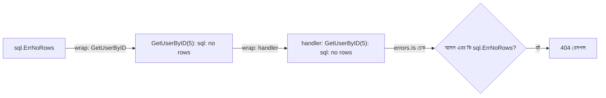

# ১৮. Error Handling Best Practices

লেসন ৫-এ আমরা দেখেছিলাম Go-তে এরর কোনো `try/catch` দিয়ে ধরা পড়ে না — বরং প্রতিটা ফাংশন তার শেষ রিটার্ন ভ্যালু হিসেবে একটা `error` ফেরত দেয়, আর কলার সেটা `if err != nil` দিয়ে চেক করে। এই লেসনে আমরা দেখবো এই সাধারণ প্যাটার্নটাকেই কীভাবে বড় প্রোডাকশন কোডবেজে পরিষ্কার আর রক্ষণাবেক্ষণযোগ্য রাখা যায়।

প্রথম সমস্যাটা হলো — একটা এরর যখন অনেকগুলো ফাংশনের মধ্য দিয়ে উপরের দিকে উঠে যায়, তখন মূল প্রসঙ্গ (context) হারিয়ে যায়। ধরো ডাটাবেজ থেকে একটা "record not found" এরর এলো, কিন্তু সেটা যদি শুধু "not found" বলে উপরে চলে যায়, তাহলে কোন রিকোয়েস্ট, কোন ইউজার, কোন ফাংশনে সমস্যা হয়েছে বোঝা কঠিন হয়ে যায়। এর সমাধান হলো `fmt.Errorf` দিয়ে এরর **wrap** করা:

```go
func GetUserByID(id int) (*User, error) {
    user, err := db.FindUser(id)
    if err != nil {
        return nil, fmt.Errorf("GetUserByID(%d): %w", id, err)
    }
    return user, nil
}
```

`%w` ভার্ব (verb) ব্যবহার করলে মূল এররটা ভেতরে "মোড়ানো" থাকে, হারিয়ে যায় না। এর ফলে উপরের কলার চাইলে `errors.Is()` বা `errors.Unwrap()` দিয়ে আসল এররটা যাচাই করতে পারে, আবার লগে পুরো chain-ও দেখতে পারে:

```go
if errors.Is(err, sql.ErrNoRows) {
    // নির্দিষ্টভাবে "not found" পরিস্থিতি সামলানো
    http.Error(w, "user not found", http.StatusNotFound)
    return
}
```



দ্বিতীয় ভালো অভ্যাস হলো **custom error types** বানানো, যখন এররের সাথে অতিরিক্ত তথ্য (যেমন HTTP status code) জুড়ে দেয়া দরকার — এটা লেসন ৬-এ শেখা struct আর interface-এর একটা বাস্তব প্রয়োগ:

```go
type ValidationError struct {
    Field   string
    Message string
}

func (e *ValidationError) Error() string {
    return fmt.Sprintf("%s: %s", e.Field, e.Message)
}
```

`error` আসলে Go-তে একটা ইন্টারফেস মাত্র — যেকোনো টাইপ যার একটা `Error() string` মেথড আছে, সে `error` হিসেবে গণ্য হয়। তাই কাস্টম এরর টাইপ বানানো মানে শুধু এই একটা মেথড ইমপ্লিমেন্ট করা।

শেষ নিয়মটা হলো — এরর কখনো নীরবে গিলে ফেলা (silently swallow) উচিত না। `if err != nil { }` লিখে ভেতরে কিছু না করে ফেলে রাখাটা Go-তে সবচেয়ে বিপজ্জনক অভ্যাসগুলোর একটা, কারণ এতে সমস্যা লুকিয়ে থাকে যতক্ষণ না প্রোডাকশনে বড় আকারে ফেটে বের হয়। প্রতিটা এরর হয় হ্যান্ডল করতে হবে, নয়তো লগ করে/wrap করে উপরে পাঠাতে হবে — মাঝামাঝি কোনো অপশন নিরাপদ না।

এতদিন আমরা এরর নিয়ে কথা বললাম যেটা প্রত্যাশিত পরিস্থিতি (expected failure)। কিন্তু কখনো কখনো প্রোগ্রামে এমন কিছু ঘটে যা সত্যিই অপ্রত্যাশিত আর মারাত্মক — regex প্যাটার্নের ভুল বা কোনো ইনপুট প্রসেস করতে গিয়ে অপ্রত্যাশিত ক্র্যাশ। পরের লেসনে আমরা দেখবো Regular Expression দিয়ে কীভাবে ইনপুট প্যাটার্ন যাচাই করে এই ধরনের অনেক সমস্যা আগে থেকেই ঠেকানো যায়।
